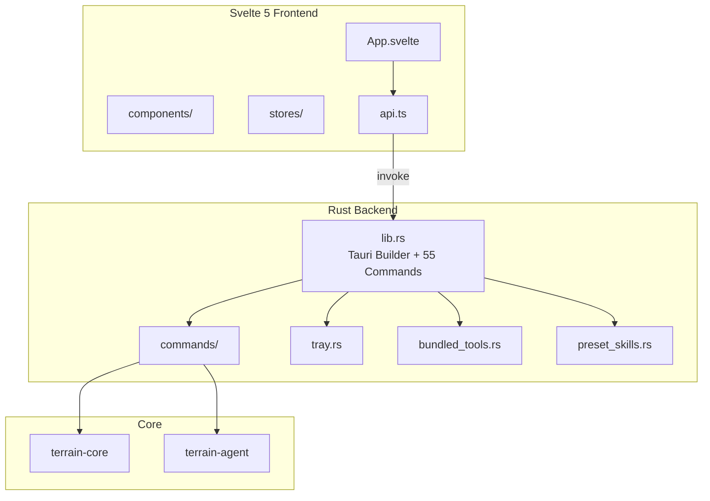
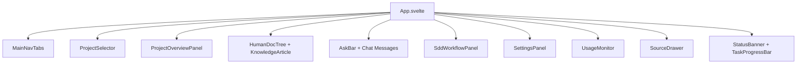

# Desktop App — Tauri + Svelte

## What this module does

The desktop app is Terrain's graphical face — a Tauri v2 shell with a Svelte 5 frontend that provides a full GUI for project management, knowledge browsing, Ask Q&A, SDD workflows, settings, and environment integration. It's the experience most users encounter first: a native window with a sidebar, tabbed navigation, streaming chat, and a polished Markdown reader. If `terrain-core` is the engine and `terrain-agent` is the brain, the desktop app is the **cockpit with all the gauges and controls**.

The Rust backend (`src-tauri/`) exposes 55+ IPC commands that the Svelte frontend invokes through auto-generated TypeScript bindings. The frontend never touches the filesystem directly — every operation flows through Tauri's IPC bridge.

---

## Architecture overview

---

## Rust backend — src-tauri/

### Bootstrap — lib.rs

`lib.rs` (116 lines) defines `AppState`, initializes the Tauri builder, and registers all 55+ IPC command handlers (`lib.rs:54-110`). Key setup steps:

1. **Load dotenv** (`terrain_agent::load_dotenv()`) — API keys and env overrides
2. **Initialize tracing** — `tracing_subscriber` with `info,terrain=debug`
3. **Build paths** — `commands::init_paths()` resolves the workspace
4. **Create `AppState`** — wraps `Runtime` for shared access
5. **Plugin registration** — `tauri_plugin_dialog`, `tauri_plugin_shell`
6. **Preset skills + bundled tools** — extracted at setup time from embedded resources
7. **System tray** — `tray::init(app)` creates the menu bar icon

`AppState` (`lib.rs:9`) is the bridge between Tauri's managed state and Terrain's `Runtime`. It provides `paths()`, `model_config()`, and `set_model_config()` — the three things the IPC handlers need.

### IPC commands — commands/

The `commands/` directory mirrors the CLI's command groups:

| Module | Handles |
|--------|---------|
| `commands/project.rs` | Project list, scan, init, remove, overview, remark |
| `commands/knowledge.rs` | Search, read document, list/read human docs |
| `commands/workflows.rs` | Ask Q&A, quick refresh, Litho generation, agent context |
| `commands/sessions.rs` | Ask session CRUD, SDD session management |
| `commands/settings.rs` | Model settings, ACP check, LLM check |
| `commands/env.rs` | Env status, plan, apply |
| `commands/assets.rs` | Pack agent assets, plan Litho, grep pack |
| `commands/usage.rs` | Usage probe and snapshot |
| `commands/payloads.rs` | IPC payload types |
| `commands/util.rs` | Shared utilities |

### System tray — tray.rs

`tray.rs` manages the macOS menu bar icon and context menu, providing quick access to project switching and app visibility.

### Resource packaging

- **`bundled_tools.rs`** — embeds platform-specific tool binaries (CodeGraph, RTK) as Tauri resources, extracted to `~/.terrain/bin/` at first launch
- **`preset_skills.rs`** — embeds Skill playbooks from `.agents/skills/` and `.claude/skills/`, deployed on setup

---

## Svelte frontend — src/

### App.svelte

`App.svelte` (1,530 lines) is the root component. It orchestrates:

- **Project selection** — sidebar with `ProjectSelector`
- **Tabbed navigation** — `MainNavTabs` switching between Overview, Knowledge, Ask, SDD, Settings, Usage
- **Streaming Ask** — real-time token display via Tauri event listeners
- **Status banners** — freshness warnings, task progress
- **Source code viewer** — `SourceDrawer` for inline code inspection

The component tree:

### State management — stores/

Svelte 5 runes power the state layer in `stores/`:

| Store | Purpose |
|-------|---------|
| `project.svelte` | Current project, registry, task state |
| `chat.svelte` | Ask messages, streaming state, sources |
| `status.svelte` | Status banner text and auto-dismiss |
| `readerLayout.svelte` | Doc tree visibility, reader layout |

### API bindings — api.ts

`api.ts` wraps every Tauri `invoke()` call with typed TypeScript functions. The frontend calls `searchKnowledge(...)`, `computeFreshness(...)`, etc. — each maps 1:1 to a Rust IPC command.

### Type safety — types + generated

TypeScript types follow a strict contract defined in `AGENTS.md`:

| File | Role |
|------|------|
| `src/lib/generated/` | **Auto-generated** by `terrain-ts-export` from Rust `#[ts-rs]` annotations |
| `src/lib/types.client.ts` | Pure frontend extensions (e.g., `SourceSlice` with `format?` and `focus_line?`) |
| `src/lib/types.ts` | Re-exports `generated/` + `types.client.ts` as the single import point |

Rust `Option<T>` maps to `T | null` — not `undefined` — and all frontend null checks follow this convention.

### Internationalization — i18n/

`i18n/` provides locale-aware translations. The app detects the system language (via `terrain_core::language`) and the frontend applies it through `applyLocale()`. All user-facing strings go through the `tr()` or `t()` helpers.

---

## Frontend stack

| Layer | Technology | Version |
|-------|-----------|---------|
| Framework | Svelte | 5 (runes) |
| Build | Vite | 8 |
| Styling | TailwindCSS | 4 |
| Language | TypeScript | 5.9 |
| Desktop shell | Tauri | v2 |
| Icons | Lucide | @lucide/svelte |
| Markdown | Custom renderer | with Mermaid lightbox |

---

## IPC flow example

A typical Ask query flows like this:

1. User types in `AskBar` and presses Enter
2. `App.svelte` calls `askKnowledge(project, query)` from `api.ts`
3. Tauri invokes the Rust `ask_knowledge_cmd` handler
4. The handler calls `terrain_agent::ask_knowledge()` with the `Runtime`'s `ChatEngine`
5. The agent streams `AskStreamEvent` tokens back through Tauri events
6. `App.svelte` listens via `listen('ask-stream', ...)` and updates the chat UI in real time
7. Tool calls (grep, read) execute against `terrain-core` and their results are fed back to the LLM

---

## Design principles

1. **IPC as API boundary.** The frontend is a pure consumer of Tauri commands — no direct filesystem access, no knowledge of `.terrain/` paths.
2. **Generated types.** TypeScript types are never hand-written for IPC payloads; they flow from Rust via `ts-rs`, preventing drift.
3. **Component isolation.** Each Svelte component owns its small piece of UI and delegates data fetching to `api.ts`.
4. **Event-driven streaming.** Long-running operations (Ask, Litho) stream progress through Tauri events rather than blocking the IPC call.
