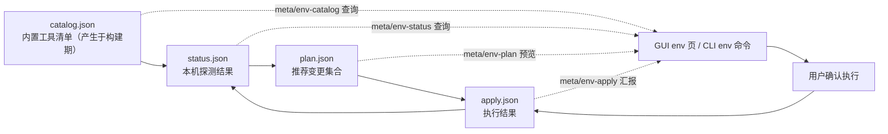

# 环境集成（Env Integration）领域

**模块路径**：`crates/terrain-core/src/assets/env/`（catalog.rs、status.rs、plan.rs、apply.rs、agents_md.rs）+ `integrations/` + `agent_tools_deploy.rs` + `bundled_tools.rs` + `preset_skills.rs`
**生成日期**：2026-09-21

---

## 概述

环境集成模块解决的是 Terrain 落地部署时最琐碎、却最决定"开箱体验"的问题：**目标机器上的各种工具与目录要从哪里来、怎么摆、文件系统里到底缺什么**。它不再生成任何文档，而是管四件事——内置工具清单（`bundled_tools`）、预设 skill 目录（`preset_skills`）、Agent 工具链部署（`agent_tools_deploy`）、以及 AGENTS.md 的管理段落（`env/agents_md.rs`）。

可以把它想成**安装了全套家具的新房入住流程**：catalog.json 是一张"装修清单"（每个工具叫什么、装哪个版本、作用在哪些平台）；status 是"巡检员"（挨个看清单上的东西装没装、修没修过）；plan 是"项目经理"（在给定动作里算出应该执行哪些变更）；apply 是"施工队"（按依赖顺序执行）；AGENTS.md patch 是"住户须知"（把舱位约定写进仓库门口）。它不动脑（不 invoke LLM），但它是整个"Agent 可编程、环境可复现"体验的基础设施。

---

## 核心功能点

1. **内置工具盘点（`bundled_tools.rs`）**：`collect_bundled_tools` 列出随安装包发布的附加工具（如 `bun` 用来跑 worker、`aria2` 用来下载 LLM 模型），`metadata_bundled_tools` 在首次应用时展示说明。

2. **预设 skill 目录（`preset_skills.rs`）**：`resolve_preset_skill_dir` 从内置资源解析 macOS `.app/Contents/Resources/preset_skills` 与通用 sources 目录；`copy_preset_skill` 把预设 skill 拷进目标。`SkillListEntry` 结构支撑 `meta/preset-skills` 查询。

3. **Agent 工具部署（`agent_tools_deploy.rs`）**：把 `rtk` / `codegraph` / `terrain` 三个约定工具链部署到 Agent 环境（`TERRAIN_AGENT_TOOLS_*` 约定路径），供工作流与 Agent 交互时直接使用。

4. **环境目录状态机（`env/catalog.rs` 等）**：四种阶段文件的管理——`catalog.json`（内置清单，`meta/env-catalog` 查询）、`status.json`（探测结果）、`plan.json`（推荐变更）、`apply.json`（应用结果）。`apply_env_catalog` 在 `src-tauri` 侧有专属入口。

5. **变更规划（`env/plan.rs`）**：`compute_env_plan` 读 catalog + status，按动作子集算差异；`EnvPlan`（`TerminalProfile` 与动作的装载计划）供 `env/plan` 命令与 GUI 呈现。

6. **变更应用（`env/apply.rs`）**：`apply_env_plan` 执行计划（写 crontab、合并 AGENTS.md 等），`EnvApplyStatus` 汇报结果；`update_terminal_profile` 生成终端配置文件。

7. **AGENTS.md 管理段落（`env/agents_md.rs`）**：patch 受管理的 AGENTS.md 片段（`TERRAIN_ENV_DEFAULT_PATTERN` 常量）让"环境即仓库状态"，项目录下即可带走一致的操作约定。

8. **忽略/命名规则（`ignore.rs` 等）**：标准忽略项与命名规则，保证环境变更不误伤用户文件。

---

## 关键组件

| 组件/类型 | 文件路径 | 核心职责 |
|---------|---------|---------|
| `collect_bundled_tools` | `crates/terrain-core/src/bundled_tools.rs` | 内置附加工具盘点 |
| `resolve_preset_skill_dir` / `copy_preset_skill` | `crates/terrain-core/src/preset_skills.rs` | 预设 skill 解析与拷贝 |
| `deploy_agent_tools` | `crates/terrain-core/src/agent_tools_deploy.rs` | rtk/codegraph/terrain 工具链部署 |
| `onboard_env` / `compute_env_plan` | `crates/terrain-core/src/assets/env/{status,plan}.rs` | 环境探测与计划 |
| `apply_env_plan` / `EnvApplyStatus` | `crates/terrain-core/src/assets/env/apply.rs` | 计划执行与状态上报 |
| `update_terminal_profile` | `crates/terrain-core/src/assets/env/apply.rs` | 终端配置生成 |
| `patch_agents_md` | `crates/terrain-core/src/assets/env/agents_md.rs` | AGENTS.md 受管理段落（`TERRAIN_ENV_DEFAULT_PATTERN`） |
| `Terrain env command` 支持 | `crates/terrain-core/src/assets/env/mod.rs` | 环境状态态与逃逸提示 |

---

## 内部数据流

四次状态机（catalog → status → plan → apply）把"环境该长什么样"从"装没装"分离成两个问题，并在 `apply.json` 落盘后闭环回 catalog/status 供下次比对。

**关键步骤说明**：
1. 盘点（catalog.rs）：内置工具清单在构建期打进资源（`bundled_tools` + `preset_skills`），运行时读盘。
2. 探测（status.rs）：`onboard_env` 逐项查本机安装情况，产物写 `status.json`。
3. 规划（plan.rs）：`compute_env_plan` 在给定动作子集内算"要装什么、要卸什么、要改什么"，产物 `plan.json` 供预览。
4. 应用（apply.rs）：`apply_env_plan` 执行（写 crontab、合并 AGENTS.md、生成终端 profile），产物 `apply.json` 回写状态，环闭。

---

## 关键接口与扩展点

- **`meta/env-catalog` / `meta/env-status` / `meta/env-plan` / `meta/env-apply` 查询**：四个元数据查询分别返回四个阶段文件，GUI 与 CLI 共享。
- **`apply_env_catalog`（src-tauri 入口）**：桌面端一键应用推荐变更。
- **扩展「新环境工具」**：在 `bundled_tools` / `preset_skills` 清单加条目 + catalog 记录，plan/apply 自动纳入差异计算。
- **自定义 Agent 路径**：Agent 工具链按 `TERRAIN_AGENT_TOOLS_*` 约定路径部署，不同机器可各自配置而不改核心逻辑。

---

## 与其他模块的交互

| 交互模块 | 方向 | 接口/协议 | 说明 |
|---------|------|---------|------|
| `assets` | 周边 | `assets/env/*` 挂靠 | env 是资产工厂的子域 |
| `paths` / `settings` | 依赖 | 工具链约定路径 / 用户偏好 | 目标目录与可写性判定 |
| `integrations` | 依赖 | `integrations/mod.rs` | 套壳包：把 CR 工具、终端 profile 等组装给 env 用 |
| `src-tauri` | 消费 | `apply_env_catalog` / `env` IPC | GUI env 页驱动 |
| `terrain-cli` | 消费 | `env` / `assets plan` | 终端环境命令 |
| `repo_walk` / `git_policy` | 周边 | .gitignore 感知遍历 | 环境目录是否误被包进包 |

---

## 跨模块协作场景

**在「首次启动一个 Agent 项目」中**：开发者点 `env` 页的"预览变更"——GUI 发 `meta/env-status`（探本机 + 读 status.json），再发 `meta/env-plan`（读 plan.json 展示差异），点"应用"后触发 `apply_env_plan` 写 AGENTS.md 片段并刷新 status.json。整个流程由 `apply_env_catalog` 入口驱动，`env/agents_md.rs` 的 `TERRAIN_ENV_DEFAULT_PATTERN` 决定"哪些段落是 Terrain 管理的"，绝不碰用户手写内容。

**在「CI 机器绿色启动」中**：脚本跑 `terrain env apply`——status 侧发现缺 `bun` 后，`bundled_tools` 从安装包补量；缺 `rtk`/`codegraph`/`terrain` 时由 `agent_tools_deploy` 按约定路径部署；最后 AGENTS.md patch 保证"这台机器用这套工具链"成为仓库事实。

---

## 性能考量

- **无 LLM 调用**：整个 env 链路纯文件系统 + 进程探测，毫秒级。
- **阶段文件即缓存**：status.json / plan.json 持久化后，重开 GUI 不用重新探测整台机器。
- **依赖顺序批处理**：`apply_env_plan` 按依赖顺序执行，避免工具链半成品（如只装了 `rtk` 没装运行环境）。
- **可复现**：plan 一律可预览、可干跑，执行动作小而原子，失败不留下半吊子状态。

---

## 实现亮点

1. **"状态机驱动的环境即服务"**：用四阶段 JSON 文件把"探测/规划/执行"解耦，GUI 预览、CLI 脚本、CI 批处理共用同一批状态。
2. **AGENTS.md 受管理段落的运维观**：`TERRAIN_ENV_DEFAULT_PATTERN` 精确标示 Terrain 管理的段落，保护用户手写内容——"受管但不占有"是环境协作的正确边界。
3. **自带工具链、自足可部署**：`bundled_tools`（bun/aria2）+ `preset_skills`（skill 目录）+ `agent_tools_deploy`（rtk/codegraph/terrain）把"新手能用"从口号变成可执行清单。
4. **`integrations` 套壳包装**：把 CR 工具、终端 profile 等能力按 `integrations` 组装，env 不直接理解每个工具的细节，只消费标准化目录接口。