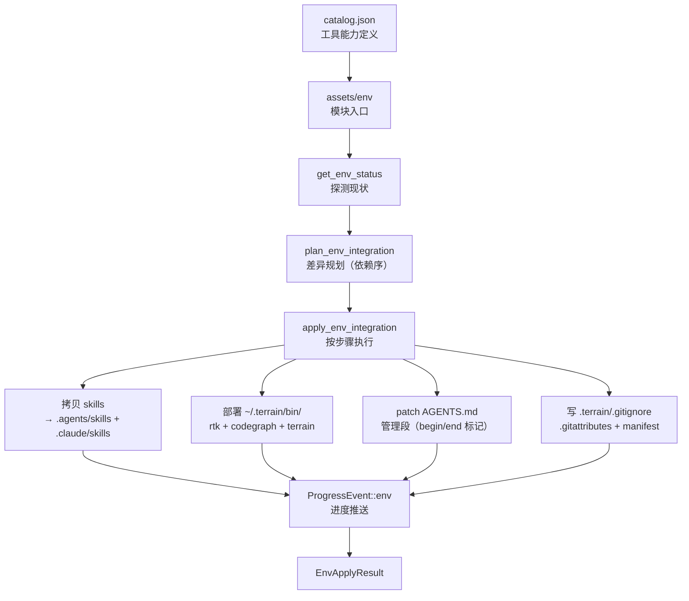

# env（环境集成与工具链部署）领域

**模块路径**：`crates/terrain-core/src/assets/env/` + `crates/terrain-core/src/agent_tools_deploy.rs`
**生成日期**：2026-09-15

---

## 这个模块在做什么

env 模块是 Terrain 的"装修工"——它把 Terrain 的"工具契约"一键落到用户机器与仓库里。如果你把 Terrain 比作一家餐厅，env 就是那个负责"把菜单贴到墙上、把餐具摆到位、把调料瓶放好"的后勤主管。它的核心设计是"探测→规划→应用"三步走，确保操作幂等且不破坏用户自己的配置。

这个模块之所以重要，是因为 Terrain 的价值不仅在于生成知识，还在于让所有 AI 编码助手都能一致地消费这些知识。env 通过部署统一的 AGENTS.md 管理段、预设 Skills 和工具二进制（RTK、CodeGraph），确保无论用户用哪个 Agent，都能拿到同一套知识与工具契约。

---

## 核心功能点

1. **探测与规划**：`get_env_status` 探测各工具（rtk/codegraph/terrain CLI 等）是否已集成、是否可跳过（optional）或已锁（locked）；`plan_env_integration` 依 `depends_on` 拓扑生成差异步骤（`EnvPlanStep` 列表）。核心实现在 `crates/terrain-core/src/assets/env/status/plan.rs:112`。

2. **应用**：按规划步骤依次执行：拷贝 skills/ → `.agents/skills` 与 `.claude/skills`；部署 `~/.terrain/bin/{rtk,codegraph,terrain}`（platform-matched）；把 AGENTS.md 管理段 patch 进受管区域（begin/end 标记）；写 `.terrain/.gitignore/.gitattributes`；落地 manifest 供后续探测判定"已集成"。核心实现在 `crates/terrain-core/src/assets/env/apply.rs:33`。

3. **AGENTS.md 自动托管**：管理段由 Terrain 生成并维护，随 `.terrain/` 分发。Agent 借它第一时间知道工具约定。核心实现在 `env-catalog/agents-md/` 片段。

4. **进度与幂等**：每步派发 `ProgressEvent::env`（EnvApplyProgress）让 UI 实时显示；重复 apply 幂等（基于 manifest 已集成判定跳过）。核心实现在 `crates/terrain-core/src/progress.rs:49-51`。

---

## 关键组件

| 组件/类型 | 文件路径 | 核心职责 |
|---------|---------|---------|
| `EnvStatus` | `crates/terrain-core/src/assets/env/status/types.rs:8` | 一插件状态（探测结果） |
| `EnvIntegrationStatus` | `crates/terrain-core/src/assets/env/status/types.rs:19` | 状态矩阵条目（id/kind/label/integrated/optional/locked/depends_on） |
| `EnvPlan` / `EnvPlanStep` | `crates/terrain-core/src/assets/env/status/types.rs:35/45` | 应用计划（步骤列表 + 依赖序） |
| `EnvApplyResult` | `crates/terrain-core/src/assets/env/apply.rs:25` | apply 结果载体 |
| `AgentEnvStatus` | `crates/terrain-core/src/schema/project.rs:63` | 项目级环境状态（UI 展示） |
| `deploy_env_catalog_to_home` | `crates/terrain-core/src/agent_tools_deploy.rs` | 拷贝 CATALOG → `~/.terrain/env/catalog/` |
| `catalog.json` | `env-catalog/catalog.json` | 工具能力定义（skills/agents-md/工具元数据） |

---

## 内部数据流

**关键步骤说明**：
1. **探测**（`get_env_status`）：由 `assets/env/status/` 处理，读取 catalog.json 并逐一检查各工具的集成状态
2. **规划**（`plan_env_integration`）：由 `assets/env/status/plan.rs:112` 处理，依 `depends_on` 拓扑排序生成步骤
3. **应用**（`apply_env_integration`）：由 `assets/env/apply.rs:33` 处理，按步骤执行并推送进度

---

## 关键接口与扩展点

**新增工具**：在 `catalog.json` 加条目（能力/skills/agents-md 片段），env 模块自动探测和部署。

**新增宿主**（如 Cursor）：只需扩展 skills 拷贝目标，在 `apply.rs` 中添加新的目标目录。

**AGENTS.md 管理段设计**：为什么用"管理段"而非整文件？因为用户自己的 AGENTS.md 内容必须保留，Terrain 只维护自己声明的边界（begin/end 标记），避免互相覆盖导致工作流破坏。

---

## 与其他模块的交互

| 交互模块 | 方向 | 接口/协议 | 说明 |
|---------|------|---------|------|
| assets | 被依赖 | `assets/env/mod.rs` | env 是 assets 的子模块 |
| workflows | 被依赖 | `apply_env_integration` | Init 流程末尾可触发 env 部署 |
| cli | 被依赖 | `terrain env status/plan/apply` | CLI env 命令直接调用 |
| tauri | 被依赖 | UI Env 面板 | 桌面端通过 IPC 调用 env 功能 |
| progress | 依赖 | `ProgressEvent::env` | 每步推送进度事件 |

---

## 跨模块协作场景

> 本模块在核心业务流程中的角色

**在环境集成中**：env 是核心执行者。具体参与：
- `terrain env status` → `get_env_status` 探测各工具集成状态
- `terrain env plan` → `plan_env_integration` 生成差异步骤
- `terrain env apply` → `apply_env_integration` 按步骤执行

**在桌面 App Bootstrap 中**：env 在启动时自动运行。具体参与：
- Tauri 首启时 → `get_env_status` 探测 → 如需部署则自动 `apply`
- 用户无感知，"开箱即用"

---

## 性能考量

- **幂等设计**：重复 apply 不会重复部署，基于 manifest 判定"已集成"的步骤直接跳过
- **依赖序执行**：`depends_on` 拓扑排序确保工具按正确顺序部署（如 terrain CLI 依赖 rtk）
- **进度实时推送**：每步派发 ProgressEvent，UI 可展示详细进度

---

## 实现亮点

- **AGENTS.md 管理段**：用 begin/end 标记划分 Terrain 维护的区域，用户自定义内容不受影响——这是一种"最小侵入"的集成策略
- **catalog.json 驱动**：工具能力定义与代码解耦，新增工具只需改 JSON 而不改 Rust 代码
- **platform-matched 部署**：`bundled_tools.rs` 根据平台（darwin-arm64/win32-x64）选择正确的二进制，确保跨平台可用
