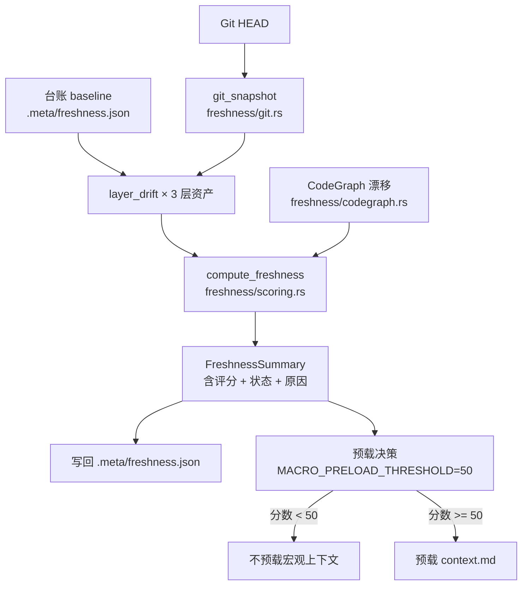

# freshness（知识保鲜）领域

**模块路径**：`crates/terrain-core/src/freshness/`
**生成日期**：2026-09-15

---

## 这个模块在做什么

freshness 模块是 Terrain 的"保质期质检台"——它回答一个关键问题："仓库变了，我的知识还有效吗、该预付多少信任？"。如果把知识资产比作食品，freshness 就是那个在包装上印"保质期至 2026-09-15"的质检员：它用 Git 提交历史与 CodeGraph 符号图做**独立交叉验证**，确保不会因为单一信息源的延迟而误判。

这个模块的核心设计哲学是"fail-closed"——在无法度量时按**不新鲜**处理，而不是误报"零漂移"。这是因为在无法验证的那一刻恰好把文档当作最新，是最危险的。宁可让用户看到"不新鲜"的提示（重新 scan 即可恢复），也不会被过时文档误导。

---

## 核心功能点

1. **三层资产漂移度量**：每层资产各带一张 `asset_id` 台账 + 其生成时的 HEAD baseline。`layer_drift` 把每层"当前 git_snapshot 相对 baseline"的漂移幅度量化（新增/修改/删除文件计数）。核心实现在 `crates/terrain-core/src/freshness/mod.rs`。

2. **新鲜度评分**：`compute_freshness` 汇总为 `FreshnessSummary`：含 `history_drift`（提交变多）、`worktree_drift`、`codegraph_drift`、各资产状态与全局评分；写回 `.meta/freshness.json`。核心实现在 `crates/terrain-core/src/freshness/scoring.rs`。

3. **fail-closed 漂移判定**：台账基准不可达（rebase/squash/amend/force-push/浅克隆）或"资产就绪但无基准" → 该层直接 stale（安全侧），否则按 drift 文件数分级为 fresh / render-ready(stale) / stale。核心实现在 `crates/terrain-core/src/freshness/mod.rs:161-221`。

4. **工作区脏污排除**：`working_tree_dirty_excluding_knowledge` 把 `.terrain/knowledge/` 的常态化修改排除在"工作区脏"之外，避免过度告警。

5. **双源交叉验证**：Git 与 CodeGraph 任一源说漂移都算漂移，杜绝"单一索引没更新却报新鲜"。核心实现在 `crates/terrain-core/src/freshness/codegraph.rs`（若存在）。

---

## 关键组件

| 组件/类型 | 文件路径 | 核心职责 |
|---------|---------|---------|
| `DataDrift` | `crates/terrain-core/src/freshness/mod.rs` | 资产层 + 漂移签名 + 状态 |
| `FreshnessSummary` | `crates/terrain-core/src/schema/freshness.rs:20` | 三层评分与原因（IPC 载荷） |
| `LayerScored` | `crates/terrain-core/src/freshness/scoring.rs` | 每层细粒度评分结果 |
| `git_snapshot` | `crates/terrain-core/src/freshness/git.rs` | 历史集/工作区漂移度量 |
| 阈值常量 | `crates/terrain-core/src/freshness/mod.rs` | FRESH=80 / VERIFY=70 / MACRO_PRELOAD=50 |
| `codegraph_drift` | `crates/terrain-core/src/freshness/codegraph.rs` | CodeGraph 索引漂移独立检测 |
| 台账读写 | `crates/terrain-core/src/freshness/ledger.rs` | `.meta/freshness.json` 读写 |

---

## 内部数据流

**关键步骤说明**：
1. **Git 快照**（`git_snapshot`）：由 `freshness/git.rs` 处理，采集历史集和工作区漂移数据
2. **层漂移度量**（`layer_drift`）：由 `freshness/mod.rs` 处理，量化每层资产相对 baseline 的变化
3. **评分汇总**（`compute_freshness`）：由 `freshness/scoring.rs` 处理，折叠为 0-100 分

---

## 关键接口与扩展点

**新增保存层**：把"某类资产 + 它的 HEAD 基线"登记进台账即可自动纳入漂移计分——无需修改 freshness 代码。

**阈值调整**：FRESH=80 / VERIFY=70 / MACRO_PRELOAD=50 是可调常量，调整它们可以改变保鲜的"松紧度"。

**CodeGraph 交叉验证**：新增一种外部索引源只需在 `compute_freshness` 中添加一个漂移输入。

---

## 与其他模块的交互

| 交互模块 | 方向 | 接口/协议 | 说明 |
|---------|------|---------|------|
| assets | 依赖 | `baseline_matches_head` | assets 检查基线是否需要重打 |
| workflows | 被依赖 | `compute_freshness` | Init/Refresh 末尾调用保鲜 |
| chat | 依赖 | `MACRO_PRELOAD_THRESHOLD` | Ask 前根据新鲜度决定是否预载宏观上下文 |
| settings | 依赖 | freshness 参数 | 阈值和策略从 settings 读取 |

---

## 跨模块协作场景

> 本模块在核心业务流程中的角色

**在项目初始化中**：freshness 负责"质检贴标"。具体参与：
- Init 流程末尾 → `compute_freshness` → 写入保鲜基线台账
- 后续每次刷新都会对比当前 HEAD 与这个基线

**在快速刷新中**：freshness 是最后一步。具体参与：
- scan + context 更新完成后 → `compute_freshness` → `QuickRefreshResult` 包含新评分

**在 DeepWiki Ask 中**：freshness 驱动预加载决策。具体参与：
- `prepare_agent_assets_for_ask` 读取新鲜度评分
- 分数 < 50 → 不预载 `agent/context.md`（宏观上下文不可信）
- 分数 >= 50 → 预载，确保 LLM 回答有充足上下文

---

## 性能考量

- **fail-closed 设宁可保守**：宁可误报"不新鲜"也不误报"最新"，代价是用户可能多跑一次 scan
- **双源交叉验证**：Git 与 CodeGraph 任一源说漂移都算漂移，杜绝单一索引延迟
- **台账写回**：每次评分结果写回 `.meta/freshness.json`，后续读取无需重算
- **工作区脏污排除**：`.terrain/knowledge/` 的修改不计入"工作区脏"，避免过度告警

---

## 实现亮点

- **fail-closed 设计哲学**（`freshness/mod.rs:161-221`）：基准不可达 → stale，这是从历史 bug 中总结出的教训——过去"无法测量时按零漂移"导致在最该怀疑文档时给了满分
- **三层资产独立评分**：agent/human/knowledge 各层独立漂移度量，用户能精确知道"哪层过时了"
- **预载决策驱动**：新鲜度分数直接影响 Ask 的行为（是否预载宏观上下文），而非仅作展示
