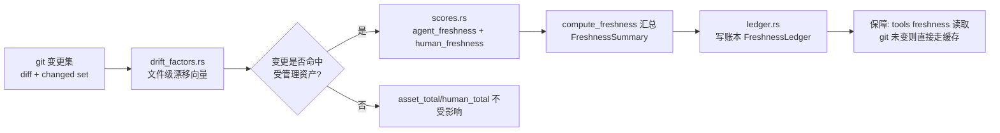

# 新鲜度（Freshness）领域

**模块路径**：`crates/terrain-core/src/freshness/`（lib.rs、drift_factors.rs、scores.rs、ledger.rs）+ `git.rs`
**生成日期**：2026-09-21

---

## 概述

新鲜度模块回答一个"知识管理终局问题"：**`.terrain/` 里的资产到底还有多可信？** 它不看文件有没有生成过，而是看**这一版知识与代码当下的差距有多远**。机制是"账本式快进 + 变更集审计 + 双层评分"：先用 git 变更集与资产基线算"知识坐标系"上的漂移因素（drift factors），再用漂移因素叠加出 `agent`（Agent 资产）与 `human`（人类文档）两套新鲜度评分，最后落成一个持久化的账本。

可以把它想成**一瓶开了封的红酒的"remaining shelf-life"标签**：状态（账本）记录"上次开封"的时间与经济剩余量，评分函数根据"从开封至今发生了多少变化"更新剩余过期时间。账本带来的运维价值是实打实的：`terrain tools freshness` 无需重走昂贵的扫描就能拿到最新评分（缓存有效性由"git HEAD 没变 + 工作树没脏 + 无资产 meta 更新"三条廉价规则判定），让"保鲜检查"成为一个 O(1) 的廉价操作，而不是每次重算整棵树。

---

## 核心功能点

1. **漂移因素分析（`freshness/drift_factors.rs`）**：`git_diff_source_paths` 用 git 变更集穿透到源码层，算"对象列表"与"逐文件 DIFF"两个漂移向量；`GitChangedSet` 聚合变更文件、目标路径、作者、范围。它是新鲜度评分的"证据层"，与"距离最后一次变更的时间"配合计算。

2. **双层评分（`freshness/scores.rs`）**：`total_drift_factor` 把文件级漂移收敛为一个数值；`agent_freshness(agent) -> Freshness` 与 `human_freshness(human) -> Freshness` 分别对 Agent 资产与人类文档算分。评分不仅看时间，还看变更集的文件路径是否命中受管理资产（`agent_files_changed` 判定哪些变更影响 Agent 资产）。

3. **账本读写（`freshness/ledger.rs`）**：`read_freshness_ledger` / `write_freshness_ledger` 持久化 `FreshnessLedger`，缓存新鲜度快照与基线；`ensure_ledger_meta` 确保元数据文件存在。账本是否有效由 `agent/human` 的 git 状态比对决定——**不是必重新扫描**，命中缓存即直接返回。

4. **小结与汇总（`freshness/lib.rs`）**：`compute_freshness(root, slug, repo, scoped_execution, remote_var) -> FreshnessSummary` 编排"读基线 → 分析 drift → 算双层分数 → 记账"，输出 `FreshnessSummary`（`asset_total / human_total` 两个总数）。`Freshness` 类型（`freshness/scores.rs:131-133`）持 `freshness_score`（0-100）+ `freshness_category`（low/medium/high）。

5. **变更集工具（`git.rs`）**：先拿到"git diff 数据 + 变更集"作为所有评分的输入。它不只算文件数，还区分"同文件偏离 1-100 行"与"大附件"等细粒度变化，输出 `merg` 类偏移量。

---

## 关键组件

| 组件/类型 | 文件路径 | 核心职责 |
|---------|---------|---------|
| `compute_freshness` | `crates/terrain-core/src/freshness/lib.rs` | 新鲜度编排主函数 → `FreshnessSummary` |
| `total_drift_factor` | `crates/terrain-core/src/freshness/scores.rs` | 文件级漂移收敛为数值 |
| `agent_freshness` / `human_freshness` | `crates/terrain-core/src/freshness/scores.rs` | Agent 资产 / 人类文档双层评分 |
| `Freshness` | `crates/terrain-core/src/freshness/scores.rs:131` | 评分 + 分类（low/medium/high） |
| `git_diff_source_paths` | `crates/terrain-core/src/freshness/drift_factors.rs` | git 变更集穿透源码层 |
| `GitChangedSet` | `crates/terrain-core/src/freshness/drift_factors.rs` | 变更聚合（文件/路径/作者/范围） |
| `read_freshness_ledger` / `write_freshness_ledger` | `crates/terrain-core/src/freshness/ledger.rs` | 账本持久化与缓存 |
| `ensure_ledger_meta` | `crates/terrain-core/src/freshness/ledger.rs` | 元数据文件存在性 |

---

## 内部数据流

一次新鲜度计算的完整链路：先取变更集（git diff），再判断哪些变更撞到了受管理资产，然后对资产算分、汇总结论并写账本。账本侧有个捷径：如果 git 状态没变，`read_freshness_ledger` 直接返回缓存。

**关键步骤说明**：
1. 取证据（drift_factors.rs）：`git_diff_source_paths` 把"提交差异"降级为"源码路径的漂移向量"——只关心被改的源码文件，而非全部 diff 字节。
2. 判断命中（scores.rs：`agent_files_changed`）：同一批变更对 `agent` 与 `human` 的影响不同。命中 Agent 资产的文件（如 `agent/repomix.md`）才影响 `agent` 评分。
3. 算分（scores.rs：`agent_freshness`）：结合 1) 距上次基线的时间区间，2) 命中漂移的大小（行数、文件数、是否大附件）。分数落 `low/medium/high` 三个区间。
4. 记账（ledger.rs：`write_freshness_ledger`）：落盘基线让后续 `compute_freshness` 可用"git 没变"捷径直接复用。
5. 消费（lib.rs：`compute_freshness`）：GUI freshness 页 / `terrain tools freshness` 读取并展示两个总数与逐层明细。

---

## 关键接口与扩展点

- **`compute_freshness(root, slug, repo, scoped_execution, remote_var)`**：唯一主入口，输出 `FreshnessSummary`；`scoped_execution` 与 `remote_var` 支持在计算时限定范围/换基线。
- **`agent_freshness` / `human_freshness`**：分别提供给需要"只看一个面"的消费者（如 quick_refresh 只关注 agent 侧）。
- **扩展「其他资产类型」**：加一层评分函数并在 `compute_freshness` 汇总、在 `FreshnessSummary` 加字段即可——`asset_total` 与 `human_total` 是对外稳定契约，新增评分不影响既有字段。
- **`Freshness` 分类区间**：`low/medium/high` 的阈值集中在 scores.rs，是"是否提示刷新"的判断依据。

---

## 与其他模块的交互

| 交互模块 | 方向 | 接口/协议 | 说明 |
|---------|------|---------|------|
| `git`（git.rs） | 依赖 | `git_diff_source_paths` | 变更集是新鲜度唯一起点 |
| `assets` | 联动 | `agent_context_synced_with_head` / 基线 | context 同步判定与新鲜度共享"HEAD 比对"思路 |
| `project` / `overview` | 依赖 | 项目登记 / 资产清单 | 知道"要评分的资产有哪些" |
| `usage` | 并列 | — | 都与"知识库存量"相关但独立计算 |
| `workflows/quick_refresh` | 消费 | `compute_freshness` | 保鲜后收尾统一落账（`quick_refresh.rs:240`） |
| `src-tauri` | 消费 | `freshness_cmd` / `tools freshness` | GUI 与 Agent API 双入口 |
| `terrain-cli` | 消费 | `terrain tools freshness --json` / `terrain refresh` | 终端/CI 保鲜检查 |

---

## 跨模块协作场景

**在「快速保鲜后」**：`run_quick_refresh` 完成 scan + context 刷新后，以 `compute_freshness` 收尾（`quick_refresh.rs:240`）——新基线写入账本，下一次 `terrain tools freshness` 直接读到最新分。这形成了一个闭环：**刷新 → 落新账 → O(1) 查询**。

**在「GUI freshness 页」**：用户打开新鲜度 Tab（或外部 Agent 跑 `terrain tools freshness`）：前几次重算、之后命中账本缓存。若返回 `low`，UI 提示"再跑一次快速刷新"。评分本身是"保鲜动作"的触发器，是整个"知识随代码保鲜"方法论的最小闭环。

---

## 性能考量

- **账本缓存（3 规则捷径）**：git HEAD 未变 + 工作树未脏 + 资产 meta 未更新 → `read_freshness_ledger` 直接返回，不做任何扫描。这让 `tools freshness` 在无变化时接近瞬时返回。
- **证据只取 diff 路径**：`git_diff_source_paths` 只解析"变更路径集合"而非 diff 全字节，避免大包全读。
- **按需重算而非全量重建**：`compute_freshness` 只在 git 状态不再匹配时重走分析，其余时间命中缓存。
- **分类低 noise**：`low/medium/high` 三档让 UI 给用户"大信号"，而非每个文件的微小波动。

---

## 实现亮点

1. **"账本 + 重算"替代数据库索引**：没有数据库也能做到 O(1) 新鲜度查询——账本存缓存快照，三条廉价 git 规则判定失效，需要的应用场景内吻合"文件系统即数据库"的架构。
2. **双层评分的心智模型**：`agent` 评分面向模型消费视角（索引过期怎么弥合）、`human` 面向人阅读视角（文档漂移多少）——两种资产的保鲜策略天然不同，却共享同一套 drift 证据。
3. **变更命中的严格维度**：`agent_files_changed` 严格区分"变更撞到哪一层资产"，一个对 `human/` 文件的大修不会错误地拉低 `agent` 评分——批评的是"该资产生态下面临的漂移"。
4. **Freshness 与 Ledger 透明可查**：外部 Agent 拿到的不是黑盒数字，而是 `asset_total/human_total` 两层 + 命中文件明细，可据此自行决定是否刷新。