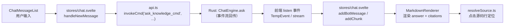

# 前端（Frontend）领域

**模块路径**：`src/`（App.svelte、UsageWindow.svelte、main.ts）+ `src/lib/`
**生成日期**：2026-09-21

---

## 概述

前端是 Terrain 的桌面操作界面——一个基于 **Svelte 5 + Vite 8 + TailwindCSS 4 + TypeScript** 的单页应用，通过 Tauri 的 `invoke` 与 `listen` 与 Rust 后端对话。它不承载任何业务逻辑：所有代码分析、生成、保鲜都在 Rust 侧完成，前端负责三件事——**呈现**（项目卡片、路线状态、文档渲染）、**指挥**（把按钮点击转成 IPC 调用）、**倾听**（`progress`/`done` 事件驱动滚动日志）。

把它想成**驾驶舱仪表盘**：仪表（项目状态卡片、新鲜度进度、Usage 用量图）显示飞机的实时状态，控制杆（操作按钮）把指令发回飞行控制电脑，而"引擎"（生成/问答/保鲜）全在机舱深处——驾驶舱里的人绝不自己发动机器。前端设计上刻意分区：`App.svelte` 是宿主壳（Tab 导航、全局状态）靠五个 Tab 呈现实体（项目 / 文档 / DeepWiki / SDD / 设置），`UsageWindow` 是独立的小窗（Usage 用量图），两者各自 `main` 引导。充满细节的 `src/lib/api.ts` + 类型层（`generated/` auto + `types.client.ts` 手工）是三层的桥。

---

## 核心功能点

1. **应用壳与 Tab 导航（`App.svelte`）**：顶部 Tab 切换五个面板；`registerIntervalHandle` 管理轮询；`handleTabResize` 保持布局；`tabIndex`/`settings` 等 store 注入。

2. **标记渲染（`src/lib/components/MarkdownRenderer.svelte`）**：`marked` + `highlight.js` 渲染 Markdown，并跑 **Mermaid** 校验——`loadMermaid` 回调传入 render 错误即捕获并注入到 UI 的 `tab` 渲染前检查；保证非法图不炸界面。

3. **引用面板（`src/lib/components/`、`resolveSource.ts`）**：`resolveSource.ts` 把 `SourceSlice` 的 `{file_path, file_line}` 解析成可展示路径；`ChatMessageList.svelte` 等把 answer 里的 citations 渲染成"点击跳到源码行"。

4. **API 桥接（`src/lib/api.ts`）**：`invokeCmd` 封装 `invoke`，`registerUpdateCycle`/`renewUpdateCycle` 处理 IPC 事件注册与轮询重设；`SourceSlice` 等类型消费。

5. **聊天状态机（`src/lib/stores/chat.svelte`）**：管理 Ask 会话的 `handleNewMessage`（发 IPC + 流式事件重启）、`messages`/`isStreaming`/`sessionId` 状态，`addBotMessage`/`addChunk` 增量渲染。

6. **SDD 流程（`src/lib/stores/sdd.svelte`、`components/SddPanel.svelte`）**：选择一个 session / 阶段，先 `run_sdd_phase_cmd`，再在 `done` 回调里填回当前阶段输出。

7. **SDK 引导（`src/lib/components/SdkSetupPanel.svelte`）与 `WorkflowsPanel`**：初始化/保鲜/文档/SDD 的入口面板，`initialize` 事件触发端到端初始化。

---

## 关键组件

| 组件/类型 | 文件路径 | 核心职责 |
|---------|---------|---------|
| `App.svelte` | `src/App.svelte` | 应用壳：Tab 导航 + 全局状态 + 轮询管理 |
| `UsageWindow.svelte` | `src/UsageWindow.svelte` | 独立用量小窗（Usage 图） |
| `main.ts` | `src/main.ts` | 两个窗口的入口引导 |
| `MarkdownRenderer.svelte` | `src/lib/components/MarkdownRenderer.svelte` | Markdown + Mermaid 渲染 |
| `api.ts` | `src/lib/api.ts` | invoke 封装 + 事件注册 + SourceSlice 消费 |
| `stores/chat.svelte` | `src/lib/stores/chat.svelte` | Ask 会话状态机 |
| `stores/sdd.svelte` + `SddPanel.svelte` | `src/lib/stores/sdd.svelte` / components | SDD 阶段执行与输出回填 |
| `resolveSource.ts` | `src/lib/components/../../resolveSource.ts` | SourceSlice → 源码行定位 |
| `types.ts` / `types.client.ts` / `generated/` | `src/lib/` | 类型层：生成物 + 前端扩展 |

---

## 内部数据流

一次"DeepWiki 提问"在前端的完整生命线：用户输入被守卫在 chat store，经 IPC 到 Rust 引擎，返回流式事件序列，倒灌回 UI 更新。`registerUpdateCycle` 保证"事件流打断后重连"的粘性。

**关键步骤说明**：
1. 守卫（chat.svelte：`handleNewMessage`）：发送前检查是否在流式状态（`isStreaming`），避免重复提交。
2. IPC（api.ts：`invokeCmd`）：`on_ask_knowledge(Channel)` 建立事件通道，`on_event(Answer)` 在全局 handler 里逐条分流。
3. 流式转状态（chat.svelte：`addChunk`）：`Chunk` 事件追加到 `currentBotMessage`；`Done` 关闭流式态。
4. 渲染（MarkdownRenderer）：`marked` 解析 answer，`highlight.js` 上色代码块；`source-slice` 模板引用解析回可点击行。
5. 解析（resolveSource.ts）：`{file_path, file_line}` → 项目内绝对路径，供"跳到源码行"。

---

## 关键接口与扩展点

- **`invokeCmd(command, payload)`**：所有 Rust 桥的统一入口；请求失败统一抛 `Error` 给调用方 store。
- **`registerUpdateCycle` / `renewUpdateCycle`**：事件注册与轮询重设的封装；新面板只需调用即可获得实时更新。
- **`stores/chat.svelte` 状态通道**：`messages / isStreaming / sessionId / currentDoc` 是 Ask 面板的公共契约，新增面板复用即可。
- **类型层**：`generated/`（ts-rs 生成，勿手改）为 IPC 真源；`types.client.ts` 只放 UI 专用扩展（如 `SourceSlice & { format?, focus_line? }`）——改动源头永远是 Rust。

---

## 与其他模块的交互

| 交互模块 | 方向 | 接口/协议 | 说明 |
|---------|------|---------|------|
| `src-tauri` | 主对话 | `invoke` / `listen` | 57 个 IPC 命令 + 事件流 |
| `generated/` 类型 | 依赖 | ts-rs 生成物 | IPC 类型真源，勿手改 |
| `chat`（Rust） | 消费 | `AskStreamEvent` 流 | 问答事件流渲染 |
| `sessions`（Rust） | 消费 | session 列表 / 消息 CRUD | 会话列表与加载 |
| `litho`（Rust） | 消费 | `litho-progress` / `litho-done` | 文档生成进度流 |
| `sdd`（Rust） | 消费 | `run_sdd_phase_cmd` | SDD 面板执行 |

---

## 跨模块协作场景

**在「DeepWiki 问答」中**：用户提交 → `stores/chat.svelte` 设 `isStreaming` → `api.ts` 建立 Channel 并 `invoke(ask_knowledge_cmd)` → Rust 端 `ChatEngine` 流式回传 `Phase/Chunk/Thinking/Usage` 事件 → 前端 handler 按类型逐个更新渲染 → `Done` 收尾。全程无轮询（事件驱动），滚动与渲染全凭事件。

**在「SDD 阶段执行」中**：`SddPanel.svelte` 选 session → `stores/sdd.svelte` 调 `run_sdd_phase_cmd(phase, session_id, input)` → Rust 端 `run_sdd_phase` 按阶段执行 → `done` 回调把输出写回 `outputs/{n}.md` 的展示区，用户在面板内继续下一阶段。

---

## 性能考量

- **流式而非轮询**：Ask 用 Channel 事件流而非轮询状态文件，渲染与网络成本随文字量线性增长。
- **Mermaid 渲染延迟**：`MarkdownRenderer` 只在文档视图里跑 `mermaid.run`，且捕获渲染错误，避免大文档拖垮主线程。
- **`isStreaming` 守卫**：避免重复提交同一个问题，降低半完成流式状态下的请求压力。
- **类型层零运行时成本**：`generated/` 与 `types.client.ts` 都是编译期类型，无运行时代价。

---

## 实现亮点

1. **Svelte 5 runes 新范式**：`stores/chat.svelte` 用 `$state`/`$effect`，源码干净且响应式能力强；`App.svelte` 顶层 `$state` 管理全局 UI 状态。
2. **"千行 store，零逻辑"**：业务逻辑不写进组件，store 是唯一的 UI-Rust 状态通道——组件只管渲染，store 只管编排。
3. **Mermaid 校验前置**：`MarkdownRenderer` 捕获非法图渲染错误并注入校验，防止文档里的坏图直接炸掉整个渲染管线。
4. **类型溯源纪律**：前端绝不手写重复 Rust 类型的 IPC 载荷，全部经 `generated/`；`types.client.ts` 只做 UI 扩展——从源头堵住类型漂移。