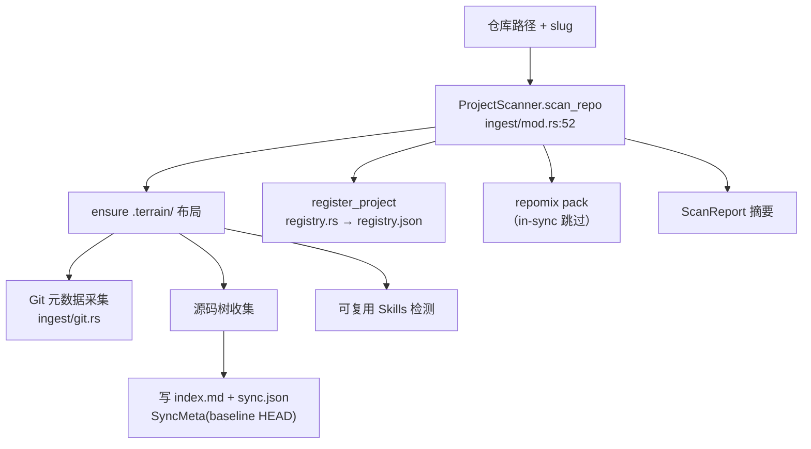

# ingest（项目扫描与登记）领域

**模块路径**：`crates/terrain-core/src/ingest/`
**生成日期**：2026-09-15

---

## 这个模块在做什么

ingest 模块是知识工厂的"原料进厂车间"——它把"一个 Git 仓库路径"拆解成索引、元数据与登记记录，是纯离线的第一道工序。如果把 Terrain 比作一条汽车生产线，ingest 就是那个负责"接收钢材、分类入库、贴标签"的原料仓库管理员：它不关心后面要造什么车，只负责把原材料整理好、登记好，让后续车间能高效工作。

这个模块的"纯离线"特性很重要——它不依赖任何 LLM，只用 Git 子进程和文件系统操作。这意味着即使用户的机器上没有配置任何模型，scan 仍然能完成，知识资产的"骨架"（index.md + sync.json + pack）仍然能建立。

---

## 核心功能点

1. **扫描主流程**：路径解析 → 确保 `.terrain/` 布局 → `ProjectScanner(context).scan_repo` → 收集源码树、Git 元数据、可复用技能、写入 `index.md` + `.meta/sync.json`（SyncMeta：baseline HEAD、`assets.updated_at`）。核心实现在 `crates/terrain-core/src/ingest/mod.rs:52-110`。

2. **登记**：成功后 `register_project` 写入 `~/.terrain/registry.json`（名称/路径/slug），供 CLI/UI/tools 用 slug 定位。核心实现在 `crates/terrain-core/src/registry.rs`。

3. **元数据采集**：GitScanner 记录 commit、分支、工作区状态；OpenApiImporter 吸收 OpenAPI 接口定义进 `interfaces/`。核心实现在 `crates/terrain-core/src/ingest/git.rs` 和 `ingest/openapi.rs`。

4. **包与索引联动**：scan 内触发 repomix pack（in-sync 跳过）——给后面 assets/freshness/Ask 的"最新地图"垫底。

---

## 关键组件

| 组件/类型 | 文件路径 | 核心职责 |
|---------|---------|---------|
| `ProjectScanner` | `crates/terrain-core/src/ingest/mod.rs:39` | 持有 context 的扫描器，scan_repo 入口 |
| `ScanReport` | `crates/terrain-core/src/ingest/mod.rs:19` | scan 产出摘要（IPC 载荷） |
| `SyncMeta` | `crates/terrain-core/src/ingest/mod.rs` | 资产的 baseline HEAD 与更新时间 |
| `RegisteredProject` | `crates/terrain-core/src/registry.rs` | registry.json 条目 |
| GitScanner | `crates/terrain-core/src/ingest/git.rs` | Git 元数据采集（commit/branch/status） |
| OpenApiImporter | `crates/terrain-core/src/ingest/openapi.rs` | OpenAPI 接口导入 |

---

## 内部数据流

**关键步骤说明**：
1. **布局确保**（`ensure .terrain/`）：确保目录结构存在，为后续写入做准备
2. **元数据采集**（GitScanner）：由 `ingest/git.rs` 处理，记录 commit、分支、工作区状态
3. **登记**（`register_project`）：由 `registry.rs` 处理，写入 `~/.terrain/registry.json`

---

## 关键接口与扩展点

**新增扫描来源**：如 OpenAPI，即新增一个 importer 步骤（如 `ingest/openapi.rs`），在 `scan_repo` 管线中挂接。

**新增资产**：在 scan 管线里挂接新的 pack/context 步骤即可。

---

## 与其他模块的交互

| 交互模块 | 方向 | 接口/协议 | 说明 |
|---------|------|---------|------|
| assets | 被依赖 | `scan_repo` 产出 | assets 消费 scan 的产出（index.md/sync.json/pack） |
| workflows | 被依赖 | `run_project_initialization` | Init/Refresh 最先调用 ingest |
| settings | 依赖 | `KnowledgeSettings` | 增量策略参数影响 scan 行为 |

---

## 跨模块协作场景

> 本模块在核心业务流程中的角色

**在项目初始化中**：ingest 是第一道工序。具体参与：
- `terrain init <path>` → `scan_repo` → 扫描仓库、写 index.md/sync.json、触发 repomix pack
- 产出被后续的 Litho、agent context、freshness 消费

**在快速刷新中**：ingest 重新扫描。具体参与：
- `terrain refresh <path>` → `scan_repo` → 检查 in-sync → 如需则重新 pack

---

## 性能考量

- **纯离线**：不依赖 LLM，scan 速度取决于仓库大小和磁盘 IO
- **repomix in-sync 跳过**：未变更时不重新打包，节省最耗时的 IO 操作
- **Git 子进程只读**：`git rev-parse/log/diff/status` 都是只读操作，不会修改仓库

---

## 实现亮点

- **"纯离线"设计**：ingest 不依赖任何 LLM，确保即使无模型环境也能建立知识资产骨架
- **SyncMeta 基线**：每次 scan 都记录 baseline HEAD，后续 freshness 和增量更新都以此为基准
- **repomix 联动**：scan 内自动触发 pack，确保后续模块能立即使用最新的源码索引
