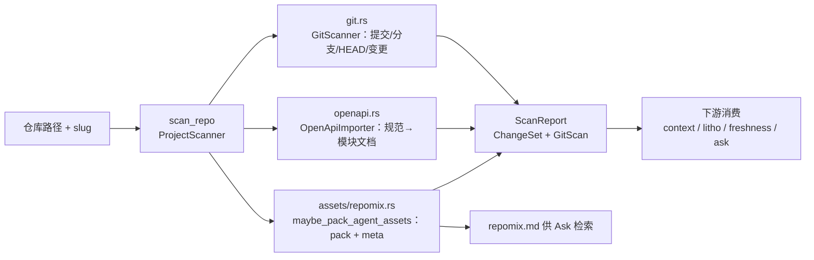

# 源码扫描（Ingest）领域

**模块路径**：`crates/terrain-core/src/ingest/`（mod.rs、git.rs、openapi.rs）+ `repo_walk.rs`
**生成日期**：2026-09-21

---

## 概述

ingest 是 Terrain 的**入口闸门**：一切知识资产的源头都是它。它把"一个 Git 仓库"扫描成"结构化知识包"的四个组成部分：GitScanner（提交历史、分支、变更）、OpenApiImporter（OpenAPI 规范 → 文档）、repomix 打包入口（源码 → pack）、以及仓库遍历规则（哪些文件该看不该看）。扫描产出 `ScanReport`，这是初始化、快速保鲜、上下文生成、Litho 文档、问答共用的同一份"原料"。

可以把它想成**港口的关税申报**：一艘满载源码的船靠岸，申报员（`ProjectScanner`）清点货物（文件）、分舱（Git/OpenAPI/repomix）、开出一张总运单（`ScanReport`），后面每个车间（repack/context/litho）都凭这张单子领料。工程难点几乎都在"边界"上：`.gitignore` 感知的遍历要分清哪些文件进包、哪些被排除；`git diff` 要穿到源码层定位"谁动了哪里"；OpenAPI 导入要识别出规范里的"模块边界"。这些边界做错了，后面的知识资产会全盘失真，所以这里是最该对"遍历与忽略规则"较真的地方。

---

## 核心功能点

1. **项目扫描（`ProjectScanner`）**：`ingest/mod.rs:39-111`。`scan_repo(repo_path, slug) -> ScanReport` 把仓库扫成可消费结构。它依次执行 GitScanner、OpenApiImporter、maybe_pack_agent_assets。`ScanReport`（`ingest/mod.rs:52-56`）聚合源码包、文档索引、模块边界。

2. **Git 扫描（`git.rs`）**：GitScanner 产出 `GitScan`：提交列表、分支、当前 HEAD、最近变更文件。`git_diff_source_paths` 用 git 变更穿透到源码层，`GitChangedSet` 聚合变更文件/路径/作者/范围（服务于 freshness 与增量计划）。

3. **OpenAPI 导入（`openapi.rs`）**：OpenApiImporter 把 OpenAPI 规范转成模块文档（挂在 routes），供知识库消费 API 边界。`import_openapi` 从文件/URL 导入到知识目录。

4. **repomix 打包（`repomix.rs`）**：`maybe_pack_agent_assets` 用内嵌 `repomix-core` 生成 `agent/repomix.md` + `agent/meta.json`（`AgentPackMeta`：token 统计、baseline git HEAD）。`agent_pack_ready` 判定包是否与 HEAD 同步。

5. **仓库遍历（`repo_walk.rs`）**：`discover_repo_walk` 感知 `.gitignore` 遍历仓库（是否忽略文件、忽略哪些目录），`WalkOptions` 控制开关（包括隐藏目录）。`should_skip_path` 判定路径是否应跳过。

6. **子进程能力（`subprocess` / `run_repo_walk`）**：扫描与打包可注入到子进程运行环境（`discover_repo_walk` 的 `RepoWalk` 数据模型支持跨进程序列化）。

---

## 关键组件

| 组件/类型 | 文件路径 | 核心职责 |
|---------|---------|---------|
| `ProjectScanner` | `crates/terrain-core/src/ingest/mod.rs:39` | 扫描编排：Git + OpenAPI + repomix → `ScanReport` |
| `ScanReport` | `crates/terrain-core/src/ingest/mod.rs:52` | 扫描结果（源码包 + 文档索引 + 模块边界） |
| `GitScanner` | `crates/terrain-core/src/ingest/git.rs` | 提交/分支/HEAD/最近变更 |
| `git_diff_source_paths` | `crates/terrain-core/src/ingest/git.rs` | git 变更穿透源码层（供 freshness） |
| `OpenApiImporter` | `crates/terrain-core/src/ingest/openapi.rs` | OpenAPI 规范 → 模块文档 |
| `maybe_pack_agent_assets` | `crates/terrain-core/src/assets/repomix.rs` | repomix 打包 + AgentPackMeta |
| `discover_repo_walk` / `should_skip_path` | `crates/terrain-core/src/repo_walk.rs` | `.gitignore` 感知遍历与跳过判定 |
| `WalkOptions` | `crates/terrain-core/src/repo_walk.rs` | 遍历开关（含隐藏目录） |

---

## 内部数据流

扫描只有一条主线：扫 Git → 导 OpenAPI → 顺手打包。三个产出（GitScan、模块文档、pack）分别被下游以不同方式消费，`ScanReport` 是它们的总装单。

**关键步骤说明**：
1. 入口（mod.rs:39）：`scan_repo` 对外只暴露"路径 + slug"两个概念，内部把三个子扫描编排好。
2. Git 证据（git.rs）：变更集要被 freshness 与增量计划同时消费，因此 GitScanner 输出里既有完整提交也有源码级 diff 路径。
3. OpenAPI（openapi.rs）：规范文件被导入成模块文档，挂在 routes——API 边界成为知识库的一等公民。
4. 顺手打包（repomix.rs）：`maybe_pack_agent_assets` 在 scan 阶段顺带产出 pack，Ask 微层检索的底料在这里形成。

---

## 关键接口与扩展点

- **`scan_repo(repo_path, slug)`**：唯一扫描入口；返回 `ScanReport`。新增扫描器只需在 `scan_repo` 内加一步并把结果并入 `ScanReport`。
- **`discover_repo_walk(repo_root, options)`**：`.gitignore` 感知遍历的核心接口；`WalkOptions` 可开关隐藏目录等行为。
- **`import_openapi(source)`**：OpenAPI 导入入口，支持文件与 URL 两种来源。
- **扩展「新源码形态」**：在 `ingest/` 下加新扫描器 + 在 `ScanReport` 加字段即可，下游工作流不需要感知具体形态——这正是"总装单"模式的好处。

---

## 与其他模块的交互

| 交互模块 | 方向 | 接口/协议 | 说明 |
|---------|------|---------|------|
| `assets/repomix` | 下游消费 | `maybe_pack_agent_assets` | 扫描后顺带打包 |
| `freshness` | 下游消费 | `git_diff_source_paths` / `GitChangedSet` | git 证据是评分的唯一起点 |
| `git_policy` | 辅助 | `.terrain/` Git 策略 | 哪些文件入库，哪些豁免，影响遍历判定 |
| `workflows/init` | 消费 | `run_project_initialization` 内部 scan | 初始化的第一步 |
| `workflows/quick_refresh` | 消费 | `run_quick_refresh` 内部 scan | 保鲜的第一步 |
| `src-tauri` | 消费 | `scan_repo_cmd` / `import_openapi_cmd` | GUI 扫描与导入 |
| `terrain-cli` | 消费 | `terrain scan` | 终端扫描 |

---

## 跨模块协作场景

**在「项目初始化」中**：`run_project_initialization` 第一步就是 `ProjectScanner.scan_repo`（`workflows/init.rs`），产出 `ScanReport`；随后 `maybe_pack_agent_assets` 打包，Litho 靠 scan 后的知识索引取材，context 生成靠 pack 做底料。一次扫描，喂饱所有下游。

**在「快速保鲜」中**：`run_quick_refresh` 再次 scan，但 repomix 层会判断"与 HEAD 同步则跳过 pack"——**增量直觉在这里落地**：不是每次都重包，而是 HEAD 对齐检查后才决定。这使"保鲜"的成本被控制在"真的变了才付"。

**在「新鲜度评分」中**：`compute_freshness` 从 `git_diff_source_paths` 取证据，得到"哪些源码路径被改"的向量——这是对"文档漂移"的客观刻度，而它的原始数据正是 ingest 层的 git 证据。

---

## 性能考量

- **增量打包**：`maybe_pack_agent_assets` 只在 HEAD 对齐时才重包，减少 1MB 级 pack 的重写负担。
- **`.gitignore` 感知遍历**：`discover_repo_walk` 一开始就过滤 node_modules/bootstrap 等大目录，避免把无用内容卷进知识包。
- **git 只取 diff 路径**：`git_diff_source_paths` 不读 diff 全字节，只解析变更路径集合——这是 freshness 能保持 O(change set) 的原因。
- **子进程序列化**：`RepoWalk` 数据模型跨进程可传，扫描可下沉到子进程平行执行而不重复扫描。

---

## 实现亮点

1. **三个扫描器 = 一套"总装单"**：Git、OpenAPI、repomix 的输出收敛成 `ScanReport` 一个类型，下游只认总装单，不知道也无需知道内部有几种扫描，扩展性极好。
2. **git 变更穿透到源码层**：`git_diff_source_paths` 把"提交差异"翻译成"源码路径漂移向量"，让 freshness 与增量计划共享同一份"谁动过"的证据。
3. **路线图即知识**：OpenAPI 导入把 API 边界变成一等知识公民，接口文档不再散落在浏览器里，而是进入可被检索的索引。
4. **忽略规则是遍历的边界就是信任的边界**：`.gitignore` 感知 + `should_skip_path` 让"什么进包"有据可查——知识里绝不会混进依赖代码与构建产物。