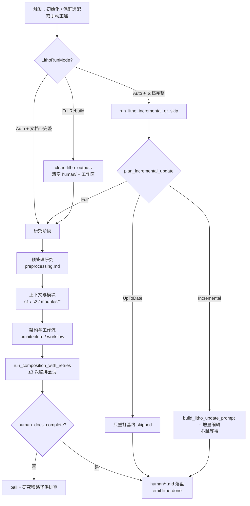

# Litho（人类文档生成）领域

**模块路径**：`crates/terrain-agent/src/litho.rs`（+ `litho_native.rs`）
**生成日期**：2026-09-21

---

## 概述

Litho 是 Terrain 的**人类文档生成引擎**——也就是本套文档（`human/`）的产生方式。它是一个"研究 → 编排"的两段式流水线：第一阶段用一个外部 Agent（默认 opencode，ACP 协议）或内置 LLM 完成四份研究稿（预处理、上下文、领域模块、架构/工作流），第二阶段用另一个 prompt 命令 Agent 把这些研究稿"编排"成完整的人类文档集合。这样做的理由在于：**文档生成与代码抽象是同构的**——先理解（研究），再组织（编排）；理解不充分时，编排出来的文档就会空洞。

可以把它想成一位**建筑评论家**：他不会一上来就写"这栋楼很漂亮"；而是先看图纸（研究）、走工地（源码）、画总平面（架构图），最后才落笔成文。Litho 工程上的难点集中在**"等到齐才收工"的机理**上：怎么判断文档集已经完整、怎么在 Agent 磨蹭时主动结束（稳定 tick）、怎么在墙钟到点时干净地放弃（abort）而不是无限等下去，以及最麻烦的——**ACP 在运行时失败时怎么降级**而不白白浪费 45 分钟。

---

## 核心功能点

1. **生命周期模式（`LithoRunMode`）**：`litho.rs:21-38`。`Auto`（补缺模式：缺文档就跑，已完整则增量/跳过）与 `FullRebuild`（清空重建）。`from_force_refresh(bool)` 从 `force_refresh` 派生。初始化用 scratch 第一次走 `Auto`，强制重建走 `FullRebuild`。

2. **预备阶段（`prepare_litho_generation`）**：`litho.rs:121-152`。校验 `human/` 输出与 `.litho-agent/` 工作区存在，产出 `LithoGenerationJob`（含注入子进程的 env），为后续执行定工作目录与伪终端。

3. **传输选择（`LithoTransport`）**：`litho.rs:52-119`。把 `execution` 模式解析成三态传输对象：`AcpStrict`（纯 ACP）、`AcpWithFallback`（hybrid，ACP 失败降级 native）、`Native`（原生 LLM）。降级对用户可见。`acp_failure_warrants_fallback` 判定失败该不该降级。

4. **原生降级（`native_litho_fallback`）**：`litho_native.rs` + `litho.rs:499-528`。用 `ChatNativeAgent` + 只读受限工具集（read-file / code runner）重放研究流水线，产出与 ACP 形态一致的产物，`LITHO_NATIVE` 环境变量或 `TERRAIN_LITHO_NATIVE` 控制。

5. **三态生命周期（`run_litho_incremental_or_skip`）**：`litho.rs:121-152`。`Auto` 模式下 `plan_incremental_update` 三态：UpToDate（只重打基线 + skipped 文案）、Incremental（`build_litho_update_prompt` + diff）、Full（变更过大全量）。

6. **等待策略（`await_litho_turn_with_doc_poll` / `with_heartbeat`）**：`litho.rs:359-459` / `243-270`。全量用 3s 轮询文档数，检测到完整集后连续 10 个稳定 tick 提前收工；增量用心跳，不做提前完成启发（增量是原地编辑，文档数不增长），两者都受 45min 墙钟约束。

7. **编排重试（`run_composition_with_retries`）**：`litho.rs:663-712`。最多 `MAX_COMPOSITION_ATTEMPTS=3` 次组合尝试，直到 `human_docs_complete`；失败则 bail 并给出研究稿路径供排查。

---

## 关键组件

| 组件/类型 | 文件路径 | 核心职责 |
|---------|---------|---------|
| `LithoRunMode` | `crates/terrain-agent/src/litho.rs:21` | Auto / FullRebuild + `from_force_refresh` |
| `prepare_litho_generation` | `crates/terrain-agent/src/litho.rs:121` | 预备工作区与 job |
| `LithoTransport` | `crates/terrain-agent/src/litho.rs:52` | 三态传输（AcpStrict/AcpWithFallback/Native） |
| `native_litho_fallback` | `crates/terrain-agent/src/litho_native.rs` / `litho.rs:499` | 原生 LLM 降级重放 |
| `run_litho_incremental_or_skip` | `crates/terrain-agent/src/litho.rs:121` | 增量/跳过/全量三态入口 |
| `await_litho_turn_with_doc_poll` | `crates/terrain-agent/src/litho.rs:359` | 全量：轮询 + 10 稳定 tick 提前收工 |
| `await_litho_turn_with_heartbeat` | `crates/terrain-agent/src/litho.rs:243` | 增量：心跳等待 + 墙钟 |
| `run_composition_with_retries` | `crates/terrain-agent/src/litho.rs:663` | 编排重试（`MAX_COMPOSITION_ATTEMPTS=3`） |
| `LITHO_CORE_RESEARCH_FILES` | `crates/terrain-core/src/assets/litho.rs` | 四阶段研究检查点清单 |

---

## 内部数据流

一次全量 Litho 生成的完整流程：模式判定 → 传输选择 → 研究四阶段 → 编排组合 → 完整性校验 → 落盘。增量路径在模式判定处分叉，研究区已齐则直接走编排。

**关键步骤说明**：
1. 模式判定（litho.rs:21）：`Auto` 补缺、`FullRebuild` 清空重建；初始化走 Auto（`litho.rs:139`）。
2. 传输选择（litho.rs:52）：hybrid 模式 `AcpWithFallback` 在运行时失败可降级 native——**但墙钟超时不降级**（`acp_failure_warrants_fallback`，`litho.rs:462-470`）。
3. 研究四阶段：产物落到 `.litho-agent/`，文件名由 `LITHO_CORE_RESEARCH_FILES`（core 侧）与 `litho.rs` 侧常量双保险定义。
4. 编排重试：组合尝试最多 3 次，每次独立检查 `human_docs_complete`，失败不无限重试而是 bail + 给排查线索。
5. 收尾等待：全量靠"文档数稳定 tick"主动提前结束，增量靠心跳顶住墙钟；两者都由 `45min` 兜底。

---

## 关键接口与扩展点

- **`run_litho_generation(mode, job, on_event)`**：主入口。返回 `LithoGenerationResult`，`LithoGenerationJob` 内带注入 env。
- **`LithoTransport` 可插拔**：新增一个传输后端只需实现 trait 并接到 `LithoTransport` 构造处——现有三个形态（Strict/WithFallback/Native）已覆盖"纯外部 / 混合 / 纯本地"三种部署。
- **`LITHO_CORE_RESEARCH_FILES`**：研究检查点的单一真源，改研究阶段 = 改这个清单，编排逻辑不动。
- **`native_litho_fallback` 的只读约束**：降级后只有只读工具（read / code），写盘由姿态分析用 `LITHO_NATIVE_ACCEPT_WRITE_PATHS` 白名单控制（`native_execution_config`）。

---

## 与其他模块的交互

| 交互模块 | 方向 | 接口/协议 | 说明 |
|---------|------|---------|------|
| `acp` | 依赖 | `build_acp_config` / `execution_pure_acp` | ACP 子进程配置与分流 |
| `chat`（ChatNativeAgent） | 依赖 | native LLM 循环 | 原生降级路径 |
| `assets/litho` | 依赖 | `plan_litho_generation` / `litho_human_complete_with_research` | 输出/工作区规划与完整性判定 |
| `workflows/init` | 被调用 | `run_litho_generation`（Auto） | 初始化文档生成 |
| `workflows/quick_refresh` | 被调用 | `run_litho_generation`（选配） | 保鲜增量文档 |
| `src-tauri` | 消费 | `litho-progress` / `litho-done` / `run_litho_generation_cmd` | GUI 进度与完成事件 |
| `ts_ipc` / `DocFrontmatter` | 依赖 | 文档 frontmatter 校验 | 产出文档带 frontmatter 便于类型消费 |

---

## 跨模块协作场景

**在「项目初始化」中**：`run_project_initialization`（workflows/init.rs:139-172）——human/ 不全时以 `LithoRunMode::Auto` 调 `run_litho_generation`。内部走四阶段研究 → 编排；完成后 `litho_ran=true` 触发 `force_refresh`，`run_agent_context_if_needed` 用这个标志强制 context 全量重建——"文档叙事换了底稿，context 摘要不再有增量锚点"。

**在「快速保鲜」中**：`run_quick_refresh`（quick_refresh.rs:165-238）——只有 `incremental_refresh && incremental_human_docs` 都成立才触发 `run_litho_generation Auto`；human/ 文档未完整时宁可跳过并提示"从头生成属于初始化"。量体裁衣：**初始化种全量，保鲜只动增量**。

---

## 性能考量

- **doc_poll 提前收工**：完整集检测 + 10 稳定 tick 让全量生成在 Agent 磨蹭时可提前"收割"，避免长时间空转。
- **增量心跳不启发**：增量是原地编辑，文档数不增长，做提前完成启发是错的——所以用心跳顶住墙钟，等 Agent 自己收敛。
- **45min 墙钟**：长生成任务在极端情况下也有出口；`abort_agent_handle` 让 `agent_handle.abort()` 干净释放子进程。
- **降级不重跑**：超时/运行时失败不再傻等，而是**不**触发 ACP→native 降级（`acp_failure_warrants_fallback` 分界：运行时失败走降级，超时走 abort）——"重跑 45 分钟是错的"。
- **研究稿缓存**：研究稿保留在 `.litho-agent/`，若 reuse 标记满足可直接跳过对应研究阶段。

---

## 实现亮点

1. **"研究 → 编排"的两段式架构**：把"理解代码"与"组织文档"拆成两个独立 prompt，理解不充分不致在编排阶段空洞——这是文档生成质量的根本保障。
2. **完整集检测的工程实现**：`doc_poll` 不仅数文档，还检查"完整集"（核心文件都已出现）才认为完成——文档数不等于完整性。
3. **稳定 tick 机制**：连续 10 次轮询都稳定才提前收工，防止"刚好数到完整但 Agent 还要补写"的抖动。
4. **三种部署形态一个接口**：`LithoTransport` 的 Strict/WithFallback/Native 让"纯外部 Agent"、"hybrid 带降级"、"纯本地只读"三种环境的用户都能又生成文档，且降级路径对用户可见可解释。