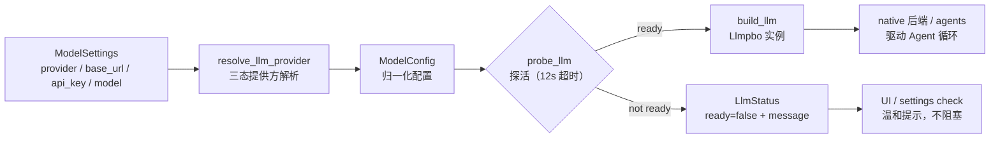

# 模型提供方（Model）领域

**模块路径**：`crates/terrain-agent/src/model.rs`
**生成日期**：2026-09-21

---

## 概述

model 模块把 Terrain 对 LLM 的访问收敛成一个干净的抽象：**解析"用谁" → 探活"能用吗" → 构造"用起来"**。它支持三种提供方——OpenAI 兼容、Ollama、LM Studio——并把"base URL + API key + 模型名 + 温度"归一化成统一的 `ModelConfig`，然后交给 `build_llm` 生产一个真正能聊的模型对象。它是"测模型能不能用"与"真正连上模型"之间唯一的女接线员。

可以把它想成**旅行社的机型柜面**：你说"我要去上海"，柜员（`resolve_llm_provider`）帮你查哪家航司（OpenAI/Ollama/LM Studio）、票价（温度参数）、有没有航班（`probe_llm` 探活）、值机（`build_llm`），一切都以标准化行程单（`ModelConfig`）落地。工程上它有三个值得注意的克制：**探测温和**（`PROBE_TIMEOUT=12s`，探活不把整条任务跑完）、**配置可覆盖**（环境变量 + settings 双通道）、**错误温和**（探活失败只把 `LlmStatus.ready=false + message` 交给 UI 提示，不抛给工作流）。

---

## 核心功能点

1. **提供方解析（`resolve_llm_provider`）**：`model.rs`。从 `ModelSettings` 解析"用的是谁"：默认 OpenAI 兼容、Ollama/LM Studio 走各自 base URL。`LlmProvider` 枚举承载三态。

2. **模型配置归一（`ModelConfig`）**：`model.rs`。把分散的 base URL / key / model / temperature 收敛为单一结构，供 `build_llm` 消费。设置里未配置的部分都会落到这里归一（例如只给 base URL 不给 key 也能工作）。

3. **构造（`build_llm`）**：`model.rs`。用 `ModelConfig` 构造 `Llmpbo` 实例（`adk-model`）。`chat` 模块的 native 后端靠它接入驱动 Agent 循环，`agents` 模块靠它吃 LLM 服务。

4. **探活（`probe_llm`）**：`model.rs:120`。对指定 provider 发最小探测（`PROBE_TIMEOUT=12s`），返回 `LlmStatus { ready, message }`。状态被 `settings check` 与 UI 展示，不阻塞主流程。

5. **环境变量覆盖**：`model.rs` 支持 `TERRAIN_LLM_BASE_URL` / `TERRAIN_LLM_API_KEY` / `TERRAIN_LLM_MODEL` 覆盖设置，测试或 CI 无需改配置。

---

## 关键组件

| 组件/类型 | 文件路径 | 核心职责 |
|---------|---------|---------|
| `LlmProvider` | `crates/terrain-agent/src/model.rs` | OpenAI 兼容 / Ollama / LM Studio 枚举 |
| `ModelConfig` | `crates/terrain-agent/src/model.rs` | base URL + key + model + temperature 归一 |
| `build_llm` | `crates/terrain-agent/src/model.rs` | 构造 `Llmpbo` 模型实例 |
| `resolve_llm_provider` | `crates/terrain-agent/src/model.rs` | 提供方解析 |
| `probe_llm` | `crates/terrain-agent/src/model.rs:120` | 探活（`PROBE_TIMEOUT=12s`）→ `LlmStatus` |
| `ModelSettings` | `crates/terrain-core/src/settings.rs:79:116` | settings 层的模型偏好（provider/base_url/api_key/model/temperature） |
| `LlmStatus` | `crates/terrain-core/src/settings.rs`（或 model.rs 侧） | `ready / message` 探活结果 |

---

## 内部数据流

从"想用模型"到"拿到能聊的模型"的完整链路：解析提供方 → 归一配置 → 构建实例；探活是这条链中间的"质检站"。

**关键步骤说明**：
1. 提供方解析（resolve_llm_provider）：从 settings 的 provider 字段选通道；未配置时回退默认（OpenAI 兼容）。
2. 归一化（ModelConfig）：base URL / key / model / temperature 在这里统一，`build_llm` 只需要一个值对象。
3. 探活（probe_llm）：最小探测控制在 12s，只回答"能不能连"，不承担真实任务。
4. 构建（build_llm）：`Llmpbo` 是 `adk-model` 的模型类型，native Agent 循环与 agents 模块共用这一实例。
5. 状态回传（LlmStatus）：`ready=false` 只作为 UI 提示，不打断工作流。

---

## 关键接口与扩展点

- **`probe_llm(provider, settings)`**：对外唯一的"模型探活"接口；`settings check` 与前端设置页都用它。
- **`build_llm(config)`**：构造模型实例的公共入口；native 后端、agents、Litho native 都复用。
- **扩展「新 Provider」**：在 `LlmProvider` 加变体 + `resolve_llm_provider` 加分支 + `ModelConfig` 包容字段即可——消费方只认归一后的 `ModelConfig`。
- **环境变量覆盖**：`TERRAIN_LLM_BASE_URL` / `TERRAIN_LLM_API_KEY` / `TERRAIN_LLM_MODEL` 让 CI 场景免改 settings 文件。

---

## 与其他模块的交互

| 交互模块 | 方向 | 接口/协议 | 说明 |
|---------|------|---------|------|
| `settings` | 依赖 | `ModelSettings`（settings.rs:79） | 模型偏好的单一真源 |
| `chat`（native） | 被依赖 | `build_llm` | native 后端的模型实例 |
| `acp` | 互补 | `agent_execution_ready` | "LLM 或 ACP 至少一个 ready"构成执行门禁 |
| `litho`（native fallback） | 被依赖 | `build_llm` + `LITHO_NATIVE` | 原生降级路径的模型来源 |
| `src-tauri` | 消费 | `probe_llm_cmd` / `check_llm` | 设置页探活与状态展示 |
| `terrain-cli` | 消费 | `settings probe-llm` | 终端探活 |

---

## 跨模块协作场景

**在「设置页测模型」中**：用户填好 base URL 与 key，点"测试"→ `src-tauri` 发 `probe_llm_cmd` → `probe_llm` 用 12s 最小探测查该 provider 是否可达 → `LlmStatus { ready, message }` 回前端展示。**不改配置只用设置页就看得出"模型能不能用"**。

**在「Ask 的 native 后端」中**：`runtime.chat_engine()` 构造 ChatEngine 时若选择 native，则调 `build_llm(ModelConfig)` 拿 `Llmpbo` 实例，交给 `LlmAgent` 跑 Agent 循环；模型构造失败则上层直接走 `fallback_search_reply`,用户看到的是"纯检索答案"，而非一个坏掉的对话框。

---

## 性能考量

- **`PROBE_TIMEOUT=12s`**：探活不吞整个任务，只做最小往返，让设置页反馈在可接受延迟内。
- **构造缓存于 `RwLock`**：`Runtime` 持有的 `ModelConfig` 改变会触发 `invalidate_chat_engine`，重建只发生在配置变化时，日常对话零重建开销。
- **`ThrottledLlm` 节流**：native 后端对构造出的模型包一层 200ms 冷却（`throttle.rs`），降低 429 概率，探活本身不受节流影响。
- **环境变量优先**：探活/构建优先读 env 覆盖，测试与流水线免去写 settings 的开销。

---

## 实现亮点

1. **统一 `ModelConfig` 抹平三家差异**：OpenAI 兼容、Ollama、LM Studio 的 base URL 语义各不相同，归一到一个配置对象后，消费方只见一种形状——这是"提供方可插拔"的核心。
2. **探活温和、不阻塞主流程**：`LlmStatus` 只有 `ready/message`，探活失败只是"提示"，不是"异常"——切合"LLM 是可选增强"的整体设计。
3. **native 与 ACP 的对称节流**：模型层支持的节流（`ThrottledLlm`）与工具层（`ThrottledTool`）在同一处设计，共同构成"token 纪律"，是长对话不失控的隐性保障。