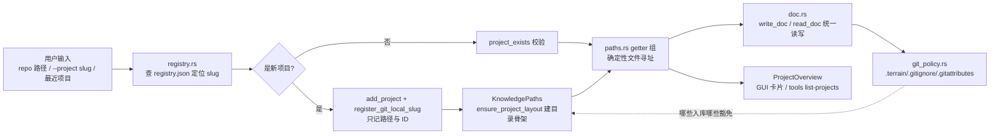

# 项目登记与目录（Project / Registry / Paths）领域

**模块路径**：`crates/terrain-core/src/`（registry.rs、project.rs、paths.rs、path_portable.rs、repo.rs、doc.rs）
**生成日期**：2026-09-21

---

## 概述

"登记与目录"解决的是 Terrain 的**寻址问题**：一台机器上可能躺着十几个项目，每个项目有自己的一套 `.terrain/` 布局；用户在 GUI 里"最近项目"、在 CLI 里 `--project` 参数、在外部 Agent 里 `terrain tools list-projects`——所有这些定位动作背后都是**同样一份注册表（registry）与同一套路径解析规则（KnowledgePaths）**。

可以把它想成**图书馆的索书卡全系统与目录架号**：registry 是"全馆一台机器上所有馆藏"的总索书卡（项目 ID + 仓库路径 + 词干，一个 JSON 搞定）；`KnowledgePaths` 是"具体一本书放在哪个书架位"的解剖式目录（`.terrain/` 下每个子目录、每个文件都有固定名与固定职责）；`ProjectOverview` 是把单个项目的全部门牌汇总成一份"图书馆屋舍概况"。它的工程重点是**一致性**：注册表一个字段错了、路径一处拼写漂了，后面几百个文件寻址都会错——所以这套模块提供了 `path_portable`（路径可移植）、slug 归一化等手段把"地址"钉死。

---

## 核心功能点

1. **项目登记（`registry.rs`）**：`ProjectRegistry` 管理 `~/.terrain/registry.json`——项目登记是**只记路径与 ID，不存知识正文**。`list_projects` 读全部、`project_exists` 确认存在、`add_project`/`remove_project` 增删、`register_git_local_slug` 用 git remote 推断 slug。这保证多项目共享同一份"名录"而互不干扰。

2. **路径解析（`paths.rs`）**：`KnowledgePaths` 是 `.terrain/` 的"目录解剖图"——`ensure_project_layout`（`paths.rs:86`）建立 `.agent/`、`.agent-context/`、`.human/`、`.litho-agent/` 等固定布局；`knowledge_dir` / `pack_backing_dir` / `context_file` / `freshness_ledger_file` 等一组 *getter* 把"要读写哪个文件"翻译成确定性路径。`paths.rs:106` 的 `resolve_knowledge_path` 从全局知识库解析指定文档。

3. **项目概况（`project.rs`）**：`ProjectOverview` 汇编单个项目"全部门牌号"——项目目录、注册信息、Git 根、知识资产存在性。`assets_count` / `freshness_scores` 等字段供 GUI 项目卡片展示。

4. **路径可移植（`path_portable.rs`）**：`to_portable` / `from_portable` 把绝对路径转成跨机器可读、相对仓库的便携记法（如把 `~/foo` 记成 `~`），让知识文档里的路径能跨机器看懂。

5. **仓库根识别（`repo.rs`）**：`discover_repo_root` 从工作目录向上找 `.git` 判定仓库根，是"我该把 `.terrain/` 挂到哪"的判据。

6. **文档读写（`doc.rs`）**：`write_doc`/`read_doc` 统一文档读写（frontmatter 依赖），`DocFrontmatter` 在 `schema.rs` 定义；所有 `human/`/`agent/` 文档的读写都经过这一层。

7. **Git 策略（`git_policy.rs`）**：`.terrain/.gitignore` 与 `.gitattributes` 的文件生成与校验（`GIT_POLICY_VERSION`），明确哪些入库（knowledge/）、哪些豁免（记账、meta、derivatives）——"知识与合规的版本边界"由策略文件声明。

---

## 关键组件

| 组件/类型 | 文件路径 | 核心职责 |
|---------|---------|---------|
| `ProjectRegistry` + JSON 管理 | `crates/terrain-core/src/registry.rs` | `~/.terrain/registry.json` 的 CRUD + slug 推断 |
| `KnowledgePaths` | `crates/terrain-core/src/paths.rs` | `.terrain/` 目录解剖 + 确定性文件寻址 |
| `ensure_project_layout` | `crates/terrain-core/src/paths.rs:86` | 建立标准目录骨架 |
| `ProjectOverview` | `crates/terrain-core/src/project.rs` | 单项目全部门牌号汇编 |
| `to_portable` / `from_portable` | `crates/terrain-core/src/path_portable.rs` | 跨机可移植路径记法 |
| `discover_repo_root` | `crates/terrain-core/src/repo.rs` | 向上找 `.git` 判仓库根 |
| `write_doc` / `read_doc` | `crates/terrain-core/src/doc.rs` | 统一文档读写（frontmatter） |
| Git 策略文件 | `crates/terrain-core/src/git_policy.rs` | `.terrain/.gitignore` / `.gitattributes`（`GIT_POLICY_VERSION`） |

---

## 内部数据流

寻址的完整主链：注册表定位项目 → KnowledgePaths 展开目录 → 文档按 doc.rs 读写。Git 策略在上游约束"哪些文件能进版本库"，path 可移植性在下游约束"文档里怎么写路径"。

**关键步骤说明**：
1. 定位（registry.rs）：`--project` 或 UI 选中的 slug 在 registry.json 里解析成 `{id, repo_path, stem}`。
2. 建立（paths.rs:86）：`ensure_project_layout` 生成固定骨架（`.agent/`、`.agent-context/`、`.human/`、`.litho-agent/` 等），此后所有 getter 都在这棵树上寻址。
3. 读写（doc.rs）：文档统一走 `write_doc`/`read_doc`，frontmatter 中的字段由 `DocFrontmatter` 类型保证。
4. 呈现（project.rs）：`ProjectOverview` 把寻址结果聚合成 GUI 卡片数据。
5. 策略（git_policy.rs）：`.terrain/.gitignore` 用 `GIT_POLICY_VERSION` 标注版本，既让知识入库，又让本地衍生物免责。

---

## 关键接口与扩展点

- **`ProjectRegistry`**：`list_projects` / `add_project` / `remove_project` / `project_exists` / `register_git_local_slug`。GUI、"最近项目"缓存、CLI `--project` 全部走这一个门面。
- **`KnowledgePaths` getter 组**：`knowledge_dir` / `pack_backing_dir` / `context_file` / `freshness_ledger_file` 等——**新增一个文件 = 新增一个 getter**，杜绝散落的字符串拼接。
- **`ensure_project_layout`**：新建项目骨架的单一入口；已有目录兼容（幂等）。
- **`to_portable` / `from_portable`**：知识文档内路径的背书——写文档用 portable，读到机器上再还原。
- **扩展「新资产文件」**：加 getter + 在 course layout 里建目录即可，不破坏对照组。

---

## 与其他模块的交互

| 交互模块 | 方向 | 接口/协议 | 说明 |
|---------|------|---------|------|
| `assets` | 被依赖 | `plan_litho_generation` / `save_sdd_output` | 所有资产生成都在 `KnowledgePaths` 树上写盘 |
| `ingest` | 被依赖 | `scan_repo` | 扫描后把布局打出来 |
| `freshness` | 被依赖 | 账本/缓存放哪 | `freshness_ledger_file` getter |
| `settings` | 并列 | 模型/ACP/知识设置 | 设置在 registry 之外独立管理 |
| `doc` / `schema` | 被依赖 | `DocFrontmatter` | 文档 frontmatter 类型 |
| `git_policy` | 并列 | 版本边界 | 入库豁免的"校验真理" |
| `src-tauri` | 消费 | 最近项目 / 目录 getter | GUI 项目卡片与导航 |
| `terrain-cli` | 消费 | `list-projects` / 目录 resolve | CLI 寻址 |

---

## 跨模块协作场景

**在「GUI 打开最近项目」中**：用户点最近项目（空 session 或前次 session 恢复）→ `src-tauri` 用 `ProjectRegistry` 查 registry.json 拿 slug/repo_path → `KnowledgePaths` 展开 `.terrain/` 布局 → `ProjectOverview` 汇总存在性 → 前端渲染项目卡片。整个过程毫秒级、零网络。

**在「外部 Agent 用 terrain tools list-projects」中**：Agent 跑 `terrain tools list-projects --json` → registry.rs 列出全部项目（id/路径/词干）→ Agent 拿 slug 继续 `read-context` / `grep-pack`。**"总索书卡"开放给外部 Agent，知识共享不依赖 GUI 打开**。

**在「CI 讲 manifest」中**：新机器 clone 仓库后头一次跑 `terrain refresh --project org/repo`——理解不了 `~` 便携路径就乱了，`path_portable` + registry 的 slug 推断让"换机器知识不迷路"。

---

## 性能考量

- **registry.json 极小单文件**：一个项目的路径 + ID，读/写都毫秒级。
- **`ensure_project_layout` 幂等**：重复初始化只补齐缺失目录，不重建已有文件。
- **document 读写统一层**：`write_doc`/`read_doc` 集中校验 frontmatter，避免几百个散落点各自对文件格式不放心。
- **密码/密钥语义**：路径 getter 一律从 `KnowledgePaths` 派发，杜绝把路径拼进各模块内联字符串导致漂移。

---

## 实现亮点

1. **"注册表只存地址不存正文"**：`registry.json` 内容极瘦（id、路径、词干），即使用户用 text editor 手改也不会伤知识主体——地址与内容的边界清晰。
2. **`path_portable` 让文档跨机器**：文档里的路径写 portable 记法，`from_portable` 还原——知识跟着 Git 到任何机器都不迷路，这正是 Git 协作规则的前提。
3. **`ensure_project_layout` 是"工厂的车间图"**：一个函数建立全部目录骨架，后续所有模块只需各自的 getter 而非拼串，把"地址错误"从根上排除。
4. **Git 策略文件的版本化**：`GIT_POLICY_VERSION` 让"哪些入库哪些豁免"有版本、可升级——知识入库策略不是散落在 .gitignore 深处，而是可审阅、可演进的一等公民。