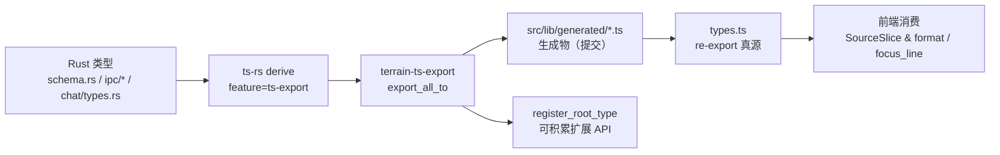

# SChema / IPC（类型真源）领域

**模块路径**：`crates/terrain-core/src/`（schema.rs、ipc/*、ts_ipc.rs）+ 工具 `crates/terrain-ts-export/`
**生成日期**：2026-09-21

---

## 概述

schema / IPC / ts_ipc 是 Terrain **跨语言边界的心脏**：它定义"前端能与后端交换什么形状的数据"，并用 ts-rs 把它同步生成成 `src/lib/generated/` 里的 TypeScript 类型。这里的核心原则用一句话讲透：**Rust 是唯一真源**——任何 IPC 载荷的结构、富化、重命名都发生在 Rust 侧，前端绝不手写重复类型。

可以把它想成**一份外贸合同的"双语条款"**：Rust 侧起草原始条款（schema），tAURI `ipc` 是"发货单"（具体载荷进出），`ts-rs` 是"翻译公证"（生成 TypeScript），前端 `types.ts` 是"进口办"（re-export 而不翻译）。它的价值在省心：字段改名、`Option<T>` 语义（`T | null` 而不是 `undefined`）、枚举变体增删，都由生成器统一传导，前后端永远不会出现"我改了 Rust 忘了改 TS"的静默漂移。`ts_ipc.rs` 里的 `export_dynamic_models` / `register_root_type` 机制则把这个"翻译过程"做成可积累的 API——每个 crate 都能贡献根类型，出儈统一。

---

## 核心功能点

1. **schema.rs（配置与文档类型）**：`DocFrontmatter`（文档 frontmatter：title/slug/version/generated_at 等）、`DynamicModelConfig`（下发到 LLM 的模型参数）、`KnowledgeSettings`/`AcpSettings`/`ModelSettings`（设置三件套）。全部带 `#[cfg_attr(feature = "ts-export", derive(ts_rs::TS))]`。

2. **ipc/*（IPC 层类型）**：`ipc/workflows.rs` 的 `InitWorkflowRequest`/`ProjectInitResult`/`AskStreamEvent`（`ipc/workflows.rs:621`）/`SddPhaseResult`；`ipc/assets.rs` 的 `ScanReport`/`PlanAssetsInput`；`BearerAsset` 等。这让"跨 IPC 边界"的载荷本身也纳入了真源体系。

3. **ts_ipc.rs（导出汇编）**：`export_dynamic_models` 把根类型 + dynamic 模型序列化给 ts-rs 处理；`register_root_type`（`ts_ipc.rs`）让 `terrain-ts-export` 的程序化根类型注册闭环。`ts_export` feature 开启时编译 ts-rs derive，未开启则完全去掉导出成本。

4. **terrain-ts-export（生成器二进制）**：`crates/terrain-ts-export/src/main.rs` 的 `run()` 把 `schema`/`ipc`/`chat` 的根类型 `export_all_to` 到 `src/lib/generated/*.ts`。生成产物**禁止手改**（AGENTS.md 红线）。

5. **前端类型层组装**：`types.ts` re-export `generated`（真源）+ `types.client.ts`（UI 专用扩展），如 `SourceSlice = IpcSourceSlice & { format?, focus_line? }`。UI 专用字段永远放 client 层。

---

## 关键组件

| 组件/类型 | 文件路径 | 核心职责 |
|---------|---------|---------|
| `DocFrontmatter` | `crates/terrain-core/src/schema.rs` | 文档 frontmatter 类型 |
| `DynamicModelConfig` | `crates/terrain-core/src/schema.rs` | LLM 动态参数下发 |
| `KnowledgeSettings`/`AcpSettings`/`ModelSettings` | `crates/terrain-core/src/settings.rs` | 设置三件套 |
| `AskStreamEvent` | `crates/terrain-core/src/ipc/workflows.rs:621` | 流式事件断言（Chunk/Thinking/ToolCall/Phase/Usage/Status） |
| `ProjectInitResult` | `crates/terrain-core/src/ipc/workflows.rs:69` | 初始化结果（+ `ipc_string`） |
| `export_dynamic_models` / `register_root_type` | `crates/terrain-core/src/ts_ipc.rs` | 导出汇编与根类型注册 |
| `terrain-ts-export` | `crates/terrain-ts-export/src/main.rs` | 生成 `src/lib/generated/*.ts` 的二进制 |
| `types.ts` / `types.client.ts` | `src/lib/` | 前端 re-export + UI 扩展 |

---

## 内部数据流

"生产真源 → 生成 TS → 前端消费"三步闭环。生成命令是 `bun run gen:types`（等价 `cargo run -p terrain-ts-export`），产物入库随 Git 流转（`src/lib/generated/` 提交）。

**关键步骤说明**：
1. 真源（schema/ipc/chat/types.rs）：结构体 + `#[cfg_attr(feature = "ts-export", derive(ts_rs::TS))]` 注解是第一步。
2. 导出（terrain-ts-export）：`run()` 里每加一个根类型就 `export_all_to` 一份；生成为完全确定性的文本文件。
3. 提交（src/lib/generated/）：生成物**入库提交**，同行伙伴拿到即最新，不需要本地再跑一次（CI 会跑 `gen:types` + `check` 校验）。
4. 前端（types.ts）：re-export + `types.client.ts` 扩展 UI 专用字段——绝不手写重复 Rust 类型。
5. 校验（`bun run check`）：类型漂移在 CI 的 typecheck 环节炸掉，不会静默潜入。

---

## 关键接口与扩展点

- **`#[cfg_attr(feature = "ts-export", derive(ts_rs::TS))]` + `ts(rename(...))`**：真源声明 + 可读性重命名。`ChatReply → AskKnowledgeReply` 是 rename 的经典案例。
- **`export_dynamic_models`（ts_ipc.rs）**：把 dynamic 模型注册进导出，支持"后续 crate 动态贡献根类型"。
- **扩展「新 IPC 根类型」**：① Rust 结构体 + 注解；② `terrain-ts-export/src/main.rs` `run()` 里 `TypeName::export_all_to(&out)`；③ 跑 `bun run gen:types`；④ 前端对齐 `null`/重名。AGENTS.md 严格规定：**不要手动编辑 `src/lib/generated/`**。
- **`Option<T>` → `T | null`**：Rust `Option` 生成唐 `null`，前端判空需与之一致（不是 `undefined`）。

---

## 与其他模块的交互

| 交互模块 | 方向 | 接口/协议 | 说明 |
|---------|------|---------|------|
| `assets` / `freshness` / `sessions` | 上游 | 内部结构体持 `doc.rs`/`settings.rs` 类型 | 这些模块定义的载荷被 schema 聚合 |
| `chat`（types.rs） | 上游 | `ChatReply`/`ChatMessageReference` | 稳态经 ts-rs 同步前端 |
| `src-tauri` | 消费 | IPC 命令签名 | Tauri handler 的返回类型全部来自真源 |
| `frontend` | 消费 | `generated/*.ts` | 前端类型依赖 |
| `terrain-ts-export` | 编排 | `register_root_type` / `export_all_to` | 根类型注册与生成 |

---

## 跨模块协作场景

**在「给 Ask 加一个流式事件」中**：① `AskStreamEvent` 枚举加 `Status` 变体（`ipc/workflows.rs:621`）；② `run()` 重生成；③ 前端 `stores/chat.svelte` 按新变体渲染。前端完全不手写 Event 类型，`serde_json::Value` 载荷也保证未来字段无损。

**在「设置页展示探活结果」中**：`probe_llm` 返回 `LlmStatus`（model.rs），结构体带 ts-rs 注解，前端按 `ready/message` 渲染状态徽标——类型与 Rust 侧定义永远同步。

**在「最近项目战斗」中**：`add_project` 入 registry 后，`ProjectOverview` 汇编字段（assets_count/freshness_scores）全部来自真源；GUI 不自行捏字典——字典就是 schema。

---

## 性能考量

- **编译期展开，运行期零成本**：ts-rs derive 只影响编译（feature 关闭则无开销），前端类型是纯编译期类型。
- **生成物入库免重跑**：`src/lib/generated/` 提交后，同事前端开箱即可 typecheck，不用等本地跑 Rust 生成。
- **CI 双保险**：`bun run check` 会 typecheck 生成物 + 前端代码，任何"Rust 改了 TS 没跟"都会在合并前暴露。
- **确定性生成**：生成文本稳定，diff 干净，利于 code review 聚焦语义而非格式噪声。

---

## 实现亮点

1. **"生成代替同步"消灭类型漂移**：跨语言边界没有"人工同步"这一步，只有"生成 + 校验"两步——从机制上根除字段漂移类 bug。
2. **`ts_ipc.rs` 的注册式导出**：`register_root_type` 让新 crate 能贡献根类型，导出不是"写死在 main.rs 的一锤子买卖"，而是可积累 API。
3. **`Option<T>` 语义前端显式化**：`T | null` 而非 `undefined` 的前端契约让判空代码一目了然，配合 `types.client.ts` 的 UI 扩展（`SourceSlice & { format? }`）既保真又保形。
4. **双源纪律（真源 vs 客户端扩展）**：`types.ts` 只 re-export、`types.client.ts` 只加 UI 字段——真源与放展的边界清晰，二次意愿有据可查。