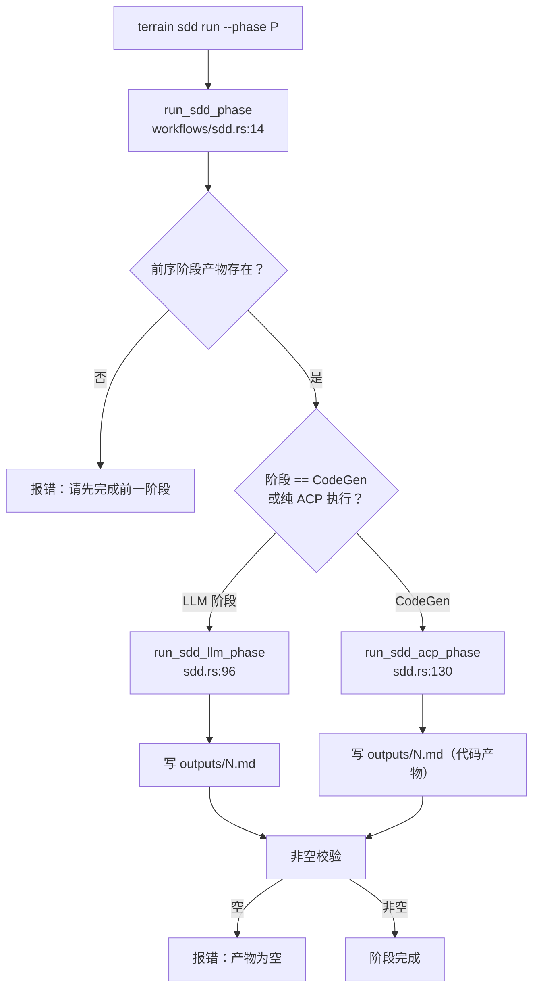

# sdd（标准开发流程）领域

**模块路径**：`crates/terrain-agent/src/sdd.rs` + `crates/terrain-core/src/assets/sdd.rs`
**生成日期**：2026-09-15

---

## 这个模块在做什么

sdd 模块是 Terrain 的"从需求到代码的四阶段流水线"——Requirements → TechDesign → CodeGen → CodeReview。如果把软件开发比作盖房子，sdd 就是那个"先画图纸、再做结构设计、然后施工、最后验收"的标准化流程。每一段都落盘成可回溯的文件，阶段之间以"产物存在性"强制执行顺序——这是一种简单的"签入/签出"机制，确保不会跳步。

这个模块的核心设计是"双执行通路"：前两段（需求/设计）和后一段（审查）交给 Native LLM 逐段精修（这些任务是"写文本 + 判断"，低延迟的 Native LLM 更省），CodeGen 委派给 ACP 编码 Agent 直接在仓库里动笔（这些任务需要"文件级编辑 + 跑测试 + 改配置"，正是富工具 Agent 的强项）。

---

## 核心功能点

1. **四阶段建模**：`requirements`/`tech-design`/`code-gen`/`code-review` 各有一阶段产物；阶段间有 hard guard——前序阶段输出文件不存在则拒绝执行。核心实现在 `crates/terrain-agent/src/workflows/sdd.rs:14`。

2. **LLM 阶段执行**：requirements/tech-design/code-review 走 Native LLM（`run_sdd_llm_phase`），逐段生成并写 `outputs/{N}.md`。核心实现在 `crates/terrain-agent/src/sdd.rs:96`。

3. **CodeGen 阶段执行**：code-gen 走 ACP 子进程（`run_sdd_acp_phase`），注入 `TERRAIN_SDD_SKILL`/`TERRAIN_SDD_WORKSPACE`/`TERRAIN_SDD_OUTPUT`/`TERRAIN_SDD_CODEBASE`/`TERRAIN_LLM_SMALL_MODEL`/`TERRAIN_NON_INTERACTIVE` 环境变量，由编码 Agent 读需求/设计文档并产出代码。核心实现在 `crates/terrain-agent/src/sdd.rs:130`。

4. **会话管理**：每个 `project_slug` 可创建/激活/删除会话，session-id 稳定；非空校验收尾（空产物 → 报错，不静默通过）。核心实现在 `crates/terrain-core/src/sessions.rs`。

---

## 关键组件

| 组件/类型 | 文件路径 | 核心职责 |
|---------|---------|---------|
| `run_sdd_llm_phase` | `crates/terrain-agent/src/sdd.rs:96` | LLM 阶段执行（requirements/tech-design/code-review） |
| `run_sdd_acp_phase` | `crates/terrain-agent/src/sdd.rs:130` | CodeGen 阶段执行（ACP 子进程） |
| `run_sdd_phase` | `crates/terrain-agent/src/workflows/sdd.rs:14` | 入口：前置校验 + 路由派发 |
| `SddRunCommandPayload` | `crates/terrain-core/src/schema/sdd.rs` | 运行载荷（project_slug/phase/session_id/input） |
| 产物命名 | `crates/terrain-core/src/assets/sdd.rs` | `outputs/{N}.md` 阶段序号规范 |
| `phase_prior_output_exists` | `crates/terrain-agent/src/workflows/sdd.rs` | 阶段顺序强制器 |
| Session 管理 | `crates/terrain-core/src/sessions.rs` | SDD session 生命周期与存储 |

---

## 内部数据流

**关键步骤说明**：
1. **前置校验**（`phase_prior_output_exists`）：由 `workflows/sdd.rs` 处理，确保前序阶段产物存在
2. **LLM 执行**（`run_sdd_llm_phase`）：由 `sdd.rs:96` 处理，Native LLM 逐段生成
3. **ACP 执行**（`run_sdd_acp_phase`）：由 `sdd.rs:130` 处理，ACP 子进程在仓库中编码

---

## 关键接口与扩展点

**新增阶段**：加产物名 + guard + 阶段执行函数即可。

**换 ACP 二进制**：改 `TERRAIN_SDD_SKILL` env 或 `AcpSettings.binary` 即可切换到其他编码 Agent。

**与知识联动**：SDD 输入框即"要解决的问题/痛点"，Agent 可借用 Terrain 知识（read-context/read-doc）做约束。

---

## 与其他模块的交互

| 交互模块 | 方向 | 接口/协议 | 说明 |
|---------|------|---------|------|
| workflows | 被依赖 | `run_sdd_phase` | SDD 是 workflows 的一个子流程 |
| chat | 依赖 | `ChatEngine` | LLM 阶段通过 ChatEngine 执行 |
| assets | 依赖 | SDD 资产（skills/提示） | 环境变量注入依赖 assets 模块 |
| settings | 依赖 | `AcpSettings` | 决定走 ACP 还是 Native |

---

## 跨模块协作场景

> 本模块在核心业务流程中的角色

**在 SDD 四阶段开发中**：sdd 是核心执行者。具体参与：
- 用户输入"要解决的问题" → requirements 阶段（Native LLM）→ 产出 `outputs/1.md`
- tech-design 阶段（Native LLM）→ 产出 `outputs/2.md`
- code-gen 阶段（ACP 子进程）→ 产出 `outputs/3.md`（代码）
- code-review 阶段（Native LLM）→ 产出 `outputs/4.md`（审查报告）

---

## 性能考量

- **阶段间强制顺序**：避免用户跳步导致的无效执行
- **非空校验**：确保产物不为空，防止"静默失败"
- **ACP 环境变量注入**：让编码 Agent 能访问需求/设计文档和代码库

---

## 实现亮点

- **"产物存在性"强制顺序**：用简单的文件存在检查替代复杂的状态机，既可靠又易调试
- **双执行通路**：LLM 阶段（低延迟文本生成）和 ACP 阶段（深度工具调用）各取所长
- **session 续传**：每个项目可创建/激活/删除会话，session-id 稳定，支持中断后继续
