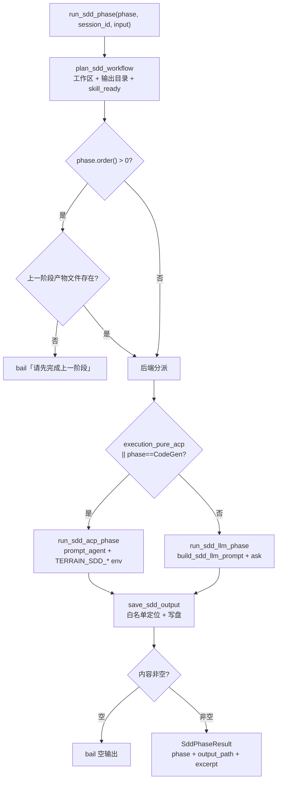

# SDD（标准化开发）领域

**模块路径**：`crates/terrain-agent/src/workflows/sdd.rs` + `crates/terrain-core/src/assets/sdd.rs`
**生成日期**：2026-09-21

---

## 概述

SDD（Standardized Development）是 Terrain 里最"流程化"的工作流：它把软件开发做成**四个严格有序的阶段**——需求（`1.requirements.md`）→ 技术设计（`2.tech-design.md`）→ 实现（`3.implementation.md`）→ 代码评审（`4.code-review.md`）——每个阶段都必须在上一个阶段产出的**文件**存在后才能进行。与"尽力而为"的 Ask 形成鲜明对比，SDD 的气质是**纪律**：上一阶段产物文件不存在，入口直接拒绝（`bail`）并明确指出先完成哪个阶段。

可以把它想成**法学院的分级课程体系**：不修完《基础法学》就不能选《证据法》——课程表是固定顺序的，选了后面的课却缺前置学分，教务处（`run_sdd_phase`）直接退单。工程上它有两个独特设计：一是**"文件即进度"**（`build_phase_infos` 只 stat + 读 mtime，四阶段完成度就是 `outputs/` 下有没有对应文件，删文件即回退进度）；二是**后端分派语义**（文档阶段可以走 native LLM，但 CodeGen 阶段**必须走 ACP**——因为写代码需要 shell 能力，本地 ChatEngine 只有只读工具）。输出落盘有白名单保护（`is_sdd_local_path`），且写盘后内容为空也直接拒绝——"产出是真理，写盘不是筹码"。

---

## 核心功能点

1. **工作流规划（`plan_sdd_workflow`）**：`workflows/sdd.rs:25-29` / `assets/sdd.rs:311`。定工作区（`~/.terrain/sdd/{slug}/{session}/`）、输出目录、`skill_ready` 判定；把 skill 目录解析到 `SddPlan`。SDD 的"版本库"不止是流程文件——resolved skill 也要就位。

2. **阶段执行（`run_sdd_phase`）**：`workflows/sdd.rs:14`。输入 phase + session_id + 用户输入，先校验前置产物，再选后端，最后 `save_sdd_output` 落盘。**前置缺少直接 bail**（"Complete X before Y"语义），绝不静默跳过。

3. **后端分派（`run_sdd_llm_phase` / `run_sdd_acp_phase`）**：`workflows/sdd.rs:114,130`。`execution_pure_acp || phase == CodeGen` 走 ACP；否则走 LLM。ACP 路径用 `sdd_acp_config` 注入 `TERRAIN_SDD_SKILL`/`TERRAIN_SDD_WORKSPACE`/`TERRAIN_SDD_OUTPUT_DIR`/`TERRAIN_HUMAN_OUTPUT_DIR` 四个环境变量；LLM 路径用 `build_sdd_llm_prompt` 构建"只回 markdown 将直接落盘"的指令。

4. **Prompt 构建（`build_sdd_phase_prompt`）**：`assets/sdd.rs:405`。为 LLM 版组装"前序工件 + 阶段指令 + 当前草稿 + 反馈"。`build_sdd_llm_prompt` 追加"输出会直接写入文件"的系统约束,保证返回的是纯 markdown。

5. **落盘保护（`save_sdd_output`）**：`assets/sdd.rs:176`。`is_sdd_local_path` 白名单（`paths.rs:207`）校验目标在 `~/.terrain/sdd/` 内，内容非空才允许写入 `outputs/{n}.md`；否绝回写。

6. **会话管理（`assets/sdd.rs` 会话集）**：`create_sdd_session` / `delete_sdd_session` / `save_sdd_session` / `set_active_sdd_session`，配合 `SddSessionInfo` / `SddStatus` 类型（`assets/sdd.rs` + `ipc`），让 SDD 的多阶段进度持续可查。

7. **阶段信息（`build_phase_infos`）**：`assets/sdd.rs:287`。只 stat 四个 md 文件 + mtime，产出每阶段"完成/未完成"与时间戳；无大文件读取。

---

## 关键组件

| 组件/类型 | 文件路径 | 核心职责 |
|---------|---------|---------|
| `run_sdd_phase` | `crates/terrain-agent/src/workflows/sdd.rs:14` | 阶段执行唯一入口（前置校验 + 分派 + 落盘） |
| `plan_sdd_workflow` | `crates/terrain-agent/src/workflows/sdd.rs:25` / `assets/sdd.rs:311` | 工作区/输出目录/skill_ready 规划 |
| `run_sdd_llm_phase` | `crates/terrain-agent/src/workflows/sdd.rs:114` | native LLM 阶段执行 |
| `run_sdd_acp_phase` | `crates/terrain-agent/src/workflows/sdd.rs:130` | ACP 阶段执行（CodeGen 强制） |
| `build_sdd_phase_prompt` / `build_sdd_llm_prompt` | `crates/terrain-core/src/assets/sdd.rs:405,311` | 阶段/LLM prompt 构建 |
| `save_sdd_output` | `crates/terrain-core/src/assets/sdd.rs:176` | 白名单 + 非空落盘 |
| `is_sdd_local_path` | `crates/terrain-core/src/paths.rs:207` | 输出路径白名单 |
| `build_phase_infos` | `crates/terrain-core/src/assets/sdd.rs:287` | 阶段文件完成度探查（stat/mtime） |

---

## 内部数据流

一次阶段执行的完整链路：规划 → 前置校验 → 后端分派 → prompt → 执行 → 落盘校验。注意三条硬约束都在关键时刻"说不"——前置缺失 bail、路径越界拒绝、内容为空拒绝。

**关键步骤说明**：
1. 规划（sdd.rs:25）：`SddPlan` 定死工作区与输出目录，skill 就位性由 `skill_ready` 先行判断。
2. 前置校验（sdd.rs:31-45）：`is_file()` 一次 stat，缺文件直接 bail，指名阶段——"文件即进度"的严格版。
3. 分派（sdd.rs:52-68）：`execution_pure_acp || phase == CodeGen` 走 ACP，否则 LLM——写代码必须 shell，语义边界清晰。
4. 执行（ACP / LLM）：ACP 给四个 `TERRAIN_SDD_*` 环境变量；LLM 用"只回 markdown 将落盘"约束。
5. 落盘（assets/sdd.rs:176）：`is_sdd_local_path` 白名单 + 空内容拒绝——写盘不是成功标准，产出内容才是。

---

## 关键接口与扩展点

- **`run_sdd_phase(phase, session_id, user_input)`**：四阶段入口内的唯一 API；`SddPhaseArg`（CLI 的 `--phase requirement/design/implementation/code-review`）直接映射到此。
- **`build_phase_infos`**：阶段完成度查询接口——GUI SDD 面板的进度环与确认下一步的基础。
- **扩展「新阶段」**：① `SddPhase` 枚举加变体（含 `order()` 返回顺序）；② 对应 md 文件名进 `build_phase_infos` 的 stat 集合；③ `workflows/sdd.rs` 分支补 `CodeGen` 判定。前置校验、白名单落盘、非空检查全程复用。
- **`is_sdd_local_path`**：白名单切安全边界；任何输出落盘都先问它。

---

## 与其他模块的交互

| 交互模块 | 方向 | 接口/协议 | 说明 |
|---------|------|---------|------|
| `acp` | 依赖 | `sdd_acp_config` / `execution_pure_acp` | CodeGen 强制 ACP（四大 env 注入） |
| `chat`（ask_knowledge） | 依赖 | `build_sdd_llm_prompt` + `ask_knowledge` | 文档阶段的 native 后端 |
| `assets` | 依赖 | `plan_sdd_workflow` / `build_sdd_phase_prompt` / `save_sdd_output` / session CRUD | 纸面管理与落盘 |
| `paths` / `doc` | 依赖 | `is_sdd_local_path` / 输出目录解析 | 路径安全边界 |
| `src-tauri` | 消费 | `run_sdd_phase_cmd` / `sdd-progress` | GUI SDD 面板 |
| `terrain-cli` | 消费 | `terrain sdd --phase ...` | 终端/流水线阶段执行 |

---

## 跨模块协作场景

**在「GUI SDD 面板做技术设计」中**：用户选了 Design 阶段 → `run_sdd_phase_cmd(design, session_id, input)` → `plan_sdd_workflow` 定工作区 → 前置校验看到 `1.requirements.md` 存在 → 后端分派（非 CodeGen → LLM）→ `build_sdd_llm_prompt`（只带 req 的前序工件 + 草稿）→ `ask_knowledge` 出 markdown → `save_sdd_output` 写 `2.tech-design.md` → `SddPhaseResult` 回 UI。用户在此面板内继续下一步，同一 session 自动接力。

**在「CLI/流水线跑 CodeGen」中**：`terrain sdd --phase implementation --project org/repo --input "..."` → `execution_pure_acp || phase == CodeGen` 为真 → `run_sdd_acp_phase` → `sdd_acp_config` 注入四个 env → ACP Agent 在 `TERRAIN_SDD_WORKSPACE` 内真改仓库文件并写 `3.implementation.md` 摘要后返回。**代码必须真入库，agent 不能只产出描述**——这正是选 ACP 的语义。

---

## 性能考量

- **只 stat 不读正文**：`build_phase_infos` 判定完成度只 `is_file()` + 读 mtime，不读四个 md 内容——阶段进度查询近乎零成本。
- **Prompt 只带前序工件**：`build_sdd_llm_prompt` 只把"前一个阶段文件的全文 + 草稿"拼进 prompt，不每阶段转储全部历史，token 可控。
- **ACP 单会话往返**：CodeGen 用一次 `prompt_agent` 完成全部写盘任务，避免多轮 token 膨胀。
- **白名单校验廉价**：`is_sdd_local_path` 是纯路径前缀比较，无 IO。

---

## 实现亮点

1. **"文件即进度 + 删文件即回退"**：四个 md 文件的存在与否就是阶段完成度的全部真相，无数据库、无隐藏状态——SDD 的"状态机"是文件系统本身。
2. **CodeGen 强制 ACP 的语义边界**：文档可以交给只读的 native LLM，写代码必须交给能跑 shell 的 ACP——"能改文件的能力"被当作分派标准而非"任务复杂程度"。
3. **三重"说不"的纪律**：前置缺失 bail、输出越界拒绝、内容为空拒绝——三处硬约束让"流程纪律"不是口号而是编译进代码的行为。
4. **白名单即权限域**：`is_sdd_local_path` 让"输出只能落在 `~/.terrain/sdd/`"从约定变成强制，模型/Agent 无法把文件写到任何不想写的地方。