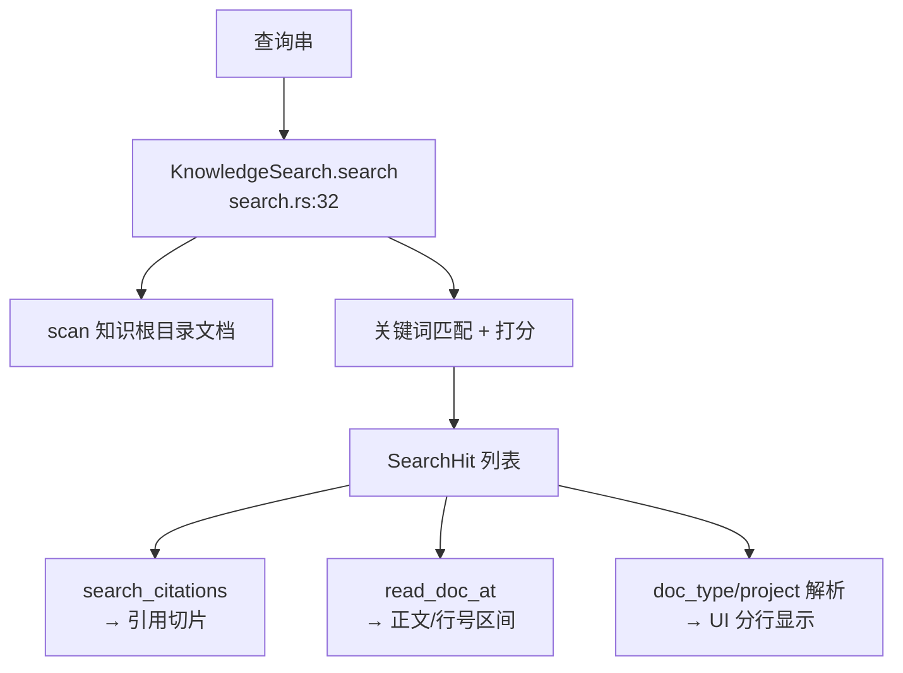

# search（知识检索）与 session（Ask 会话）领域

**模块路径**：`crates/terrain-core/src/search.rs` + `crates/terrain-agent/src/chat/tracker.rs`
**生成日期**：2026-09-15

---

## 这个模块在做什么

search 模块是知识库的"取件柜台"——它让人类、Ask 引擎与外部 Agent 都能在 `.terrain/` 里全文检索并定位到具体文件与行号。如果把知识资产比作图书馆里的书籍，search 就是那个"帮你找到哪本书、哪一页、哪一段"的智能检索系统。

这个模块的简洁性是它最大的优势——`KnowledgeSearch` 是一个纯函数式的检索器，不维护状态、不依赖 LLM，只做"匹配 + 打分 + 返回结果"。这使得它能被多个消费者同时使用：CLI 的 `terrain search`、Ask 的 `search_knowledge` 工具、外部 Agent 的 `terrain tools search`、UI 的知识阅读器。

---

## 核心功能点

1. **全文检索**：`KnowledgeSearch::search(query)` 在知识根目录的文档内容中匹配关键词，返回 `SearchHit`（path、rel_path、project、doc_type、title、snippet、score）。核心实现在 `crates/terrain-core/src/search.rs:32`。

2. **引用组装**：`search_citations(path, start, end)` 从命中切片抽出引用区间，供 Ask 回答的"证据链"展示。核心实现在 `crates/terrain-core/src/search.rs`。

3. **精确读档**：`read_doc_at` 按 rel path + 行号区间读取文档正文（`terrain tools read-doc` 同款）。核心实现在 `crates/terrain-core/src/search.rs`。

4. **doc_type/project 解析**：把命中结果归属到 `.terrain/` 内的人类/知识/接口等类别，便于 UI 分行显示。

---

## 关键组件

| 组件/类型 | 文件路径 | 核心职责 |
|---------|---------|---------|
| `KnowledgeSearch` | `crates/terrain-core/src/search.rs:32` | 检索器主体 |
| `SearchHit` | `crates/terrain-core/src/search.rs` | 命中条目（path/rel_path/project/doc_type/title/snippet/score） |
| `SearchMode`/`SearchOptions` | `crates/terrain-core/src/search.rs` | 检索范围与模式 |
| `search_citations` | `crates/terrain-core/src/search.rs` | 从命中切片抽出引用区间 |
| `read_doc_at` | `crates/terrain-core/src/search.rs` | 按路径+行号读取文档正文 |
| `ChatSession` 状态 | `crates/terrain-agent/src/chat/tracker.rs` | Ask 会话的 active/closed 流与 turn 数 |

---

## 内部数据流

**关键步骤说明**：
1. **检索**（`KnowledgeSearch::search`）：由 `search.rs:32` 处理，在知识根目录文档中匹配关键词
2. **引用组装**（`search_citations`）：由 `search.rs` 处理，从命中切片抽出引用区间
3. **精确读档**（`read_doc_at`）：由 `search.rs` 处理，按路径+行号读取正文

---

## 关键接口与扩展点

**加收藏/热门排序**：只需扩展 `SearchHit` 字段与打分逻辑。

**加倒排索引**：需新层面而不动接口——`KnowledgeSearch` 的接口是"给查询返回结果"，内部实现可自由替换。

---

## 与其他模块的交互

| 交互模块 | 方向 | 接口/协议 | 说明 |
|---------|------|---------|------|
| chat | 被依赖 | `search_knowledge` 工具 | Ask 的 Native Agent 注册搜索工具 |
| workflows | 被依赖 | `fallback_search_reply` | LLM 不可用时降级为纯检索 |
| cli | 被依赖 | `terrain search` | CLI 搜索命令直接调用 |
| tauri | 被依赖 | UI 知识阅读器 | 桌面端搜索功能 |
| assets | 依赖 | 知识根目录路径 | 搜索范围由 assets 定义 |

---

## 跨模块协作场景

> 本模块在核心业务流程中的角色

**在 DeepWiki Ask 中**：search 是知识检索的核心。具体参与：
- Native Agent 的 `search_knowledge` 工具调用 `KnowledgeSearch::search`
- `search_citations` 组装引用区间，展示在回答的"证据链"中
- `fallback_search_reply` 在 LLM 不可用时直接返回搜索结果

**在 CLI 搜索中**：search 是独立功能。具体参与：
- `terrain search <query>` → `KnowledgeSearch::search` → 返回 `SearchHit` 列表

---

## 性能考量

- **纯函数式**：不维护状态、不依赖 LLM，检索速度取决于文档数量和查询复杂度
- **doc_type 解析**：命中结果自动归属类别，减少 UI 端的二次处理

---

## 实现亮点

- **简洁的接口设计**：`KnowledgeSearch` 只做"匹配 + 打分 + 返回"，职责单一、易于测试
- **多消费者共享**：CLI、Ask、外部 Agent、UI 四个消费者共享同一个检索器，确保结果一致
- **引用组装**：从命中结果中自动抽出引用区间，让 Ask 回答有"证据链"支撑
