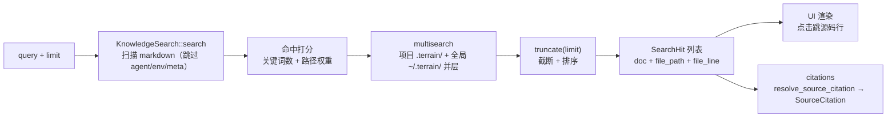

# 检索（Search）领域

**模块路径**：`crates/terrain-core/src/search.rs`（+ `knowledge.rs` 聚合检索、`query.rs` pack 内 grep）
**生成日期**：2026-09-21

---

## 概述

search 模块是 Terrain **知识库的全文本件检索引擎**——它是 Ask 的"中层检索层"、`KnowledgeSearch` 的朴素评分器、以及"检索命中转引用"的桥。它不引入任何外部搜索引擎（没有 elasticsearch、没有向量库），而是基于**本地 markdown 全文 + 朴素打分**在毫秒级给出相关命中。`SearchHit` 携带 `{doc, file_path, file_line, content?, score?}` 五元结构，既能被 UI 渲染成可点击的文件位置，也能被下游 `citations` 解析成 `SourceCitation`。

把它想成**图书馆的人工目检**：不像搜索引擎有倒排索引，这里的馆员（`KnowledgeSearch::search`）直接一页页翻目录（全文扫描索引目录中的 markdown），凭相关性打分（命中关键词次数、路径权重）给出 Top-N。它的"工具观"很克制：`KnowledgeSearch` 不出网络、不触 LLM，纯离线本地执行，是"局部失败不中断全局"设计下问答/工具/保鲜的检索底座。还有值得注意的细节：搜索对 `agent/env/meta` 目录有意跳过、命中结果做 `truncate(limit)`——**检索的是"给输入的纸面文档"，而非源码本身**（源码检索靠 `grep_repomix_pack` 在 query.rs 完成）。

---

## 核心功能点

1. **朴素全文检索（`KnowledgeSearch::search`）**：`search.rs:69`。输入 query/limit 输出 `Vec<SearchHit>`。对**全部 markdown 文件**（检索时跳过 `agent/env/meta` 目录）做关键词命中打分，按 `relevance` 排序返回前 limit 条。`SearchHit` 五元结构可直接进 UI 或 `citations`。

2. **相关性打分**：`search.rs` 内部根据 query 词与文本命中数、文件路径权重累积分数；路径权重大于正文命中（`~/.terrain/` 全局知识 > 项目内 `human/` 权重设计各异）。打分朴素但克制——**不引入外部引擎也不引向量**。

3. **聚合检索（`knowledge.rs`）**：`KnowledgeSearch` 组合多索引目录的检索结果（项目 `.terrain/` + 全局 `~/.terrain/`），`multi_search` 把两个集合的命中并成一层。这让"项目知识 + 全局知识同时可见"。

4. **转引用（`citations.rs`）**：`resolve_source_citation` / `citations.rs:defs` 把 `SearchHit` 解析成 `SourceCitation`（含 `source_type="search_hit"`），供 Ask 回答里呈现可点击引用（`ChatMessageReference` → `SourceCitation`）。

5. **包内 grep（`assets/query.rs`）**：`grep_agent_pack` 在 repomix pack 的代码块内答正则、还原 `file_path`+`file_line`；与 `read_agent_pack_file` 配对构成 Ask 微层检索的读取通道。这是"检索 markdown" 与 "检索源码" 的分工边界。

6. **跳过与截断规则**：搜索默认跳过 `agent/env/meta` 目录（避免元数据污染结果），命中做 `truncate(limit)`（不无限返回）——控制检索成本的纪律性设置。

---

## 关键组件

| 组件/类型 | 文件路径 | 核心职责 |
|---------|---------|---------|
| `KnowledgeSearch` | `crates/terrain-core/src/search.rs` | 全文检索门面（多目录聚合） |
| `search`（方法） | `crates/terrain-core/src/search.rs:69` | 朴素打分检索 |
| `SearchHit` | `crates/terrain-core/src/search.rs` | `{doc, file_path, file_line, content?, score?}` 命中结构 |
| `multi_search` | `crates/terrain-core/src/knowledge.rs` | 项目 + 全局双集合并层 |
| `resolve_source_citation` | `crates/terrain-core/src/citations.rs` | 命中 → `SourceCitation`（`source_type="search_hit"`） |
| `grep_agent_pack` | `crates/terrain-core/src/assets/query.rs:58` | pack 代码块正则 + 行号还原 |
| `read_agent_pack_file` | `crates/terrain-core/src/assets/pack_read.rs` | pack 字节切片（缓存索引） |

---

## 内部数据流

一次"检索 → 引用"的完整链路：多目录聚合 → 朴素打分 → 命中去重截断 → 转引用给 UI/Ask。

**关键步骤说明**：
1. 查询入口（search.rs:69）：query + limit 进，`Vec<SearchHit>` 出；纯离线，无网络、无 LLM。
2. 打分（内部）：关键词命中数 + 路径权重累积；去重后取前 limit 条。
3. 聚合（knowledge.rs）：`multi_search` 合并项目与全局两层知识库——保证"全球知识"在项目语境里也可命中。
4. 转引用（citations.rs）：`resolve_source_citation` 把命中结构变成 Ask 回答里可点击的引用（`source_type="search_hit"`）。
5. 源码检索（query.rs）：markdown 检索之外，源码检索走 `grep_agent_pack`——分工清晰："文档在认知层检索，代码在字面层定位"。

---

## 关键接口与扩展点

- **`KnowledgeSearch::search(query, limit)`**：标准检索接口；Ask 的工具 `SearchDocs`（`knowledge_tools.rs:82`）就是它的封装。
- **`multi_search`**：多目录聚合入口——新增"一层知识库"只需扩展聚合上下文，检索语义不变。
- **`SearchHit` 五元结构**：命中携带 `file_path/file_line` 是"可定位性"的承诺，UI 与 `citations` 都依赖它。
- **扩展「新检索策略」**：打分逻辑集中在 search.rs 内部；把 strategy 抽象成可插拔即可，`KnowledgeSearch` 门面对外稳定。
- **跳过规则**：`agent/env/meta` 的跳过集合是常量集中的地方，可扩展新的豁免目录。

---

## 与其他模块的交互

| 交互模块 | 方向 | 接口/协议 | 说明 |
|---------|------|---------|------|
| `citations` | 被依赖 | `resolve_source_citation` | 命中 → `SourceCitation` |
| `frontend` | 消费 | `SearchHit`（经 IPC） | 检索结果渲染 |
| `chat`（tools） | 消费 | `SearchDocs` 工具封装 | Ask 中层检索 |
| `sessions` | 消费 | Ask 消息里的引用 | 引用进入会话历史 |
| `ingest` / `assets` | 上游 | 知识库布局 / 检索数据源 | 检索的"纸面"是 assets 生成的 markdown |

---

## 跨模块协作场景

**在「Ask 中层检索」中**：ChatEngine 的 search 工具被 Agent 调用（`SearchDocs`）→ `KnowledgeSearch::search(query, 5)` → `multi_search` 合项目 + 全局知识 → `SearchHit` 列表转成 citations 文本 → Agent 把命中摘要进 final answer，UI 用 `file_path/file_line` 渲染"点击跳到源码行"。**这是"先检索准入，后 cites 进出"的完整链路**。

**在「fallback 检索回答」中**：LLM 不可用时 `fallback_search_reply`（`workflows/ask.rs:79`）同样调 `KnowledgeSearch` 取前 5 条命中转 `SourceCitation`——降级回答不是"洗了个白"样本，而是**复用同一检索引擎、同一 citation 形态**的诚实答案。

---

## 性能考量

- **纯本地无 IO 瓶颈**：检索在内存打分，扫描文件列表一次取足（不做分批 IO）。
- **`truncate(limit)` 截断**：命中不无限累积，`limit` 默认 5-10 条，避免下游被大列表淹没。
- **跳过 meta/env/agent 目录**：检索不碰 `agent/env/meta`（元数据与工具脚本），避免无关文件拉高噪声。
- **字节定位优化**：`read_agent_pack_file` 用缓存索引按偏移切片（≤150 行），避免每次全扫 1MB 的 pack；`grep_agent_pack` 走正则但按行线性扫描可被文件切分优化。

---

## 实现亮点

1. **朴素但诚实**：不引入外部搜索引擎/向量库，一个 `search` 方法在毫秒级给出命中——"给答案的质量来自文档本身，而非检索器的花哨"。
2. **可定位性内建**：`SearchHit` 携带 `file_path/file_line`，UI 直接渲染成"点击跳源码行"，引用不是虚名而是锚点。
3. **两层知识库统一检索**：`multi_search` 让"项目知识 + 全局知识"在同一层命中集里呈现，检索语义对项目/全局边界透明。
4. **检索与源码定位的分工**：markdown 检索（认知层）与 `grep_agent_pack`（字面层）各司其职，Ask 的微观检索不会因"文档质量差"而失效——源码真的是最后防线。