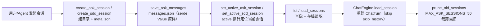

# 会话（Sessions）领域

**模块路径**：`crates/terrain-core/src/sessions/mod.rs` + `assets/ask.rs` + `assets/sdd.rs`（会话 CRUD 实现）
**生成日期**：2026-09-21

---

## 概述

sessions 模块管理 Terrain 的**会话生命周期**：Ask 会话（问答历史）与 SDD 会话（四阶段进度）的创建、读取、保存、激活、删除。底层不是数据库，而是**按会话目录落盘的 JSON 文件**（`~/.terrain/sessions/{slug}/ask/{session_id}/` 与 `~/.terrain/sessions/{slug}/sdd/{session_id}/`）——每个会话一个目录，目录内 `meta.json` + `messages.json`（Ask）或阶段产出文件（SDD）。`SddStatus`/`SddSessionInfo`/`AskSessionInfo` 是会话对外界的结构化肖像。

把它想成**茶馆的茶杯寄存柜**：每个茶客（会话）在柜子（`sessions` 目录）有一个格子（`session_id` 子目录），格子里放的是一本记录每一次交谈（`messages.json`）的册子和一张客人名卡（`meta.json`）。柜员（`UserService`-ish 的 CRUD）负责开格、取册、归还、注销；`active` 指针就是柜台上"现在这客人在哪一格"的标记。它的工程重点是**干净的状态切分**：会话数据活在文件树，`active/ask/sdd` 指针活在 UID 层，两者由 `SddStatus` / `AskSessionInfo` 验证交联——不搞临时内存里的"当前呢"。

---

## 核心功能点

1. **Ask 会话 CRUD（`assets/ask.rs`）**：`create_ask_session` / `list_ask_sessions` / `load_ask_session` / `save_ask_session` / `delete_ask_session` / `set_active_ask_session`。每会话目录 `meta.json`（`id + title + created_at + updated_at`）与 `messages.json`（`serde_json::Value` 直接存储）。

2. **Ask 消息持久化（`save_ask_messages`）**：`assets/ask.rs:259`。把消息数组原样以 `serde_json::Value` 写 `messages.json`——不解释消息语义，存储与业务解耦，未来字段无损。

3. **SDD 会话与状态（`assets/sdd.rs`）**：`create_sdd_session` / `list_sdd_sessions` / `save_sdd_session` / `set_active_sdd_session` / `delete_sdd_session`。`SddSessionInfo` + `SddStatus`（`status.rs`）把阶段进度（`build_phase_infos`）与工作流/输出目录绑定。

4. **激活指针（`SddStatus` / active）**：`active` 会话指针由 `set_active_*_session` 维护，UI 与 CLI 通过抢取"当前会话"定位继续执行；销毁时摘要提示"active 会话将不可用"。

5. **会话裁剪（`prune_old_sessions`）**：Ask 会话在 `MAX_ASK_SESSIONS=50` 阈值下按 mtime 裁剪最旧，防知识目录无限膨胀。

6. **会话重建（`chat/mod.rs:load_session`）**：读历史但跳过 `skip_history` 标记维护（tracker.rs），组装 `ChatTurn` 供 ChatEngine 续聊；save 时由 tracker 明确 skip history 写盘。

---

## 关键组件

| 组件/类型 | 文件路径 | 核心职责 |
|---------|---------|---------|
| Ask 会话 CRUD（`create/list/load/save/delete/set_active`） | `crates/terrain-core/src/assets/ask.rs` | Ask 会话目录 + meta/messages JSON |
| `save_ask_messages` | `crates/terrain-core/src/assets/ask.rs:259` | `messages.json` 原样持久化 |
| SDD 会话 CRUD（`create/list/save/set_active/delete`） | `crates/terrain-core/src/assets/sdd.rs` | SDD 会话与阶段进度 |
| `AskSessionInfo` | `crates/terrain-core/src/sessions/mod.rs` | Ask 会话结构化肖像（id/title/created/updated） |
| `SddSessionInfo` / `SddStatus` | `crates/terrain-core/src/status.rs` / `sessions/mod.rs` | SDD 会话肖像 + 活动状态指针 |
| `prune_old_sessions` | `crates/terrain-core/src/assets/ask.rs` | 会话数量裁剪（`MAX_ASK_SESSIONS=50`） |
| `load_session` | `crates/terrain-agent/src/chat/mod.rs:219` | 重建 `ChatTurn` 列表（跳过 skip_history） |

---

## 内部数据流

会话目录的生命线：创建目录 → 写 meta/messages → 激活指针 → 读取重建 → 会话被裁剪。所有状态以文件树为准，指针只是"捷径"。

**关键步骤说明**：
1. 创建（assets/ask.rs:150）：建会话目录 + `meta.json`（id/title/created_at/updated_at）。
2. 保存（assets/ask.rs:259）：`save_ask_messages` 把任意消息数组原样写 `messages.json`——存储不解语义。
3. 激活（set_active_*）：`SddStatus`/active 指针把"现在在哪"/"哪一段激活"从内存搬到文件状态。
4. 读取（chat/mod.rs:219）：`load_session` 读取历史但跳过 `skip_history` 标记消息，供 ChatEngine 继续问答。
5. 裁剪（prune_old_sessions）：超过 50 条按 mtime 淘汰最旧会话，知识目录有界。

---

## 关键接口与扩展点

- **`create_ask_session / save_ask_session / list_ask_sessions / delete_ask_session / set_active_ask_session`**：Ask 会话五件套；前端会话列表与"新建会话"都走它们。
- **`create_sdd_session / set_active_sdd_session / save_sdd_session`**：SDD 会话三件套；`SddStatus` 让"进行到哪个阶段"持续可查。
- **扩展「新会话类型」**：① `sessions/mod.rs` 加类型 + 结构肖像；② `assets/` 加 CRUD 实现（复用目录布局 + JSON 落盘）；③ `ipc` 加查询/指令变体。存储机制全程复用。
- **`MAX_ASK_SESSIONS`**：会话数量的软上限，改常量即调裁剪策略。

---

## 与其他模块的交互

| 交互模块 | 方向 | 接口/协议 | 说明 |
|---------|------|---------|------|
| `chat` | 消费 | `load_session` / `save_ask_messages` | 会话续聊的重建与保存 |
| `assets` | 周边 | 会话 CRUD 实现在 assets/ask.rs、sdd.rs | 存储层挂在资产工厂下 |
| `sdd` | 消费 | session_id 定位 + `build_phase_infos` | 阶段进度以会话目录为根 |
| `ipc` | 提供 | `AskSessionInfo`/`SddStatus` 负载 | 会话肖像走 IPC 给前端 |
| `src-tauri` | 消费 | 会话列表 / 激活 / 删除命令 | GUI 会话栏与恢复 |
| `terrain-cli` | 消费 | sessions / `--session_id` 参数 | CLI 问答与 SDD 接力 |

---

## 跨模块协作场景

**在「恢复一个 Ask 会话」中**：用户点会话列表 → `list_ask_sessions` 读 `~/.terrain/sessions/{slug}/ask/` → 选会话 → `load_ask_session` 读 meta + messages → `ChatEngine.load_session` 重建 `ChatTurn`（跳过 skip_history）→ 继续问答，历史上下文不丢。**会话恢复是无状态的（读文件即得）**。

**在「SDD 多阶段接力」中**：用户在第一阶段建 session，`SddStatus` 记录 active 指针；`run_sdd_phase_cmd(phase=design, session_id)` 里 `plan_sdd_workflow` 读 `outputs/` 就位检查，`save_sdd_session` 推进 active 指针——四阶段各自 `outputs/{n}.md` 与 active 指针共同构成"到哪了"。删会话即删目录，进度随之消失，**没有数据库回滚**。

---

## 性能考量

- **小文件 JSON**：meta 几 KB、messages 通常几十 KB，读与写毫秒级。
- **目录遍历即列表**：`list_*_sessions` 直接扫 `sessions/{slug}/*/` 目录，无索引可维护。
- **`prune_old_sessions` 有界**：会话总量被 `MAX_ASK_SESSIONS=50` 封顶，目录不会无限增长。
- **无锁无事务**：单用户单机约定保证并发写安全，不引入锁与 WAL 代价。

---

## 实现亮点

1. **"会话即目录"的状态哲学**：Ask/SDD 会话的完整状态就是文件树本身，无隐藏状态、无数据库恢复逻辑——`刷了 sessions 目录`就刷了会话库。
2. **`messages.json` 原样存储**：`save_ask_messages` 用 `serde_json::Value` 直接落盘，不解语义——未来消息字段演进旧存档零迁移。
3. **active 指针与肖像分离**：`SddStatus`/active 指针管"现在是哪"，`AskSessionInfo`/`SddSessionInfo` 管"长什么样"，查与设互不纠缠。
4. **skip_history 的会话语义**：`load_session` 尊重 tracker 的 `skip_history` 标记，会话恢复能"跳过某段不该续聊"而其余历史完整——会话重建不是无脑全量回放。