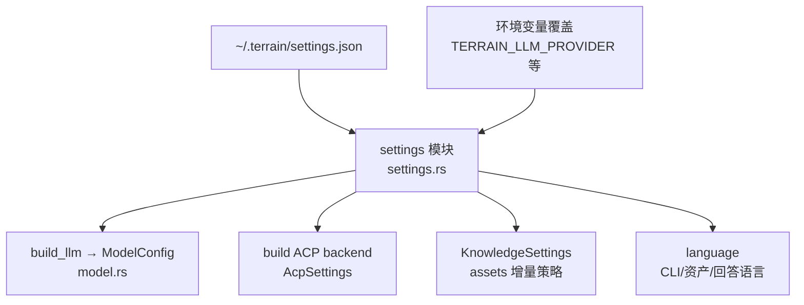

# settings（配置管理）领域

**模块路径**：`crates/terrain-core/src/settings.rs`
**生成日期**：2026-09-15

---

## 这个模块在做什么

settings 模块是全局配置的"中央抽屉"——LLM 提供商、ACP 子进程、知识刷新策略、语言偏好，全部从 `~/.terrain/settings.json` 一处读取、多处消费。如果把 Terrain 比作一家餐厅，settings 就是那个"记录了所有供应商联系方式、库存策略、菜单语言"的管理台账：厨房（core）看它决定用什么食材，采购（agent）看它决定找谁进货，前台（cli/tauri）看它决定用什么语言接待客人。

这个模块的简洁性在于"一处写入、多处消费"——所有配置变更都通过 `settings.json` 一个文件生效，不需要在多个地方同步。环境变量可以临时覆盖配置值，但不写入文件（适合 CI 或临时调试）。

---

## 核心功能点

1. **配置分组**：`AcpSettings`（ACP 子进程配置）、`ModelSettings`（LLM 模型配置）、`KnowledgeSettings`（知识刷新策略）、`language`（语言偏好）。核心实现在 `crates/terrain-core/src/settings.rs:49-148`。

2. **ProviderProfile 多档**：`profiles` 字段支持多套模型配置（如"快速档"和"强力档"），当前生效配置经 `ModelConfig` 传给 LLM 路由。核心实现在 `crates/terrain-core/src/settings.rs`。

3. **环境变量优先**：`TERRAIN_LLM_PROVIDER`/`TERRAIN_MODEL`/`OPENAI_BASE_URL`/`OLLAMA_HOST`/`TERRAIN_ACP_COMMAND` 等可在不写配置前临时切换。核心实现在 `crates/terrain-core/src/settings.rs`。

4. **诊断工具**：`check-llm`/`check-acp` 命令用于诊断配置是否正确。核心实现在 `crates/terrain-cli/src/settings.rs`。

---

## 关键组件

| 组件/类型 | 文件路径 | 核心职责 |
|---------|---------|---------|
| `AcpSettings` | `crates/terrain-core/src/settings.rs:49` | ACP 子进程配置（binary/args/command/agent_execution/auto_approve） |
| `ModelSettings` | `crates/terrain-core/src/settings.rs:133` | LLM 模型配置（provider/model/api_key/base_url/ollama_host/profiles） |
| `KnowledgeSettings` | `crates/terrain-core/src/settings.rs` | 知识刷新策略（incremental_refresh/max_changed_files/incremental_human_docs） |
| `CurrentModelSettings` | `crates/terrain-core/src/settings.rs:135` | 当前生效配置 |
| `ProfileProvider` | `crates/terrain-core/src/settings.rs` | 多档模型配置 |
| 语言偏好 | `crates/terrain-core/src/language.rs` | system/zh-CN/en 枚举与回退 |

---

## 内部数据流

**关键步骤说明**：
1. **配置读取**（`settings_file()`）：由 `settings.rs` 处理，从 `~/.terrain/settings.json` 读取
2. **环境变量覆盖**：环境变量优先级高于文件配置，适合 CI 或临时调试
3. **配置分发**：settings 模块把配置分发给 LLM 路由、ACP 后端、知识策略、语言偏好

---

## 关键接口与扩展点

**新增配置项**：加字段 + 默认值即可，无需修改其他模块。

**新增路由策略/预算上限**：只需在 `ModelSettings` 或 `AcpSettings` 中加字段。

**check-llm/check-acp**：诊断工具，用于验证配置是否正确。

---

## 与其他模块的交互

| 交互模块 | 方向 | 接口/协议 | 说明 |
|---------|------|---------|------|
| chat | 被依赖 | `ModelConfig` / `AcpSettings` | 路由决策和 LLM 配置来源 |
| assets | 被依赖 | `KnowledgeSettings` | 增量策略参数 |
| workflows | 被依赖 | LLM 可用性探测 | workflows 决定是否跳过生成 |
| cli | 被依赖 | `terrain settings get/set` | CLI 设置命令直接调用 |
| tauri | 被依赖 | 桌面端设置面板 | UI 设置读写 |

---

## 跨模块协作场景

> 本模块在核心业务流程中的角色

**在项目初始化中**：settings 决定是否跳过生成。具体参与：
- `run_project_initialization` 检查 LLM/ACP 是否可用（从 settings 读取配置）
- 不可用时跳过 Litho/context 生成，收集 notes

**在 DeepWiki Ask 中**：settings 决定路由。具体参与：
- `ChatEngine` 读取 `AcpSettings.agent_execution` 决定走 Native 还是 ACP
- `ModelConfig` 决定用哪个模型

**在快速刷新中**：settings 决定增量策略。具体参与：
- `KnowledgeSettings.incremental_refresh` 决定是否增量更新
- `incremental_max_changed_files` 决定何时退回全量

---

## 性能考量

- **一处写入**：所有配置变更通过一个文件生效，无需多处同步
- **环境变量优先**：临时覆盖不写入文件，适合 CI 和调试
- **默认值完备**：大部分配置有合理默认值，用户无需全部配置

---

## 实现亮点

- **"一处写入、多处消费"**：settings.json 是唯一的配置源，避免配置分散导致的不一致
- **ProviderProfile 多档**：支持多套模型配置，用户可以根据场景切换（如"快速档"用于日常问答，"强力档"用于复杂推理）
- **环境变量覆盖**：CI 环境可以用环境变量临时切换配置，无需修改文件
