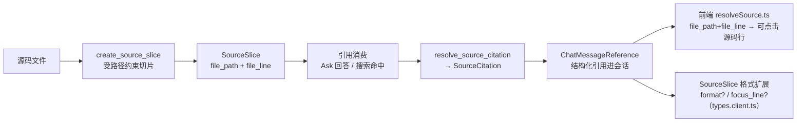

# 源码切片与引用（Source & Citations）领域

**模块路径**：`crates/terrain-core/src/`（source.rs、citations.rs）
**生成日期**：2026-09-21

---

## 概述

source 与 citations 模块负责 Terrain 回答里"**证据链**"的构建与安全：`source.rs` 把仓库里的源码切成**受路径约束的源码切片**（`SourceSlice`），`citations.rs` 把命中/切片解析成**双向可解析的源码引用**（`SourceCitation`）。两件事合起来保证一件事：**Terrain 回答里的任何"我引用了某行代码"，前端都能点到那一行，且切片的路径永远不会越出授权目录**。

可以把它想成**律师的卷宗编号**：律师（Ask/搜索）引用的每一条法规（代码行）务必有"档案号"（`file_path + file_line`），卷宗管理室（`resolve_source_citation`）凭号提卷，而"档案室的范围"（`is_sdd_local_path` 之类白名单）让任何引用都不能指向柜子外。它的工程价值在`两端联动`——**生成端**（切片要安全、带可定位字段）与**消费端**（引用要能解析回路径、前端要能定位到行）——两端都在这两个模块内闭环，之间没有任何「中间翻译层」。

---

## 核心功能点

1. **源码切片（`source.rs`）**：`create_source_slice` / `SourceSlice`（含 `file_path`、`file_line` 等）。安全约束——切片路径受控（`is_sdd_local_path`/白名单），文件读取有上限（避免超大文件拖垮切片）。

2. **引用解析（`citations.rs`）**：`resolve_source_citation` 单一入口，把"引用标识"解析成 `SourceCitation`（含 `source_type`，其中 `search_hit`/`source_slice` 为两种来源形态）。`ChatMessageReference`/`KnowledgeDoc` 等结构化类型挂在 `types.client.ts` 由前端消费。

3. **可定位性（`SourceSlice` 带 `format?`/`focus_line?`）**：前端 `resolveSource.ts` 用切片的 `file_path/file_line` 解析出"点击跳到源码行"的锚点；`focus_line` 是展示时高亮的行。UI 专用扩展放 `types.client.ts`，真源不改。

4. **搜索与切片衔接（`SearchHit` → `SourceSlice`）**：`SearchHit`（`search.rs`）携带 `{doc, file_path, file_line}`，恰是 `resolve_source_citation` 需要的定位原料——检索命中无缝转成可点击引用。

5. **双向语义（生成端与消费端闭环）**：生成端 `create_source_slice` 落可定位字段；消费端 `resolve_source_citation` / `resolveSource.ts` 单向解析回路径+行——没有任何一方在"不知来源"的情况下生产引用。

---

## 关键组件

| 组件/类型 | 文件路径 | 核心职责 |
|---------|---------|---------|
| `SourceSlice` | `crates/terrain-core/src/source.rs` | 源码切片（`file_path`/`file_line` + 内容） |
| `create_source_slice` | `crates/terrain-core/src/source.rs` | 受路径约束的切片生成 |
| `resolve_source_citation` | `crates/terrain-core/src/citations.rs` | 引用标识 → `SourceCitation` |
| `SourceCitation` | `crates/terrain-core/src/citations.rs` | 引用结构（`source_type=search_hit` 等） |
| `SearchHit` 定位原料 | `crates/terrain-core/src/search.rs` | `{doc, file_path, file_line}` |
| `ChatMessageReference` / `KnowledgeDoc` 扩展 | `src/lib/types.client.ts` | 前端消费形态（格式化/聚焦行） |
| `resolveSource.ts` | `src/lib/components/../resolveSource.ts` | 切片 → 可点击源码行 |

---

## 内部数据流

一次引用从"切片生成"到"前端点击定位"的完整链路：源码被切成带定位字段的切片，检索命中/引用经 `resolve_source_citation` 成为结构化引用，前端 `resolveSource.ts` 把它还原成可跳转锚点。

**关键步骤说明**：
1. 切片（source.rs：`create_source_slice`）：路径经白名单校验，文件读取有上限，产出带定位字段的切片。
2. 命中（search.rs）：`SearchHit` 本身就是定位原料——doc/file_path/file_line 齐备。
3. 解析（citations.rs：`resolve_source_citation`）：引用标识解析成 `SourceCitation`，`source_type` 分辨来源形态。
4. 结构化（types.client.ts）：`ChatMessageReference` 承载引用的 UI 消费形态。
5. 定位（resolveSource.ts）：`file_path/file_line` 还原成前端点击锚点，高亮 `focus_line`。

---

## 关键接口与扩展点

- **`resolve_source_citation(identifier)`**：全系统唯一的"引用 → 结构"入口；Ask 引用、搜索命中、Slice 都汇到这一处。
- **`SourceSlice` 的 `format?`/`focus_line?`**：UI 扩展放 `types.client.ts`，真源不改——切片的"双重形态"（机器可读 + 人类可跳）由扩展层承担。
- **扩展「新来源形态」**：在 `SourceCitation.source_type` 加变体，让新来源（如 ACP 返回的 `file_edit`）也能进引用体系。
- **路径白名单**：`is_sdd_local_path`（`paths.rs:207`）是切片与引用授权的"范围墙"，越界写一律拒绝。

---

## 与其他模块的交互

| 交互模块 | 方向 | 接口/协议 | 说明 |
|---------|------|---------|------|
| `search` | 供应原料 | `SearchHit`（doc/file_path/file_line） | 命中无缝转引用 |
| `chat` | 消费 | `ChatMessageReference` / citations | Ask 回答的可点击引用 |
| `sessions` | 消费 | 引用进会话历史 | Ask 消息里的引用随会话持久化 |
| `paths` | 依赖 | `is_sdd_local_path` 白名单 | 路径授权墙 |
| `frontend` | 消费 | `resolveSource.ts` / `types.client.ts` | 前端定位与格式 |
| `assets`（pack） | 信息来源 | repomix pack 内的代码块 | 微层切片的底料（源码） |

---

## 跨模块协作场景

**在「Ask 回答的引用」中**：Agent 调 `SearchDocs`/`GrepPack` 拿到命中（含 file_path/file_line）→ `resolve_source_citation` 变 `SourceCitation` → 组装进 `ChatReply` 的 citations → 前端 `ChatMessageList` 渲染每个引用为"文件名:行号"点击项 → 用户点击，`resolveSource.ts` 把 file_path+file_line 解析成项目内绝对路径并打开/高亮该行。**引用不是装饰，是可执行的锚点**。

**在「本地检索的 fallback 回答」中**：LLM 不可用时 `fallback_search_reply` 取前 5 条 `SearchHit` 转 `SourceCitation`（`source_type="search_hit"`）——降级回答里用户照样能点击每条引用跳源码，证明"引用体系"与 LLM 是否在线完全解耦。

---

## 性能考量

- **文件读取上限**：切片对超大文件设限额，避免一次"引用我第 4000 行"拖垮内存。
- **定位即常量时间**：`resolve_source_citation` 只做路径/行解析，无 IO——引用解析近乎零成本。
- **字节定位 by pack_read**：源码切片走 `read_agent_pack_file` 的缓存索引（偏移切片 ≤150 行），不做全文件线性扫。
- **白名单检查廉价**：`is_sdd_local_path` 是纯前缀比较，每条引用一个常量级检查。

---

## 实现亮点

1. **"引用双向闭环"**：生成端 `create_source_slice` 落可定位字段、消费端 `resolveSource.ts` 还原锚点——整个"证据链"闭环在 model 层与 UI 层各自落地，中间没有翻译歧义。
2. **路径白名单即授权域**：`is_sdd_local_path` 把"切片能指向哪"锁死在同一处，引用安全性不依赖业务调用方自觉。
3. **真源与 UI 扩展分离**：`SourceSlice` 真源在 source.rs，`format?`/`focus_line?` 扩展在 `types.client.ts`——既满足 ts-rs 单源纪律，又不污染后端语义。
4. **来源形态透明**：`source_type` 让每一个引用都能回答"我是从检索命中来的还是源码切片来的"，Ask 回答里可排查、可审计。