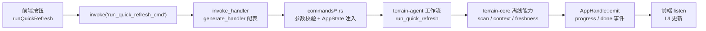

# Tauri 桌面壳（Tauri Shell）领域

**模块路径**：`src-tauri/src/`（lib.rs、main.rs、commands/*、tray.rs、env_catalog.rs、preset_skills.rs、bundled_tools.rs）
**生成日期**：2026-09-21

---

## 概述

Tauri 壳是 Terrain 的**桌面门户**：它把 `terrain-core`/`terrain-agent` 的能力组装成 57 个可 `invoke` 的 IPC 命令，建立托盘、资源注入、进度/流式事件，并负责 GUI 进程的生命周期。它是"薄层"——不写业务逻辑，只做参数校验、状态注入与事件桥接——但这个薄层决定了桌面体验的全部气质：**命令可点、进度可看、流式可滚**。

把它想成**酒店的礼宾台**：住客（前端）一提要求，礼宾（`AppState` + `invoke_handler`）先核对需求（参数），再让值班员（Rust 命令实现）干活，同时用对讲机（`AppHandle::emit`）回播进度；礼宾部（`tray.rs`）则在酒店门外维护服务形象（托盘菜单）。工程上最重要的克制是**"壳不执行业务"**：扫描、生成、问答的实现都在 `terrain-core`/`terrain-agent`，`src-tauri` 只负责把它们变成"可点击 + 可观测"。`tray` 一旦发生（如 `quit`）、`cli` 也能独立干活——**GUI 只是一个入口，不是实现的唯一入口**。

---

## 核心功能点

1. **命令清单（`invoke_handler`）**：`src-tauri/src/lib.rs:35`。`generate_handler![...]` 注册 57 个命令函数，覆盖 assets、ask、chat、docs、env、initialize、knowledge、project、sdd、search、sessions、settings、usage、litho 等域。任何一个前端 invoke 都落在这张表内。

2. **状态注入（`AppState`）**：`src-tauri/src/lib.rs`。`AppState` 持有 `Reader<Runtime>`/`Runtime` + 项目路径解析；命令通过 `state()` 取用，注入统一、无全局可变。

3. **进度与事件（emit）**：长任务用 `AppHandle::emit` 广播 `progress`/`done` 事件——`litho-progress`、`project-init-progress`、`project-init-done`、`litho-done` 等。流式问答走 `ask_knowledge_cmd` 的 `Channel<AskStreamEvent>`。

4. **托盘（`tray.rs`）**：`tray` 模块构建系统托盘图标与菜单（退出/打开主窗口等），`system_tray` 在 `run()` 里启用。

5. **资源注入（`preset_skills.rs` / `bundled_tools.rs`）**：`resolve_preset_skill_dir` 从 `.app/Contents/Resources/preset_skills` 解析、`bundled_tools` 内置附加工具清单——桌面安装包的"开箱即用"由这两个资源目录支撑。

6. **命令薄层语义（校验/重定向）**：`commands/*.rs` 只做参数校验 + 状态注入 + 事件桥接；业务下沉到 core/agent。`usage.rs` 的 `spawn_blocking`（`src-tauri/src/commands/usage.rs:14`）说明甚至线程隔离也由壳负责不阻塞异步执行器。

---

## 关键组件

| 组件/类型 | 文件路径 | 核心职责 |
|---------|---------|---------|
| `invoke_handler` | `src-tauri/src/lib.rs:35` | 57 个命令注册清单 |
| `AppState` | `src-tauri/src/lib.rs` | 状态注入（Runtime + 项目路径） |
| `run()` | `src-tauri/src/lib.rs`（`#[tauri::command]` + setup） | 生命周期、托盘、窗口 |
| `tray` | `src-tauri/src/tray.rs` | 系统托盘菜单与退出 |
| `commands/usage.rs` | `src-tauri/src/commands/usage.rs` | Usage 快照（`spawn_blocking` 隔离） |
| `commands/litho.rs` | `src-tauri/src/commands/litho.rs` | Litho 触发 + `litho-progress`/`litho-done` 事件 |
| `env_catalog` | `src-tauri/src/env_catalog.rs` | 内置 env catalog 挂载 |
| `preset_skills` / `bundled_tools` | `src-tauri/src/` | 资源注入目录 |

---

## 内部数据流

一次典型的 GUI 操作（如"快速刷新"）的完整链路：按钮 → invoke → 校验/注入 → 业务执行 → 事件回推 → UI 更新。**壳只在两端**（入参校验 + 出参/事件桥接）出现，中间全是 core/agent 的实现。

**关键步骤说明**：
1. 分发（lib.rs:35）：`invoke_handler` 的 `generate_handler` 表是命令唯一的注册面，新命令 = 这里加一行。
2. 薄层（commands/*.rs）：每个命令只做校验 + `state()` 取用 + 转发；业务不回传。
3. 执行（core/agent）：真正的 work 在 `terrain-agent` 工作流与 `terrain-core` 能力里。
4. 回推（emit）：长任务进度用 `AppHandle::emit` 广播事件；流式问答用 `Channel`。
5. UI（前端 listen）：store 监听事件增量更新。

---

## 关键接口与扩展点

- **`invoke_handler`**：命令注册唯一入口——加新 IPC 命令 = `commands/xxx.rs` 实现 + 这里注册。
- **`AppState`**：状态注入的唯一入口——新命令要共享 Runtime 就 `state()` 这里。
- **`AppHandle::emit`**：进度/完成事件的标准通道；`litho-progress`/`project-init-done` 等按约定命名。
- **`tray`**：托盘可扩展菜单项；退出/隐藏窗口语义目前收敛在 `tray.rs`。
- **`Channel<AskStreamEvent>`**：流式 IPC 的载体；新流式消息加事件变体即可（`AskStreamEvent` 在真源加变体 + 前端渲染）。

---

## 与其他模块的交互

| 交互模块 | 方向 | 接口/协议 | 说明 |
|---------|------|---------|------|
| `terrain-core` | 被调用 | 扫描/检索/会话/新鲜度等能力 | 壳直接调用核心函数 |
| `terrain-agent` | 被调用 | 工作流（init/refresh/ask/sdd/litho） | 壳驱动编排层 |
| `frontend` | 对话 | 57 个 invoke + 事件流 | 桌面体验 |
| `ts_ipc` | 依赖 | 命令签名与返回类型 | IPC 载荷类型来自真源 |
| `runtime` | 注入 | `AppState` 持有的 `Reader<Runtime>` | 共享引擎 |

---

## 跨模块协作场景

**在「追问一个会流式的 Ask」中**：前端 `ask_knowledge_cmd` → 校验 query + 建 `Channel<AskStreamEvent>` → `run_ask_knowledge_command`（`commands/ask.rs`）用 common 层注入 → `ask_knowledge(workflows/ask.rs)` → ChatEngine 流式回推 `Chunk/Thinking/ToolCall` 到 Channel → 前端 handler 逐事件渲染。**整个链路里 src-tauri 只做"搭桥"与"收尾"**。

**在「托盘退出与窗口生命周期」中**：托盘"退出" → `app.emit("quit requested")` 或 `quit` → 事件被另一个"管理窗口"监听 → 注销 `pending_preview` 并退出（`tray.rs`）。窗口关闭不杀进程、托盘仍在——壳是进程的"门户守护"。

---

## 性能考量

- **薄层零开销**：命令转发无序列化反复，进出一次 JSON。
- **`spawn_blocking` 隔离**：阻塞型工作（ccusage 用量解析）不占用异步执行器（`commands/usage.rs:14`）。
- **事件而非轮询**：进度事件推送避免前端轮询状态文件；长任务不阻塞 invoke 返回。
- **资源注入零运行时**：`preset_skills`/`bundled_tools` 在构建期打进资源，运行时只读目录。

---

## 实现亮点

1. **"薄壳 + 厚内核"**：57 个命令全是转发，业务零写在壳层——GUI 不是业务实现的复制品，只是入口形态。
2. **`invoke_handler` 单点注册**：命令清单一眼可审，新命令 = 实现 + 注册两行，开发易且审计友好。
3. **事件即可观测性**：进度/流式都走事件，前端被动更新而非主动挖——长任务体验不卡顿。
4. **进程与窗口解耦**：托盘让"关窗不退出"成为默认体验，窗口生命周期与业务运行正交。