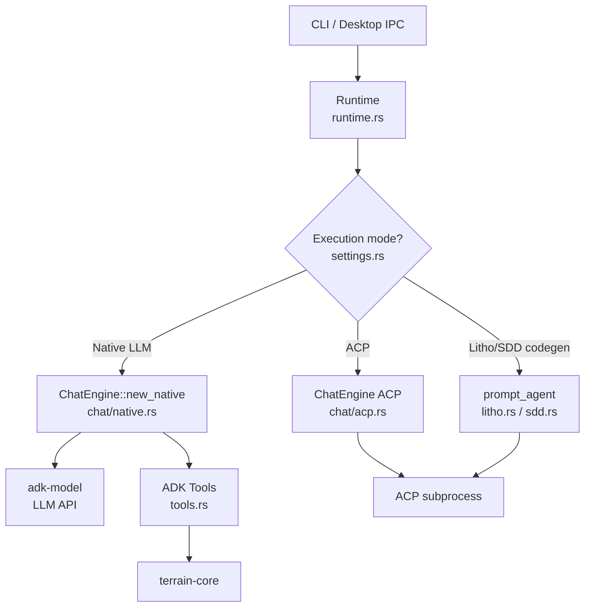

# terrain-agent Domain

**Module path:** `crates/terrain-agent/`  
**Generated:** 2026-08-24

---

## What This Module Does

terrain-agent is Terrain's nervous system — the layer that connects offline machinery to the world of LLMs and external coding agents. When you ask a question in DeepWiki, initialize a project, generate Litho docs, or run an SDD phase, terrain-agent makes the critical decision: should this task use a quick native LLM call, or does it need a full ACP subprocess with tool access?

Think of terrain-agent as the foreman on the factory floor. terrain-core builds the machines; terrain-agent decides which machine to run and when to call in a specialist (the ACP agent).

---

## Core Capabilities

1. **Litho orchestration** — `run_litho_generation` (`litho.rs`) spawns ACP agents with Litho skill prompts, polls for completion with adaptive intervals, handles `LithoRunMode::Auto` vs `FullRebuild`, and retries composition when research artifacts exist but human docs are missing.

2. **DeepWiki Ask** — `ask_knowledge` (`workflows/ask.rs:11`) drives `ChatEngine` with streaming chunk, tool-call, phase, and usage events. Falls back to plain search when LLM is unavailable.

3. **Agent context generation** — `run_agent_context_generation` (`agent_context.rs:26`) produces `agent/context.md` from Litho docs and project meta, supporting incremental git-diff updates or full rebuilds.

4. **SDD workflow execution** — `run_sdd_phase` (`workflows/sdd.rs`) routes requirements/review to native LLM and codegen to ACP subprocess.

5. **ADK tool implementations** — `tools.rs` provides `list_projects`, `read_agent_context`, `grep_agent_pack`, `read_agent_pack_file`, `search_knowledge` as `FunctionTool` instances for Ask agents.

6. **Shared runtime** — `Runtime` (`runtime.rs`) holds `KnowledgePaths` and `ModelConfig` for CLI and desktop consumption.

---

## Key Components

| Component / Type | File path | Core responsibility |
|-----------------|-----------|---------------------|
| `Runtime` | `crates/terrain-agent/src/runtime.rs` | Shared agent state for CLI/desktop |
| `ChatEngine` | `crates/terrain-agent/src/chat/mod.rs` | Native LLM and ACP chat backends |
| `run_litho_generation` | `crates/terrain-agent/src/litho.rs` | ACP-driven Litho pipeline with polling |
| `LithoRunMode` | `crates/terrain-agent/src/litho.rs:18` | Auto vs FullRebuild mode selection |
| `run_project_initialization` | `crates/terrain-agent/src/workflows/init.rs:105` | Full init: scan → litho → context |
| `ask_knowledge` | `crates/terrain-agent/src/workflows/ask.rs:11` | DeepWiki Q&A entry point |
| `build_agent` | `crates/terrain-agent/src/builder.rs` | Construct ADK agent with Terrain tools |
| `acp_spawn_command` | `crates/terrain-agent/src/acp.rs` | Build ACP subprocess spawn config |
| `tool_session_cache` | `crates/terrain-agent/src/tool_session_cache.rs` | Dedup identical tool calls per session |

---

## Internal Data Flow

**Key steps:**
1. `resolve_acp_settings` (`acp.rs`) loads ACP binary and args from settings
2. `execution_uses_native_llm` / `execution_pure_acp` determine routing per task type
3. `ChatEngine::ask` runs the tool loop with streaming callbacks
4. `prompt_agent_with_heartbeat` (`litho.rs:115`) polls ACP without early-abort heuristics

---

## Key Interfaces and Extension Points

- **Execution modes**: `AgentExecution` and `AskExecution` enums in settings control native/ACP/hybrid routing
- **Custom ACP binary**: `AcpSettings` (`settings.rs`) allows any ACP-compatible agent
- **Agent builder**: `build_agent` (`builder.rs`) assembles ADK agent with configurable tool set
- **Throttle**: `throttle.rs` rate-limits LLM API calls to prevent quota exhaustion
- **Compat tool**: `compat_tool.rs` provides backward-compatible tool interfaces

---

## Interactions with Other Modules

| Module | Direction | Interface | Description |
|--------|-----------|-----------|-------------|
| terrain-core | Depends on | All knowledge/path/freshness APIs | Every file operation delegated to core |
| terrain-cli | Depended on by | Workflow functions | CLI handlers call agent workflows |
| src-tauri | Depended on by | `Runtime` via `AppState` | Desktop IPC wraps agent runtime |
| adk-acp | Depends on | `prompt_agent`, `AcpAgentConfig` | ACP subprocess management |
| adk-model | Depends on | `build_llm`, `ModelConfig` | Native LLM calls |

---

## Role in Core Business Flows

**In project initialization**: `run_project_initialization` (`workflows/init.rs:105`) chains scan (core) → litho (agent ACP) → context (agent LLM) with progress events at each stage.

**In Litho generation**: Agent builds prompt via `build_litho_generation_prompt` (core), spawns ACP, polls until `litho_human_complete_with_research` returns true or timeout.

**In DeepWiki Ask**: `ChatEngine` preloads macro context overview, then loops through tools for meso/micro layers. Citations extracted via `extract_source_citations` (core).

**In SDD**: Phases 1/2/4 use native LLM; phase 3 (codegen) spawns ACP with repo write access.

---

## Performance Considerations

- ACP polling: 3s active / 6s stable intervals with 10 stable ticks before slowing (`litho.rs:37-39`)
- Wall timeout: 45 minutes default, configurable via `TERRAIN_LITHO_TIMEOUT_SECS` (`litho.rs:68-74`)
- Tool session cache prevents redundant `read_agent_context` and `read_pack_file` calls
- `truncate_tool_json` caps tool output at 24,000 chars (`tools.rs:35`)
- Ask stream uses `Mutex` for thread-safe callback (`ask.rs:19`)

---

## Implementation Highlights

- **Composition retry**: If research artifacts exist in `.litho-agent/` but human docs missing, `build_litho_composition_prompt` retries only phases 3-4 (`assets/litho.rs:63`)
- **Incremental Litho**: `build_litho_update_prompt` routes git-changed paths to specific deep-exploration docs (`assets/litho.rs:97`)
- **Context incremental guard**: `reject_incremental_document` prevents updates that shrink the context body (`agent_context.rs`)
- **OpenCode feature gate**: `#[cfg(feature = "opencode")]` wraps ACP-specific Litho polling (`litho.rs:114`)
