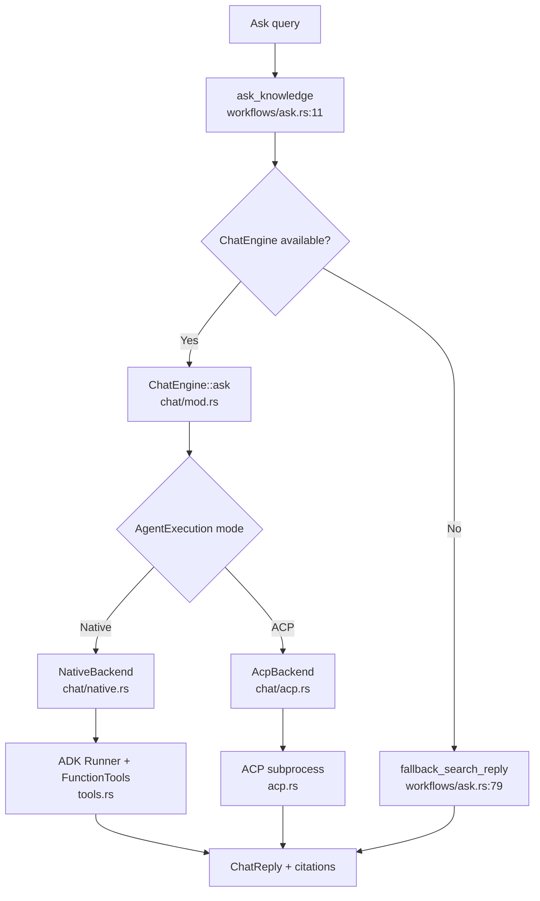

# terrain-agent Domain

**Module path**: `crates/terrain-agent/src/`
**Generated**: 2026-08-22

---

## What This Module Does

terrain-agent is where Terrain actually *does things* — it talks to LLMs, spawns ACP subprocesses, drives Litho document generation, runs SDD phases, and registers the tool schemas that power DeepWiki Ask. If terrain-core is the kitchen with recipes and ingredients, terrain-agent is the service staff that cooks, serves, and handles customer requests.

The module's central abstraction is `ChatEngine` — a dual-backend engine that can route Ask queries through either a native ADK Runner (direct LLM API calls) or an ACP subprocess (external coding agent), selected at runtime by the `AgentExecution` setting.

---

## Core Capabilities

1. **Dual-backend ChatEngine** — `ChatEngine` (`chat/mod.rs:54`) supports Native ADK (`chat/native.rs`) and ACP (`chat/acp.rs`) backends. `new_native` forces native LLM for hybrid workloads like context generation and SDD doc phases.

2. **Litho generation driver** — `run_litho_generation` (`litho.rs`) manages the full Litho lifecycle: plan → ACP prompt → poll with heartbeat → composition retry → completeness verification. Supports `LithoRunMode::Auto` and `FullRebuild` (`litho.rs:17-24`).

3. **Workflow orchestration** — The `workflows/` module chains core operations into user-facing flows: `init.rs` (full initialization), `ask.rs` (DeepWiki Q&A), `sdd.rs` (SDD phases), `quick_refresh.rs` (lightweight update).

4. **ADK tool registry** — `tools.rs` exposes knowledge-layer tools (`read_agent_context`, `grep_agent_pack`, `search_knowledge`, `read_agent_pack_file`) as ADK `FunctionTool` instances for the ChatEngine to call during Ask.

5. **Runtime engine cache** — `Runtime` (`runtime.rs`) caches `ChatEngine` and `ModelConfig` across IPC calls, avoiding re-initialization on every Ask question.

---

## Key Components

| Component / Type | File Path | Responsibility |
|----------------|-----------|----------------|
| `ChatEngine` | `crates/terrain-agent/src/chat/mod.rs:54` | Ask Q&A engine with dual backend |
| `NativeBackend` | `crates/terrain-agent/src/chat/native.rs` | ADK Runner for direct LLM calls |
| `Runtime` | `crates/terrain-agent/src/runtime.rs` | Engine cache and config holder |
| `run_litho_generation` | `crates/terrain-agent/src/litho.rs` | Litho ACP orchestration with polling |
| `LithoRunMode` | `crates/terrain-agent/src/litho.rs:17` | Auto vs FullRebuild generation strategy |
| `ask_knowledge` | `crates/terrain-agent/src/workflows/ask.rs:11` | Ask workflow entry with streaming |
| `run_project_initialization` | `crates/terrain-agent/src/workflows/init.rs` | Full init pipeline orchestration |
| `list_projects_tool` | `crates/terrain-agent/src/tools.rs:42` | ADK tool: list indexed projects |
| `read_agent_context_tool` | `crates/terrain-agent/src/tools.rs:61` | ADK tool: read context by section |
| `build_acp_config` | `crates/terrain-agent/src/acp.rs` | ACP spawn configuration builder |
| `AgentContextGenerator` | `crates/terrain-agent/src/context_generator.rs` | Pluggable context generation |

---

## Internal Data Flow

**Key steps:**
1. `ask_knowledge` obtains a cached `ChatEngine` from `Runtime` or falls back to keyword search
2. `ChatEngine::ask` preloads macro context, then iterates tool calls for meso/micro layers
3. `finalize_usage` (`chat/mod.rs:35`) estimates token counts when the provider doesn't report them
4. `sanitize_answer_text` applies `prepare_chat_markdown` for consistent rendering

---

## Key Interfaces and Extension Points

- **`AgentContextGenerator` trait** — Allows swapping context generation strategy (native LLM vs ACP)
- **`LithoRunMode`** — Controls whether Litho skips, incrementally updates, or fully rebuilds
- **`tool_session_cache`** — Deduplicates identical tool calls within a session via fingerprint hashing
- **`AgentExecution` enum** — `AcpNative`, `AcpOnly`, `Hybrid` — gates backend selection in `acp.rs`

---

## Interactions with Other Modules

| Module | Direction | Interface | Description |
|--------|-----------|-----------|-------------|
| terrain-core | Depends on | All planning, search, freshness functions | Agent executes what core plans |
| src-tauri | Used by | `Runtime`, workflow functions | Desktop IPC delegates to agent |
| terrain-cli | Used by | Same workflow functions | CLI is a thin wrapper |
| ADK ecosystem | Depends on | adk-core, adk-agent, adk-model, adk-tool | Native LLM execution |
| ACP protocol | Depends on | agent-client-protocol | External agent subprocess |

---

## Role in Core Business Flows

**In Litho generation**: terrain-agent builds the ACP prompt via `prepare_litho_generation` (`litho.rs:43`), spawns the agent, polls for completion with progress heartbeats, and retries composition up to 3 times. Incremental updates use `build_litho_update_prompt` from core but execution stays in agent.

**In Ask Q&A**: The three-layer retrieval loop runs entirely in `ChatEngine::ask`. Tools in `tools.rs` bridge to core's `KnowledgeSearch`, `grep_repomix_pack`, and `read_agent_pack_file`. Citations are extracted via `extract_source_citations` from core.

**In SDD**: `run_sdd_phase` (`workflows/sdd.rs`) dispatches lightweight phases to native LLM and CodeGen to ACP, using the SDD skill directory resolved by core's `resolve_sdd_skill_dir`.

---

## Performance Considerations

- `ASK_TIMEOUT` = 1200 seconds (`chat/mod.rs:33`) accommodates long multi-tool Ask sessions
- Tool call caching in `tool_session_cache.rs` prevents redundant repomix reads within a session
- Litho polling uses adaptive intervals: 3s active, 6s stable (`litho.rs:37-38`), with 45-minute wall timeout
- `Runtime` caches ChatEngine across IPC calls — model initialization happens once per app session

---

## Implementation Highlights

The Litho heartbeat polling design (`litho.rs:109-113`) deliberately avoids early-completion heuristics for incremental updates. Because incremental Litho edits files in place, doc counts never grow — a naive "all files present" check would abort the ACP session mid-edit after about a minute. The heartbeat-only approach lets the agent finish its work regardless of file count stability.
