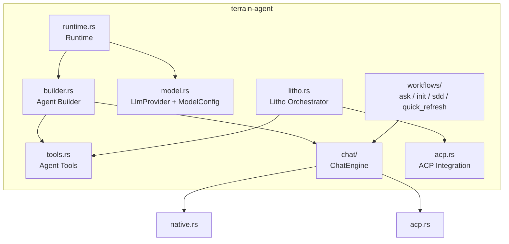
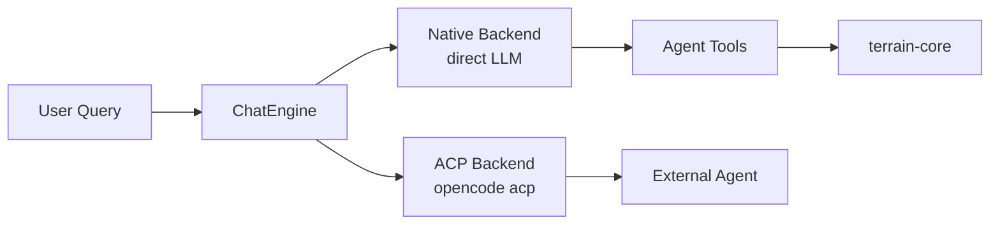

# terrain-agent — The Brain

## What this module does

`terrain-agent` is where the LLM lives. It wraps model providers (Ollama, OpenAI-compatible, LM Studio) behind a unified `ModelConfig`, constructs an agentic loop with tools that can read the knowledge base, and orchestrates the high-level workflows — Ask Q&A, Litho generation, SDD phases, and project initialization. If `terrain-core` is the filing cabinet, `terrain-agent` is the **librarian who reads the files and talks to you**.

The module also manages a `Runtime` singleton that caches the `ChatEngine` and model settings, enabling the desktop app and CLI to share a single LLM connection across requests.

---

## Module map

---

## Model configuration — model.rs

`LlmProvider` (`model.rs:14`) enumerates the three supported backends: `Ollama`, `Openai`, `LmStudio`. `ModelConfig` (`model.rs:21`) bundles provider, model name, host, and optional API key into a single serializable struct.

Resolution follows a priority chain (`model.rs:54`):

1. `~/.terrain/settings.json` (UI-saved preferences)
2. Environment variables (`OPENAI_API_KEY`, `TERRAIN_API_KEY`, `OLLAMA_HOST`)
3. Built-in defaults per provider

The `build_llm` function (`model.rs:41`) constructs the concrete `adk_core::Llm` trait object from a `ModelConfig`, choosing the appropriate client.

---

## Agent construction — builder.rs

`build_agent` (`builder.rs:15+`) is the factory that assembles a complete LLM agent with its tool belt. It:

1. Selects the system instruction based on the resolved language (`builder.rs:26`)
2. Registers all agent tools (search, grep, read, list)
3. Optionally wraps tools with cooldown throttling
4. Attaches the LLM via `adk_agent::LlmAgentBuilder`

The system instruction (`builder.rs:31-49`) is a dense document that teaches the agent how to use the repomix pack, when to grep versus read, and how to cite sources. It adapts to the configured language so button names and section headings match the user's UI.

---

## Agent tools — tools.rs

Tools are the agent's hands — the functions the LLM can invoke during a conversation. All are defined in `tools.rs` (618 lines) and built atop `adk_tool::FunctionTool`:

| Tool | Purpose |
|------|---------|
| `list_projects` | Enumerate indexed projects |
| `search_knowledge` | Full-text search across knowledge docs |
| `read_doc` | Read a specific knowledge document |
| `read_doc_ask` | Read a doc with Ask-specific context |
| `grep_agent_pack` | Grep the repomix source pack for symbols/patterns |
| `read_agent_pack_file` | Read a file section from the repomix pack (with line ranges) |
| `read_agent_pack_meta` | Check pack existence, sync status, and tree |
| `read_agent_context` | Read the agent context document |
| `list_human_docs` | List Litho-generated human docs |
| `read_freshness` | Read the cached freshness summary |

Each tool uses a session cache (`tool_session_cache.rs`) to deduplicate identical calls within a conversation, preventing the agent from re-greping the same pattern.

Truncation guards (`tools.rs:23-35`) ensure large JSON responses stay under `MAX_TOOL_JSON_CHARS` (24,000 chars) to avoid overwhelming the model's context window.

---

## Chat engine — `chat/`

`ChatEngine` (`chat/mod.rs:54`) is the conversation runtime. It manages:

- **Backend selection** — native LLM (direct model call) or ACP (delegated to an external agent process like `opencode acp`)
- **Prompt assembly** (`chat/prompt.rs`) — injects freshness context, agent context, and tool results into the prompt
- **Usage tracking** (`chat/tracker.rs`) — records token counts per turn
- **Streaming** (`chat/types.rs`) — `AskStreamEvent` for real-time token delivery

The `ACP backend` (`chat/acp.rs`) spawns an external agent process and communicates via JSON-over-stdin/stdout, enabling integration with coding agents that have their own tool ecosystems.

---

## Litho generation — litho.rs

At 714 lines, `litho.rs` is the largest file in the crate. It orchestrates the 4-phase Litho pipeline that produces human-readable documentation:

1. **Research** — the agent reads source code and produces research artifacts
2. **Deep Exploration** — module-level deep dives with Mermaid diagrams
3. **Composition** — merges research into coherent narrative documents
4. **Validation** — checks completeness against the required file list

Key constants control the pipeline (`litho.rs:37-41`):

| Constant | Value | Purpose |
|----------|-------|---------|
| `POLL_INTERVAL_SECS` | 3 | How often to check ACP agent progress |
| `STABLE_TICKS` | 10 | Consecutive stable polls before declaring done |
| `MAX_COMPOSITION_ATTEMPTS` | 3 | Retries for the composition phase |
| `DEFAULT_WALL_TIMEOUT_SECS` | 2700 (45 min) | Maximum wall-clock time for a full run |

`LithoRunMode` (`litho.rs:18`) distinguishes `Auto` (skip if complete, incrementally update if drifted) from `FullRebuild` (wipe and regenerate everything).

---

## Workflows — `workflows/`

| Workflow | File | Purpose |
|----------|------|---------|
| `ask_knowledge` | `workflows/ask.rs` | End-to-end Ask Q&A: refresh context if stale, invoke LLM, stream response |
| `run_project_initialization` | `workflows/init.rs` | Scan → Litho → agent context in one shot |
| `run_quick_refresh` | `workflows/quick_refresh.rs` | Scan + repack without Litho |
| `run_sdd_phase` | `workflows/sdd.rs` | Execute a single SDD phase (Requirements, Tech Design, Code Gen, Code Review) |

---

## Runtime — runtime.rs

`Runtime` (`runtime.rs:11`) is the shared state singleton used by both the desktop app and CLI. It holds:

- `paths: KnowledgePaths` — the workspace resolver
- `model_config: RwLock<ModelConfig>` — hot-swappable model settings
- `chat: Mutex<Option<Arc<ChatEngine>>>` — lazily constructed, cached engine

`Runtime::chat_engine` (`runtime.rs:55`) checks whether the cached engine's config still matches current settings before returning it, invalidating automatically when the user changes providers in the UI.

---

## ACP integration — acp.rs

ACP (Agent Communication Protocol) enables Terrain to delegate to external coding agents. `acp.rs` resolves the ACP binary (default: `opencode`), builds spawn commands, and detects whether the external agent is available.

The execution model is controlled by `AgentExecution` (`terrain-core`): `Acp` (full delegation) or `AcpNative` (use native LLM for generation but ACP for tool calls).

---

## Throttling and caching

- **`throttle.rs`** — configurable cooldown between LLM calls and tool invocations, preventing rate-limit violations
- **`tool_session_cache.rs`** — fingerprints tool calls by arguments and caches responses within a session, deduplicating repeated queries

---

## Design principles

1. **Two-tier architecture.** `terrain-core` handles data; `terrain-agent` handles intelligence. The boundary is clean: no LLM code in core, no filesystem mutations in agent tools.
2. **Backend agnostic.** The `ChatEngine` abstracts over native LLM and ACP, allowing the same workflows to run with Ollama locally, a cloud API, or a delegated coding agent.
3. **Tool-centric design.** The agent's capabilities are defined entirely by its tool belt — adding a new tool (e.g., a new knowledge source) is a matter of registering a new `FunctionTool` in `builder.rs`.
