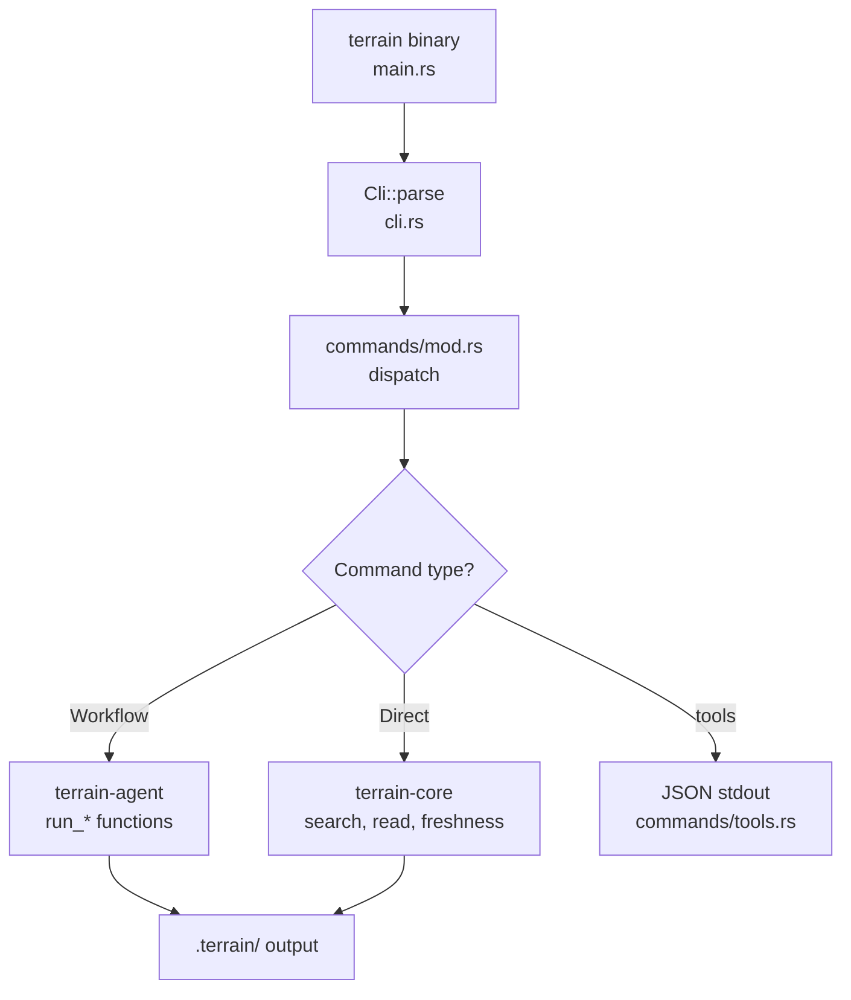

# terrain-cli Domain

**Module path:** `crates/terrain-cli/`  
**Generated:** 2026-08-24

---

## What This Module Does

terrain-cli is Terrain's command-line front door — a structured interface built with clap that exposes every Terrain capability as a subcommand. Whether you're a developer running `terrain init`, a CI pipeline calling `terrain assets run-litho`, or an ACP agent invoking `terrain tools read-context`, the CLI provides a uniform, scriptable entry point.

The CLI itself is intentionally thin: it parses arguments, resolves the workspace repository, and delegates to terrain-agent workflows or terrain-core functions. All business logic lives downstream.

---

## Core Capabilities

1. **Project lifecycle commands** — `init`, `scan`, `refresh` wire to agent workflows (`commands/init.rs`, `commands/knowledge.rs`)
2. **Knowledge access** — `search`, `read`, `ask query` for browsing and Q&A
3. **Asset management** — `assets` subcommands for Litho, repomix packing, agent context generation
4. **ACP tools surface** — `tools` subcommands emit JSON for external coding agents
5. **Environment setup** — `env status/plan/apply` for Skills and bundled tool installation
6. **SDD workflow** — `sdd run --phase` executes individual SDD phases
7. **Settings management** — `settings get/set/check-llm/check-acp` for configuration

---

## Key Components

| Component / Type | File path | Core responsibility |
|-----------------|-----------|---------------------|
| `Cli` | `crates/terrain-cli/src/cli.rs:16` | Root clap parser with global `--repo-path` |
| `Commands` | `crates/terrain-cli/src/cli.rs:25` | Top-level subcommand enum |
| `ToolsCommands` | `crates/terrain-cli/src/cli.rs:238` | ACP JSON tool subcommands |
| `AssetCommands` | `crates/terrain-cli/src/cli.rs:296` | Asset generation subcommands |
| `main` | `crates/terrain-cli/src/main.rs` | Entry point, tokio runtime, dispatch |
| `commands/tools.rs` | `crates/terrain-cli/src/commands/tools.rs` | JSON stdout for ACP agents |
| `commands/assets.rs` | `crates/terrain-cli/src/commands/assets.rs` | Litho, pack, context handlers |
| `commands/env.rs` | `crates/terrain-cli/src/commands/env.rs` | Environment integration |
| `util.rs` | `crates/terrain-cli/src/util.rs` | Shared path resolution helpers |

---

## Internal Data Flow

**Key steps:**
1. `main.rs` initializes tokio runtime and resolves `KnowledgePaths::from_workspace()`
2. Command handler in `commands/*.rs` parses subcommand-specific args
3. Workflow commands create `Runtime` and call agent functions with progress callbacks
4. `tools` commands serialize results as JSON for ACP agent consumption

---

## Key Interfaces and Extension Points

- **Global `--repo-path`**: Scopes all commands to a specific repository (`cli.rs:17-19`)
- **Subcommand pattern**: Add new commands via `Commands` enum variant + handler in `commands/`
- **`SddPhaseArg`**: clap value enum mapping to `SddPhase` (`cli.rs:191-208`)
- **NDJSON streaming**: `ask query --stream` emits `AskStreamEvent` lines (`cli.rs:158-160`)

---

## Interactions with Other Modules

| Module | Direction | Interface | Description |
|--------|-----------|-----------|-------------|
| terrain-agent | Depends on | `Runtime`, workflow functions | All AI orchestration delegated |
| terrain-core | Depends on | `KnowledgePaths`, search, freshness | Direct calls for offline ops |
| ACP agents | External consumer | `terrain tools` JSON API | Agents invoke CLI as tool |

---

## Role in Core Business Flows

**In CI/CD**: `terrain refresh` and `terrain assets run-litho` are the primary automation entry points.

**In ACP integration**: `terrain tools read-context`, `grep-pack`, `search` form the three-layer knowledge access API for external agents.

**In developer workflow**: `terrain init` is the onboarding command; `terrain ask query` provides terminal-based DeepWiki.

---

## Performance Considerations

- CLI is a thin sync wrapper; async agent calls run on tokio runtime spawned in `main.rs`
- `tools` commands optimize for machine consumption: compact JSON, no decorative output
- Workspace repo resolution cached per invocation via `KnowledgePaths::from_workspace()`

---

## Implementation Highlights

- **Long version string**: Includes usage hint in `--version` output (`cli.rs:11-14`)
- **Language setting**: `settings language` subcommand delegates to `terrain_core::language` module
- **Source read**: `source read` provides live repo file slices with line ranges for citation verification
