# terrain-cli — The Command-Line Interface

## What this module does

`terrain-cli` is the terminal entry point for everything Terrain can do. It wraps `terrain-core` and `terrain-agent` behind a `clap`-powered CLI that exposes project scanning, knowledge search, Ask Q&A, SDD workflow execution, settings management, and environment integration — all from the command line. If the desktop app is Terrain's graphical cockpit, the CLI is its **text-mode dashboard**: leaner, scriptable, and CI-friendly.

The binary is intentionally thin. It delegates almost all logic to the core and agent crates, limiting itself to argument parsing, output formatting, and initialization.

---

## Entry point — main.rs

`main.rs` is 16 lines of pure bootstrapping (`main.rs:1-16`):

```rust
#[tokio::main]
async fn main() -> Result<()> {
    terrain_agent::load_dotenv();
    terrain_core::ensure_bundled_tools_initialized();
    terrain_core::ensure_preset_skills_initialized();
    commands::run(Cli::parse()).await
}
```

Three initialization steps happen before any command:

1. **`load_dotenv()`** — loads `.env` files for API keys and config overrides
2. **`ensure_bundled_tools_initialized()`** — extracts platform-specific tool binaries (CodeGraph, RTK) to `~/.terrain/bin/`
3. **`ensure_preset_skills_initialized()`** — deploys Skill playbooks to the conventional location

Then `Cli::parse()` hands off to the command dispatcher.

---

## Command tree — cli.rs

All command definitions live in `cli.rs` (376 lines) using clap's derive API. The top-level `Cli` struct (`cli.rs:16`) accepts a global `--repo-path` flag that overrides the auto-detected workspace.

```mermaid
graph TD
    terrain[terrain CLI]
    terrain --> list[project list]
    terrain --> scan[scan]
    terrain --> init[init]
    terrain --> refresh[refresh]
    terrain --> search[search]
    terrain --> read[read]
    terrain --> project[project<br/>overview / remark / remove]
    terrain --> settings[settings<br/>get / set / language / check-llm / check-acp]
    terrain --> ask[ask<br/>query / sessions-list]
    terrain --> sdd[sdd<br/>status / run]
    terrain --> usage[usage<br/>probe / snapshot]
    terrain --> source[source read]
    terrain --> tools[tools<br/>JSON-output agent tools]
    terrain --> assets[assets<br/>pack / plan / litho / human / context]
    terrain --> env[env<br/>status / plan / apply]
```



---

## Command groups

### Project management

| Command | Description |
|---------|-------------|
| `terrain list` | List all indexed projects |
| `terrain scan [repo]` | Scan a Git repo into Markdown knowledge docs |
| `terrain init [repo]` | Full initialization: scan + Litho generation + agent context |
| `terrain refresh [repo]` | Quick refresh: scan + repack, skips Litho |
| `terrain project overview --project <slug>` | Show freshness, doc counts, and paths |
| `terrain project remark --project <slug> <text>` | Attach a human-readable note to a project |
| `terrain project remove --project <slug>` | Unregister a project (doesn't delete `.terrain/`) |

### Knowledge query

| Command | Description |
|---------|-------------|
| `terrain search <query>` | Full-text search across all knowledge docs |
| `terrain read <path>` | Read a document by its path |
| `terrain ask query <question>` | Ask a question against project knowledge (with `--stream` for NDJSON) |
| `terrain ask sessions-list --project <slug>` | List Ask conversation sessions |

### SDD (Standardized Development Workflow)

| Command | Description |
|---------|-------------|
| `terrain sdd status --project <slug>` | Show SDD session status |
| `terrain sdd run --project <slug> --phase <phase>` | Execute an SDD phase |

Phases are: `requirements`, `tech-design`, `code-gen`, `code-review` (`cli.rs:192-197`).

### Settings

| Command | Description |
|---------|-------------|
| `terrain settings get` | Show effective model settings |
| `terrain settings set <file>` | Load settings from a JSON file |
| `terrain settings language [value]` | Get or set the output language |
| `terrain settings check-llm` | Test LLM connectivity |
| `terrain settings check-acp` | Verify ACP agent availability |

### Agent tools (JSON output)

The `tools` subcommand (`cli.rs:88-91`) exposes every agent tool as a standalone CLI command that emits JSON. This enables scripting and piping:

```
terrain tools grep-pack --project my-app --pattern "fn handle_request"
terrain tools read-context --project my-app
terrain tools freshness --project my-app
```

### Asset generation

| Command | Description |
|---------|-------------|
| `terrain assets pack-agent` | Run repomix to produce the agent source pack |
| `terrain assets plan-litho` | Preview what Litho would generate |
| `terrain assets run-litho` | Execute Litho generation |
| `terrain assets agent-context` | Generate or refresh `agent/context.md` |
| `terrain assets list-human --project <slug>` | List Litho-generated human docs |
| `terrain assets register` | Register a project without scanning |

### Environment integration

| Command | Description |
|---------|-------------|
| `terrain env status` | Show current env integration status |
| `terrain env plan` | Preview what env apply would deploy |
| `terrain env apply` | Deploy Skills, CodeGraph, RTK, and AGENTS.md |

---

## Utilities — util.rs

`util.rs` contains shared helpers for output formatting and error presentation across commands. It keeps the command implementations clean by abstracting repetitive output patterns.

---

## How commands dispatch

`commands::run(Cli::parse())` (`main.rs:15`) pattern-matches on the parsed `Commands` enum and delegates to the corresponding handler in `commands/`. Each handler function is a thin adapter that:

1. Constructs a `KnowledgePaths` from the `--repo-path` argument or workspace detection
2. Calls into `terrain-core` or `terrain-agent`
3. Formats the result for terminal output (tables, JSON, or streaming NDJSON)

This adapter pattern means adding a new CLI command is usually just a new `Commands` variant in `cli.rs` and a 20–40 line handler in `commands/`.

---

## Scriptability

The CLI is designed for automation:

- **`--stream` on Ask** emits newline-delimited JSON (NDJSON) with `chunk`, `tool_calls`, `phase`, `usage`, and `done` events — perfect for piping to `jq` or custom dashboards.
- **`tools` subcommands** always emit JSON, making them safe to parse programmatically.
- **`env apply --ids <list>`** accepts a comma-separated list of integration IDs for selective deployment.
- **Exit codes** follow standard conventions: 0 for success, non-zero for errors.

---

## Design principles

1. **Thin wrapper.** The CLI contains zero business logic. All logic lives in `terrain-core` and `terrain-agent`.
2. **Convention over configuration.** The `--repo-path` global flag defaults to the current Git workspace or `TERRAIN_REPO_PATH`, so most commands work with zero arguments from a project root.
3. **Progressive disclosure.** Simple commands (`search`, `read`) need no flags; advanced commands (`sdd run`, `env apply`) expose fine-grained options.
