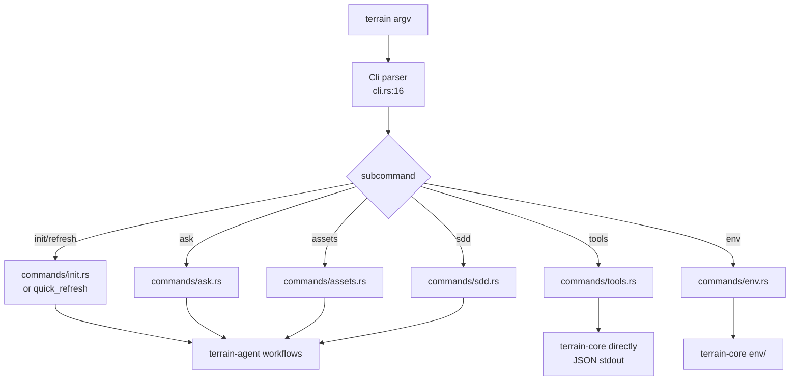

# terrain-cli Domain

**Module path**: `crates/terrain-cli/src/`
**Generated**: 2026-08-22

---

## What This Module Does

terrain-cli is Terrain's command-line interface — the tool developers and CI/CD pipelines use to scan repos, generate knowledge, ask questions, and manage agent environments. Built with clap, it exposes a hierarchical command tree where every capability available in the desktop app is also accessible from the terminal. The `terrain tools` subcommand is particularly important: it outputs JSON for ACP agents to consume the knowledge layer programmatically, making Terrain's knowledge accessible to any agent that can run shell commands.

---

## Core Capabilities

1. **Project lifecycle commands** — `scan`, `init`, and `refresh` wrap terrain-agent workflows for terminal and CI use.

2. **Knowledge access** — `search` and `read` provide direct document access without launching the desktop app.

3. **Ask CLI** — `ask query` with optional `--stream` for NDJSON event output, enabling scripted Q&A.

4. **ACP tools surface** — `tools` subcommand (`cli.rs:238-293`) exposes grep-pack, read-context, freshness, and other knowledge operations as JSON stdout.

5. **Asset management** — `assets` subcommand handles pack-agent, plan-litho, run-litho, and agent-context generation.

6. **Environment integration** — `env status/plan/apply` for deploying Skills, tools, and AGENTS.md.

---

## Key Components

| Component / Type | File Path | Responsibility |
|----------------|-----------|----------------|
| `Cli` | `crates/terrain-cli/src/cli.rs:16` | Root clap Parser with global `--repo-path` |
| `Commands` | `crates/terrain-cli/src/cli.rs:26` | Top-level subcommand enum |
| `ToolsCommands` | `crates/terrain-cli/src/cli.rs:238` | ACP knowledge tools subcommands |
| `AssetCommands` | `crates/terrain-cli/src/cli.rs:296` | Knowledge asset generation commands |
| `EnvCommands` | `crates/terrain-cli/src/cli.rs:357` | Environment integration commands |
| `commands/tools.rs` | `crates/terrain-cli/src/commands/tools.rs` | JSON stdout handlers for ACP tools |
| `commands/init.rs` | `crates/terrain-cli/src/commands/init.rs` | Init command wrapping agent workflow |
| `commands/ask.rs` | `crates/terrain-cli/src/commands/ask.rs` | Ask query with streaming support |
| `main.rs` | `crates/terrain-cli/src/main.rs` | Entry point and command dispatch |

---

## Internal Data Flow

**Key steps:**
1. `main.rs` parses `Cli` and dispatches to the appropriate `commands/` handler
2. Workflow commands (init, ask, sdd) delegate to terrain-agent's async functions
3. Tools commands call terrain-core directly and serialize results as JSON to stdout
4. Global `--repo-path` resolves via `KnowledgePaths::resolve_workspace_repo()`

---

## Key Interfaces and Extension Points

- **Global `--repo-path`** — All subcommands inherit this flag; defaults to `TERRAIN_REPO_PATH` env var or cwd Git root
- **`SddPhaseArg`** — clap `ValueEnum` mapping CLI strings to core `SddPhase` enum (`cli.rs:191-207`)
- **npm shims** — `npm/packages/` provides platform-specific binary wrappers (`@terrain-ai/cli`) for cross-platform install
- **NDJSON streaming** — `ask query --stream` emits `AskStreamEvent` variants as newline-delimited JSON

---

## Interactions with Other Modules

| Module | Direction | Interface | Description |
|--------|-----------|-----------|-------------|
| terrain-agent | Depends on | Workflow functions | Init, Ask, SDD, Litho execution |
| terrain-core | Depends on | Search, paths, env, freshness | Direct access for tools commands |
| ACP agents | Used by | `terrain tools` JSON output | External agents consume knowledge layer |
| CI/CD | Used by | `terrain init`, `terrain refresh` | Automated knowledge regeneration |

---

## Role in Core Business Flows

**In CI/CD integration**: `terrain init --repo-path .` is the primary entry point for automated knowledge generation after merge. `terrain refresh` provides a lighter alternative when only source changed.

**In ACP agent workflows**: External coding agents call `terrain tools read-context`, `terrain tools grep-pack`, and `terrain tools read-pack-file` as their first steps when entering a Terrain-enabled repository. The JSON output is designed for machine consumption.

**In developer workflows**: `terrain search` and `terrain read` provide quick knowledge access from the terminal without launching the desktop app.

---

## Performance Considerations

- Tools commands avoid agent initialization overhead by calling core directly
- `terrain tools freshness` reads cached ledger without recomputing
- Binary distributed via `cargo build --release` with LTO and strip enabled (`Cargo.toml:60-63`)

---

## Implementation Highlights

The `terrain tools` subcommand design follows the principle that agents should never need to parse human-readable output. Every tools command writes structured JSON to stdout with consistent error handling, making it trivial for ACP agents to integrate Terrain's knowledge layer as a tool in their own workflow. The trust hierarchy (repomix > CodeGraph > context.md > human docs) is documented in the tools command help text.
