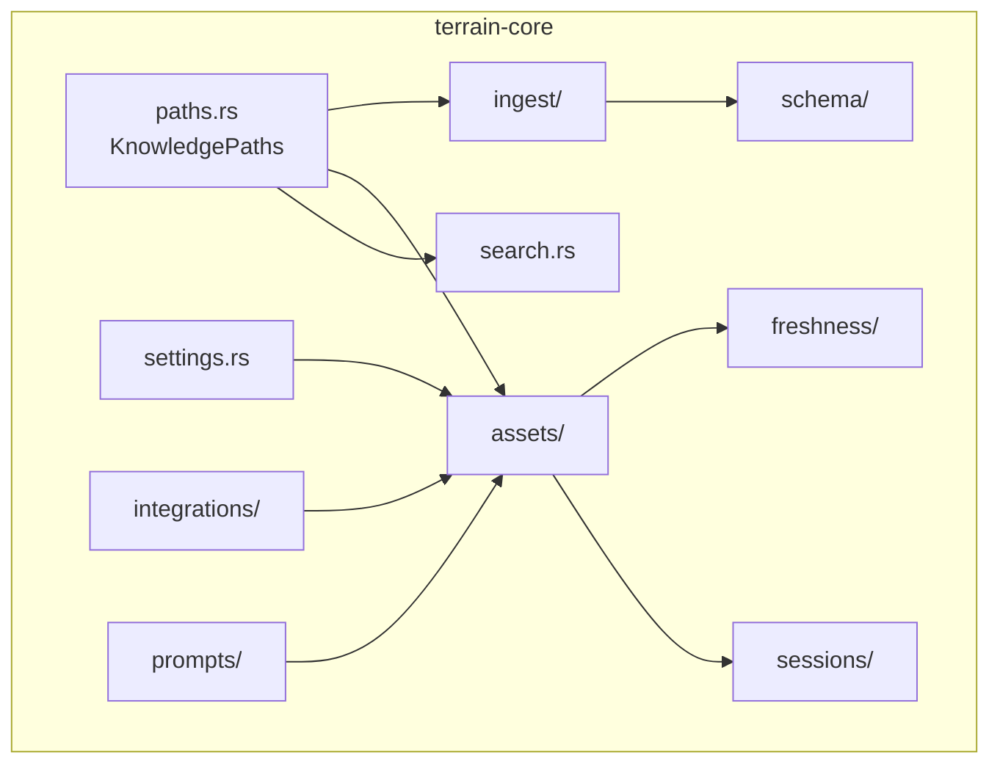
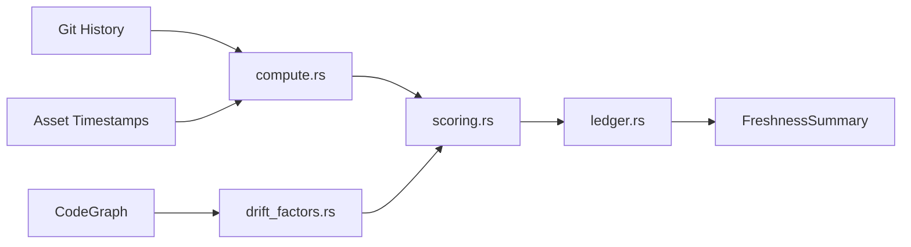

# terrain-core — The Foundation

## What this module does

`terrain-core` is the **library of record** for every non-LLM operation in Terrain. It owns the knowledge lifecycle end-to-end: scanning source repositories, ingesting code into Markdown documents, building agent packs, computing freshness scores, running full-text search, and managing every file path under `.terrain/`. Think of it as the **filing cabinet and measuring tape** of the system — it never answers questions itself, but every other module opens its drawers.

The crate is deliberately LLM-free. By keeping model calls out of this layer, `terrain-core` stays testable, fast, and free of async runtime debt. It exposes pure data transformations and filesystem operations that higher layers (`terrain-agent`, the desktop app, the CLI) orchestrate with an LLM.

---

## Module map

---

## Path resolution — KnowledgePaths

Everything in Terrain starts with a path. `KnowledgePaths` (`paths.rs:10`) is the central resolver that maps a Git repository to its `.terrain/` knowledge root and every subdirectory within it — `agent/`, `human/`, `.meta/`, `interfaces/`, `routes/`, and the per-project registry.

It resolves the workspace repo from the `TERRAIN_REPO_PATH` environment variable, or by walking up from `cwd` to the nearest Git root (`paths.rs:43`). All other modules receive a `KnowledgePaths` instance rather than constructing paths ad-hoc.

Key method: `KnowledgePaths::for_repo(repo_path)` (`paths.rs:27`) — the constructor used by both CLI and desktop app.

---

## Ingestion — `ingest/`

Ingestion is how raw source code becomes structured Markdown knowledge.

| Collector | File | Role |
|-----------|------|------|
| `GitScanner` | `ingest/git.rs` | Walks the Git tree, emits structured Markdown per file type |
| `OpenApiImporter` | `ingest/openapi.rs` | Parses OpenAPI specs into interface/route documents |
| `ProjectScanner` | `ingest/mod.rs:39` | Orchestrates collectors, writes `ScanReport` |

`ProjectScanner::scan_repo` (`ingest/mod.rs:52`) is the entry point. It registers the project, invokes each collector, and produces a `ScanReport` (`ingest/mod.rs:20`) that enumerates files written, which collectors ran, and an optional `AgentPackSummary`.

---

## Asset generation — `assets/`

The `assets/` subtree is the largest submodule. It handles everything from initial generation to incremental updates:

- **Agent context** (`assets/agent_context.rs`) — generates `agent/context.md`, the architecture-level document that gives agents their bearings. Tracks baseline HEAD so stale context is detected.
- **Repomix packing** (`assets/repomix.rs`) — runs `repomix-core` to produce `agent/repomix.md`, a compressed source-code snapshot the agent can grep and read.
- **Litho prompts** (`assets/litho.rs`) — plans the 4-phase Litho generation pipeline and produces update prompts for incremental human-readable docs.
- **Incremental updates** (`assets/incremental.rs`) — decides whether a fresh generation, incremental patch, or full rebuild is needed based on file drift.
- **Context layers** (`assets/context_layers.rs`) — splits agent context into sections (overview, tool section) with configurable size limits (`AGENT_CONTEXT_TOOL_SECTION_MAX_CHARS`, `AGENT_CONTEXT_SAVE_MAX_CHARS`).
- **SDD** (`assets/sdd.rs`) — phase output paths and artifact management for the Standardized Development Workflow.
- **Environment integration** (`assets/env/`) — deploys Skills, CodeGraph, RTK, and `AGENTS.md` into a repository.

---

## Freshness — `freshness/`

Freshness is Terrain's way of answering: "How stale are my knowledge assets?"

| Submodule | File | Responsibility |
|-----------|------|----------------|
| `compute` | `freshness/compute.rs` | Orchestrates the full freshness calculation |
| `git` | `freshness/git.rs` | Git snapshot, change-set detection, knowledge-only commit filtering |
| `scoring` | `freshness/scoring.rs` | Maps raw drift to a 0–100 score with three bands |
| `ledger` | `freshness/ledger.rs` | Persists freshness state across runs |
| `drift_factors` | `freshness/drift_factors.rs` | Breaks drift into named factors (commits, files, time) |
| `codegraph` | `freshness/codegraph.rs` | Cross-validates CodeGraph index staleness against Git |

Three score thresholds control behavior (`freshness/mod.rs:20-26`):

| Constant | Value | Meaning |
|----------|-------|---------|
| `FRESH_THRESHOLD` | 80 | Green UI state — trust the assets |
| `VERIFY_THRESHOLD` | 70 | Warn — cross-check with repomix |
| `MACRO_PRELOAD_THRESHOLD` | 50 | Danger — don't preload architecture context in Ask mode |

---

## Search — search.rs

`KnowledgeSearch` (`search.rs:30`) walks all indexed project roots and performs case-insensitive full-text matching against Markdown documents. Each hit carries a `SearchHit` (`search.rs:14`) with path, project slug, document type, title, snippet, and relevance score.

The search is intentionally simple — no inverted index, no fuzzy matching. It trades raw speed for zero-dependency reliability. For deeper queries, the LLM-backed Ask mode handles semantic search.

---

## Settings — settings.rs

`ModelSettings` (`settings.rs:19+`) is the serializable configuration root, persisted to `~/.terrain/settings.json`. It bundles:

- **`ProviderProfile`** — per-provider model name, base URL, API key
- **`AcpSettings`** — binary path, args, auto-approve, execution mode (`Acp` or `AcpNative`)
- **`KnowledgeSettings`** — language, incremental update thresholds

Constants for Ollama, OpenAI-compatible, and LM Studio defaults are defined at `settings.rs:9-17`.

---

## Sessions — `sessions/`

`sessions/mod.rs` re-exports session management from `assets/`. This thin module owns two persistence domains:

- **Ask sessions** — conversation history, active session pointer, create/list/delete/discard
- **SDD sessions** — phase output storage, session lifecycle, status queries

Sessions are file-backed (JSON), enabling resume across app restarts.

---

## Other notable modules

| Module | File | Purpose |
|--------|------|---------|
| `schema/` | `schema/mod.rs` | All typed structs: `DocFrontmatter`, `FreshnessSummary`, `SddPhase`, `ProjectOverview`, etc. |
| `registry.rs` | `registry.rs` | Project slug ↔ path registration in `~/.terrain/registry.json` |
| `human.rs` | `human.rs` | List and read Litho-generated human-facing docs from `human/` |
| `doc.rs` | `doc.rs` | `KnowledgeDoc` parse/render — Markdown ↔ structured document |
| `language.rs` | `language.rs` | i18n: system locale detection, `ResolvedLanguage` for CLI output and agent replies |
| `source.rs` | `source.rs` | Read live source code slices with line ranges |
| `prompts/` | `prompts/mod.rs` | LLM prompt templates for Litho generation, composition, and SDD phases |
| `integrations/` | `integrations/mod.rs` | Env status, bundled tool discovery, usage monitoring |
| `bundled_tools.rs` | `bundled_tools.rs` | Extracts and manages platform-specific tool binaries |
| `preset_skills.rs` | `preset_skills.rs` | Manages the preset Skill playbooks shipped with Terrain |

---

## Design principles

1. **No LLM calls.** Every public function is either synchronous or uses `tokio` only for I/O — never for model inference.
2. **Path-first.** `KnowledgePaths` is threaded through every subsystem; no module constructs its own `.terrain/` paths.
3. **Feature-gated complexity.** The `repomix` feature gates packing logic (`assets/mod.rs:12-13`), allowing lightweight builds without the repomix dependency.
4. **Schema as contract.** `schema/` types carry `#[cfg_attr(feature = "ts-export", derive(ts_rs::TS))]` annotations so the desktop app gets type-safe bindings generated by `terrain-ts-export`.
