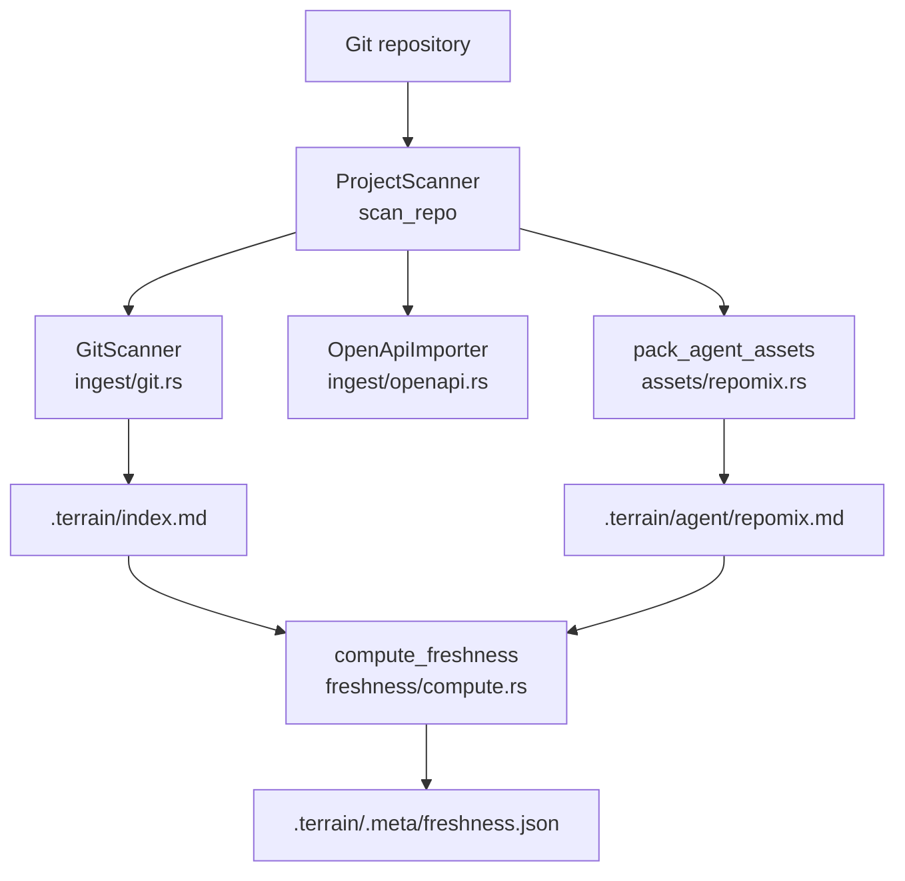

# terrain-core Domain

**Module path:** `crates/terrain-core/`  
**Generated:** 2026-08-24

---

## What This Module Does

terrain-core is Terrain's engine room — the machinery that runs without an LLM. Every operation that involves reading files, walking Git trees, searching Markdown, computing freshness scores, or planning asset generation lives here. When you run `terrain scan` or `terrain search`, terrain-core does the work directly. When terrain-agent needs to know where `.terrain/human/` lives or whether repomix is packed, it asks terrain-core.

Without this module, Terrain would be an LLM wrapper with no ground truth about the repository. terrain-core is what connects AI reasoning to actual code on disk.

---

## Core Capabilities

1. **Knowledge path resolution** — `KnowledgePaths` (`paths.rs:8-78`) is the central address book for every `.terrain/` subdirectory: human docs, agent context, repomix pack, litho workspace, freshness ledger, and SDD outputs.

2. **Multi-collector scanning** — `ProjectScanner::scan_repo` (`ingest/mod.rs:52-80`) orchestrates `GitScanner` for repository metadata, `OpenApiImporter` for API specs, and optional repomix packing into a unified `ScanReport`.

3. **Asset planning and prompts** — The `assets/` module builds Litho generation prompts (`assets/litho.rs:34`), agent context prompts (`assets/agent_context.rs`), incremental update plans (`assets/incremental.rs`), and SDD phase prompts (`assets/sdd.rs`).

4. **Freshness scoring** — The `freshness/` module compares Git HEAD against recorded baselines per asset, with special handling to exclude knowledge-only commits (`freshness/mod.rs:35-39`).

5. **Full-text search** — `KnowledgeSearch` (`search.rs`) indexes and searches across registered projects' knowledge documents.

6. **Environment integration** — `assets/env/` and `integrations/` deploy Skills, bundled tools, and AGENTS.md patches.

---

## Key Components

These components form the backbone of offline knowledge operations. Each has a single, well-defined responsibility.

| Component / Type | File path | Core responsibility |
|-----------------|-----------|---------------------|
| `KnowledgePaths` | `crates/terrain-core/src/paths.rs` | Resolve all `.terrain/` paths for a project slug |
| `ProjectScanner` | `crates/terrain-core/src/ingest/mod.rs` | Orchestrate multi-collector repo scan |
| `GitScanner` | `crates/terrain-core/src/ingest/git.rs` | Extract Git metadata and write `index.md` |
| `plan_litho_generation` | `crates/terrain-core/src/assets/litho.rs` | Build `LithoPlan` with skill and output dirs |
| `pack_agent_assets` | `crates/terrain-core/src/assets/repomix.rs` | Pack source into grep-friendly repomix index |
| `compute_freshness` | `crates/terrain-core/src/freshness/compute.rs` | Aggregate per-asset drift into summary score |
| `KnowledgeSearch` | `crates/terrain-core/src/search.rs` | Cross-project full-text document search |
| `apply_env_integration` | `crates/terrain-core/src/assets/env/apply.rs` | Install Skills, tools, AGENTS.md |
| `deploy_agent_toolchain` | `crates/terrain-core/src/agent_tools_deploy.rs` | Materialize binaries to `~/.terrain/bin/` |

---

## Internal Data Flow

**Key steps:**
1. `register_project` (`registry.rs`) adds slug→path to `~/.terrain/registry.json`
2. `GitScanner::scan` writes project index with file tree and metadata
3. `pack_agent_assets` invokes repomix-core to produce token-efficient source pack
4. `write_freshness_ledger` persists per-asset scores with recorded Git HEAD baselines

---

## Key Interfaces and Extension Points

- **Collector pattern**: Add new scan collectors by extending `ProjectScanner::scan_repo` (OpenAPI is the existing example at `ingest/openapi.rs`)
- **Repomix feature gate**: `#[cfg(feature = "repomix")]` controls whether packing is available (`assets/mod.rs:12-13`)
- **Preset skill resolution**: `resolve_litho_skill_dir()` checks user dir then app bundle (`preset_skills.rs`)
- **Incremental options**: `IncrementalOptions::from(knowledge)` configures drift thresholds (`assets/incremental.rs`)

---

## Interactions with Other Modules

| Module | Direction | Interface | Description |
|--------|-----------|-----------|-------------|
| terrain-agent | Depended on by | `KnowledgePaths`, `plan_litho_generation` | Agent calls core for all file/Git operations |
| terrain-cli | Depended on by | Public re-exports | CLI calls core directly for search/read |
| src-tauri | Depended on by | IPC → core functions | Desktop delegates to agent, which uses core |
| repomix-core | Depends on | Library API | Source packing (optional feature) |
| Git | External | subprocess | HEAD, diff, porcelain status |

---

## Role in Core Business Flows

**In project initialization**: terrain-core runs the scan phase (`ProjectScanner::scan_repo`) and packs repomix before terrain-agent takes over for Litho and context generation.

**In Litho generation**: `plan_litho_generation` (`assets/litho.rs:17`) resolves skill directory and output paths; `litho_human_complete_with_research` checks completion status.

**In Ask/DeepWiki**: `grep_repomix_pack`, `read_agent_pack_file`, and `KnowledgeSearch` serve the micro and meso knowledge layers.

**In env integration**: `apply_env_integration` deploys the full agent toolchain in dependency order.

---

## Performance Considerations

- File I/O bound; uses `walkdir` + `ignore` crate for efficient directory traversal with gitignore respect
- Repomix packing is async to avoid blocking the runtime (`pack_agent_assets`)
- `read_pack_text_cached` avoids re-reading large pack files within a session
- Freshness ledger can be read cached via `read_freshness_ledger` without full recomputation
- Knowledge-only commits excluded from drift scoring prevents false staleness (`freshness/mod.rs:82-91`)

---

## Implementation Highlights

- **Portable path storage**: `path_portable.rs` stores repo paths with tilde expansion for cross-machine registry portability
- **Language-aware prompts**: `language.rs` provides `asset_language_directive()` and `litho_file_listing()` for i18n doc generation
- **Context size enforcement**: `enforce_context_max_size` (`assets/context_layers.rs`) caps `agent/context.md` at configured limits
- **Git policy**: `git_policy.rs` defines which paths are knowledge outputs vs source for drift calculation
