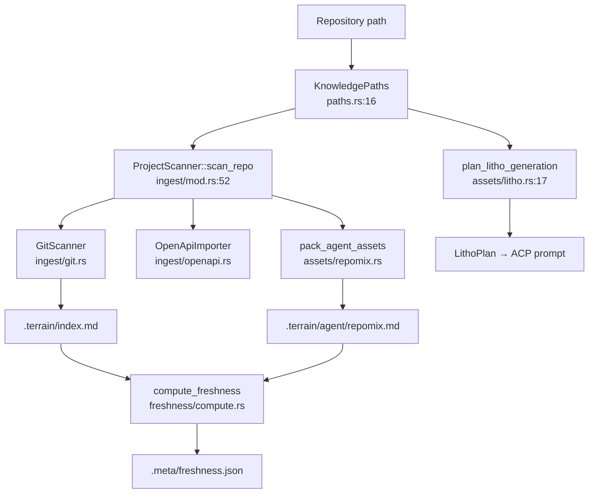

# terrain-core Domain

**Module path**: `crates/terrain-core/src/`
**Generated**: 2026-08-22

---

## What This Module Does

terrain-core is Terrain's domain brain — the layer that knows *how* to turn a Git repository into structured knowledge without ever picking up a phone to call an LLM. Every other crate in the workspace depends on it. If you picture Terrain as a restaurant, terrain-core is the kitchen: it holds the recipes (Litho prompts), manages inventory (path resolution), and defines quality standards (freshness scoring), but the waitstaff (`terrain-agent`) are the ones who actually cook with external ingredients (LLM APIs, ACP agents).

Understanding `KnowledgePaths` and the `assets/` submodule is the master key to the entire system.

---

## Core Capabilities

1. **Knowledge path resolution** — `KnowledgePaths` (`paths.rs:10`) is the single resolver for every `.terrain/` subdirectory. No code anywhere hardcodes `.terrain/human/` — it always goes through `paths.human_docs_dir(slug)`.

2. **Project scanning** — `ProjectScanner::scan_repo` (`ingest/mod.rs:52`) orchestrates Git metadata collection via `GitScanner`, optional OpenAPI spec import, and repomix packing into a single `ScanReport`.

3. **Litho planning** — `plan_litho_generation` (`assets/litho.rs:17`) builds the `LithoPlan` struct with skill directory, output paths, and workspace locations. Completeness is verified by `litho_human_complete_with_research` (`assets/litho.rs:256`).

4. **Three-layer knowledge search** — `KnowledgeSearch` (`search.rs:32`) indexes human docs, knowledge glossary, and agent context with scored `SearchHit` results including `rel_path` for direct doc reads.

5. **Freshness scoring** — The `freshness/` module computes a 0–100 drift score from Git commits, working-tree dirtiness, and CodeGraph symbol changes. Thresholds at 50 (no macro preload), 70 (verify band), and 80 (fresh green state) are defined in `freshness/mod.rs:19-26`.

6. **Environment integration** — `assets/env/` plans and applies skill/tool/AGENTS.md deployment with progress reporting.

---

## Key Components

These components form the backbone of terrain-core. Each owns a distinct slice of the knowledge lifecycle.

| Component / Type | File Path | Responsibility |
|----------------|-----------|----------------|
| `KnowledgePaths` | `crates/terrain-core/src/paths.rs` | Resolves all `.terrain/` paths per project slug |
| `ProjectScanner` | `crates/terrain-core/src/ingest/mod.rs` | Orchestrates repo scan (Git + OpenAPI + repomix) |
| `KnowledgeSearch` | `crates/terrain-core/src/search.rs` | Full-text search across knowledge layers |
| `SearchHit` | `crates/terrain-core/src/search.rs:14` | Search result with path, score, and snippet |
| `plan_litho_generation` | `crates/terrain-core/src/assets/litho.rs` | Builds Litho generation job plan |
| `litho_human_complete_with_research` | `crates/terrain-core/src/assets/litho.rs:256` | Verifies full Litho doc set completeness |
| `compute_freshness` | `crates/terrain-core/src/freshness/compute.rs` | Aggregates drift factors into score |
| `IncrementalPlan` | `crates/terrain-core/src/assets/incremental.rs` | Routes Litho updates to affected docs |
| `apply_env_integration` | `crates/terrain-core/src/assets/env/apply.rs` | Deploys skills, tools, AGENTS.md |

---

## Internal Data Flow

**Key steps:**
1. `KnowledgePaths::for_repo` (`paths.rs:27`) scopes all operations to a repository's `.terrain/` directory
2. `ProjectScanner::scan_repo` registers the project and runs collectors sequentially
3. `compute_freshness` reads git snapshot and compares against stored baselines in the freshness ledger
4. `plan_litho_generation` resolves the Litho skill directory and builds output path configuration

---

## Key Interfaces and Extension Points

- **`DocType` enum** (`schema/mod.rs`) — Categorizes knowledge documents (human, knowledge, agent) for search filtering
- **`IncrementalPlan`** — Maps Git change sets to specific Litho doc files for in-place editing
- **Feature flags** — `repomix` enables packing; `ts-export` enables TypeScript type generation
- **`AgentContextGenerator` trait** — Consumed by terrain-agent but prompt templates live in `assets/agent_context.rs`

---

## Interactions with Other Modules

| Module | Direction | Interface | Description |
|--------|-----------|-----------|-------------|
| terrain-agent | Depended on by | All public exports from `lib.rs` | Agent calls core for planning, search, freshness |
| terrain-cli | Depended on by | `KnowledgePaths`, `KnowledgeSearch` | CLI wraps core functions directly |
| src-tauri | Depended on by | IPC types from `ipc/` and `schema/` | Desktop app invokes core via agent or directly |
| repomix-core | Depends on | `pack_agent_assets` | External crate for source packing |

---

## Role in Core Business Flows

**In project initialization**: terrain-core handles scan (`ProjectScanner`), pack (`repomix`), Litho planning (`plan_litho_generation`), and freshness baseline (`write_freshness_ledger`). terrain-agent orchestrates the sequence but core does the work.

**In Ask Q&A**: `KnowledgeSearch` powers the meso-layer search. `grep_repomix_pack` and `read_agent_pack_file` in `assets/query.rs` serve the micro layer. `build_context_overview` in `assets/context_layers.rs` prepares the macro layer.

**In freshness monitoring**: `compute_freshness` runs on every project overview load. Knowledge-only Git commits are excluded from drift (`freshness/mod.rs:35-48`) so regenerating docs doesn't penalize the score.

---

## Performance Considerations

- `read_pack_text_cached` avoids re-reading multi-megabyte repomix files within a session
- Freshness ledger cached in `.meta/freshness.json` — UI reads cached values via `read_freshness_ledger` without recomputing
- `is_knowledge_output_path` filter prevents `.terrain/` changes from triggering false dirty-state alerts
- Search walks the filesystem directly (no index) — acceptable because knowledge bases are small (dozens of files, not millions)

---

## Implementation Highlights

The knowledge-only commit exclusion in freshness scoring (`freshness/mod.rs:35-48`) is a subtle but important design: when Terrain regenerates its own docs, that Git commit advances HEAD but must not register as source drift. The `count_source_commits_in_log` function filters out paths matching `is_knowledge_output_path`, keeping the freshness score stable across knowledge regeneration cycles.
