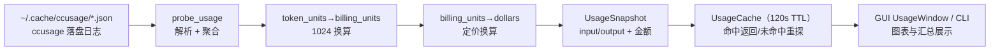

# 用量统计（Usage）领域

**模块路径**：`crates/terrain-core/src/usage.rs`
**生成日期**：2026-09-21

---

## 概述

usage 模块负责 Terrain 的 **token 用量统计**：它探测 LLM 会话产生了多少 token（输入/输出/模型成本），并在 **120 秒 TTL** 内缓存快照，供 GUI 的 Usage 窗口（`UsageWindow.svelte`）与 CLI 查询展示。它不自己调 LLM——而是**解析 `~/.cache/ccusage/` 里的 JSON 日志**（ccusage 抓取的每次调用的 token 记录），把原始记录汇总成干净的 `UsageSnapshot`。

可以把它想成**电表的集中读卡器**：电表（ccusage）在后台逐笔记录家里每一度电（token），读卡器（usage 模块）定期上门拍表、换算费用、生成月度账单（`UsageSnapshot`）。工程要点有三：一是**聚合零侵入**（不动 LLM 调用路径，只消费 ccusage 的落盘 JSON）；二是**1024 换算的通用封装**（`token_units_to_billing_units`、`billing_units_to_dollars` 交替换算，模型定价不硬编码进业务件）；三是**TTL 缓存**（90% 的查询命中也让 GUI 轮询不留性能坑）。

---

## 核心功能点

1. **探测（`probe_usage`）**：`usage.rs` 遍历 `~/.cache/ccusage/` 下 JSON 日志，解析每次调用的 token 记录。`UsageView`/`UsageAgg` 聚合出总量。

2. **快照（`UsageSnapshot`）**：`usage.rs` 把聚合结果固定成 `UsageSnapshot`（含 input/output token、换算后金额等），供 UI/CLI 一次性展示。

3. **单位换算（`token_units_to_billing_units`, `billing_units_to_dollars`）**：把 token 数按 1024 换算出计费单位、再按模型定价换算出美元——把"计费单位/价格"从业务逻辑里抽离，模型价目变动只改数据不改代码。

4. **TTL 缓存（`UsageCache`）**：`usage.rs` 维护 120s 的缓存快照，命中直接返回，未命中重新探测——GUI 的 5 秒轮询不会反复重扫日志。

5. **集成位（`src-tauri`）**：`commands/usage.rs` 用 `spawn_blocking`（`src-tauri/src/commands/usage.rs:14`）隔离解析阻塞，前端 `UsageWindow`/主窗口调用 usage 命令刷新图表。

---

## 关键组件

| 组件/类型 | 文件路径 | 核心职责 |
|---------|---------|---------|
| `probe_usage` | `crates/terrain-core/src/usage.rs` | 解析 ccusage JSON → 聚合 |
| `UsageSnapshot` | `crates/terrain-core/src/usage.rs` | 快照数据模型（token + 换算后金额） |
| `token_units_to_billing_units` / `billing_units_to_dollars` | `crates/terrain-core/src/usage.rs` | 1024 / 定价换算单 |
| `UsageCache` | `crates/terrain-core/src/usage.rs` | 120s TTL 快照缓存 |
| `commands/usage.rs` | `src-tauri/src/commands/usage.rs` | GUI 命令（`spawn_blocking` 隔离） |

---

## 内部数据流

一次用量查询的生命线：读 ccusage 日志 → 聚合 → 换算 → 缓存 → 查询命中/重探。**缓存是保护层**——同一窗口期反复查询只扫一次盘。

**关键步骤说明**：
1. 探测（usage.rs：`probe_usage`）：逐文件解析 ccusage JSON，把每次调用的 input/output token 汇成聚合值。
2. 换算（换算单）：`token_units_to_billing_units` 按 1024 换算、`billing_units_to_dollars` 按模型定价换算——业务不夹带定价。
3. 快照（usage.rs：`UsageSnapshot`）：固定结构一次交给调用方，查询方不需要懂聚合细节。
4. 缓存（`UsageCache`）：120s TTL，GUI 5 秒轮询 90% 命中缓存不扫盘。
5. 展示（commands/usage.rs）：`spawn_blocking` 隔离解析，异步执行器不被阻塞。

---

## 关键接口与扩展点

- **`probe_usage() -> UsageSnapshot`**：探测一次性快照；GUI 与 CLI 共用。
- **`UsageCache`**：TTL 缓存封装；`get_or_scan` 语义，命中/重探透明。
- **扩展「新计费维度」**：在 `UsageSnapshot` 加字段 + 换算单加函数；`ccusage` 上游只改日志格式不影响此层消费。
- **窗口集成**：`UsageWindow`/主窗口通过 `commands/usage.rs` 获取快照并刷新图表，刷新间隔由前端轮询决定。

---

## 与其他模块的交互

| 交互模块 | 方向 | 接口/协议 | 说明 |
|---------|------|---------|------|
| `src-tauri` | 消费 | `commands/usage.rs` → `probe_usage` | GUI 用量图 |
| `frontend`（UsageWindow） | 消费 | `UsageSnapshot`（IPC） | 用量图表与汇总 |
| `chat` | 平行 | — | token 记录由外部 ccusage 抓取，与 ChatEngine 的 tool 记录互补 |
| `settings` | 平行 | — | 用量窗口独立于模型设置 |

---

## 跨模块协作场景

**在「Usage 窗口刷新」中**：`UsageWindow.svelte` 定时（如 5 秒）invoke `usage_cmd` → `commands/usage.rs` `spawn_blocking` 调 `probe_usage` → 命中 `UsageCache`（120s）则直接返回，否则重探 → `UsageSnapshot` 回 UI 渲染图表。**用户看的"这几天花了几刀"不实时但近实时**，探查成本隔离在阻塞池。

**在「CLI 汇总」中**：`terrain usage` 类命令直接调 `probe_usage`，输出砖快照（或 --json）——脚本可以读用量、计费、生成报表，与聊天调用路径完全解耦。

---

## 性能考量

- **TTL 缓存**：120s 内查询不重扫日志，GUI 轮询安全。
- **`spawn_blocking` 隔离**：解析阻塞不占用异步执行器（`commands/usage.rs:14`），不拖累其他命令。
- **只读消费**：usage 不写任何日志，只读 ccusage 的文件——零写盘、零副作用。
- **聚合单层**：一次遍历聚合出总量，无多层 map-reduce 开销。

---

## 实现亮点

1. **"用量是旁路传感器"**：不侵入 LLM 调用路径，只消费 ccusage 的落盘 JSON——加装模块不带来耦合。
2. **换算与核心逻辑分离**：`token_units_to_billing_units`/`billing_units_to_dollars` 把"计费单位/价格"从业务逻辑里抽离——定价是数据不是代码，应变零重构。
3. **TTL 缓存挡住轮询风暴**：120s 缓存让"5 秒轮询一次"的用户成本基本为零。
4. **窗口即图表即快照**：`UsageSnapshot` 一个结构同时喂 GUI 图表、CLI 汇总与未来报表，消费形态统一。