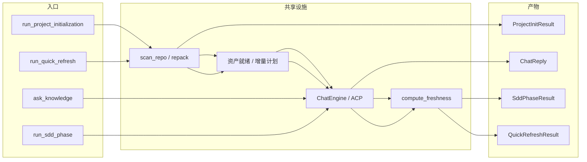

# 工作流编排（Workflows）领域

**模块路径**：`crates/terrain-agent/src/workflows/`（mod.rs、init.rs、quick_refresh.rs、ask.rs、sdd.rs）
**生成日期**：2026-09-21

---

## 概述

workflows 模块是 Terrain **一切"动作"的入口总闸**：项目初始化、快速保鲜、知识问答、SDD 四阶段——四大工作流的执行编排全部在这里。它们各自是一个"编排函数"，把 `terrain-core`（离线能力）与 `terrain-agent`（智能调用）拼成完整流程，并统一产出结构化结果（`ProjectInitResult` / `QuickRefreshResult` / `ChatReply` / `SddPhaseResult`）与进度回调。核心设计是**只暴露四个成品函数 + 一组进度类型，编排结构不外泄**——GUI 与 CLI 都看不到内部，只消费这几个"成品"。

把它想成**餐厅的四道招牌菜**：`run_project_initialization` 是"全宴"（扫描 → 文档 → 上下文全上），`run_quick_refresh` 是"轻食"（快扫 + 增量刷新），`ask_knowledge` 是"单点菜"（回答一个问题并可流式上菜），`run_sdd_phase` 是"套餐分级"（必须按顺序上菜）。它们共享同一座厨房（core/agent），但菜谱结构与纪律各不相同。工程顶层理念是**容错分层**：局部失败不中断全局、坏结果绝不静默覆盖好资产（详见第 3 章流程与第 5 章错误处理）。

---

## 核心功能点

1. **项目初始化（`run_project_initialization`）**：`init.rs:98`。先 `scan_repo` 得 `ScanReport`；`litho_human_complete_with_research`（init.rs:133）判定 human/ 是否完整，不全才 `run_litho_generation(LithoRunMode::Auto)`；最后 `run_agent_context_if_needed`（init.rs:16-94，`force_refresh=litho_ran`）保证上下文。产出 `ProjectInitResult`（`ipc/workflows.rs:69-79`：scan_files_written / repack_tokens / agent_context_generated / human_doc_count / litho_ran / notes）。**可选环节失败只记 notes，流程继续**。

2. **快速保鲜（`run_quick_refresh`）**：`quick_refresh.rs:22`。快扫 + repack（同步则跳过）→ 上下文门禁（`agent_execution_ready`）→ `run_agent_context_generation(force_full=false)`（增量优先，`plan_incremental_update` 三态）→ 可选 Litho 增量（`incremental_refresh && incremental_human_docs`）→ `compute_freshness`（quick_refresh.rs:240）收尾落账。产 `QuickRefreshResult`（refresh_mode + refresh_reason + notes，已翻译成人话）。

3. **知识问答（`ask_knowledge`）**：`ask.rs:11`。`runtime.chat_engine()` 失败即 `fallback_search_reply`（纯检索兜底，`ask.rs:79`，诚实标注"LLM 不可用"）；引擎可用则 `ChatEngine.ask` 流式回推。产 `ChatReply`（answer + citations + usage）。**LLM 不可用不等于没有回答**。

4. **SDD 四阶段（`run_sdd_phase`）**：`sdd.rs:14`。`plan_sdd_workflow` → 前置产物校验（缺则 bail 指名阶段）→ 后端分派（`execution_pure_acp || phase==CodeGen` 走 ACP，否则 LLM）→ `save_sdd_output` 白名单非空落盘。产 `SddPhaseResult`。**流程纪律绝不通融**。

5. **进度与结果统一**：四个工作流都带`on_progress` 回调；结果类型在 `ipc/workflows.rs` 定义（ts-rs 派生），GUI/CLI 消费同一套结构。

---

## 关键组件

| 组件/类型 | 文件路径 | 核心职责 |
|---------|---------|---------|
| `run_project_initialization` | `crates/terrain-agent/src/workflows/init.rs:98` | 全量初始化编排 |
| `run_agent_context_if_needed` | `crates/terrain-agent/src/workflows/init.rs:16` | 上下文门禁 + 增量/全量 + `force_refresh` |
| `run_quick_refresh` | `crates/terrain-agent/src/workflows/quick_refresh.rs:22` | 轻量保鲜编排 |
| `ask_knowledge` | `crates/terrain-agent/src/workflows/ask.rs:11` | 问答 + 检索兜底 |
| `fallback_search_reply` | `crates/terrain-agent/src/workflows/ask.rs:79` | LLM 不可用的检索兜底 |
| `run_sdd_phase` | `crates/terrain-agent/src/workflows/sdd.rs:14` | SDD 阶段执行（前置 + 分派 + 落盘） |
| `run_sdd_llm_phase` / `run_sdd_acp_phase` | `crates/terrain-agent/src/workflows/sdd.rs:114,130` | 后端分派实现 |
| `ProjectInitResult` / `QuickRefreshResult` | `crates/terrain-core/src/ipc/workflows.rs:69` / 相关 | 统一结果类型 |
| `SddPhaseArg`（CLI） | `crates/terrain-cli/src/cli.rs` | `--phase` 枚举映射 |

---

## 内部数据流

四大工作流入口到产出的总揽：它们共享"扫描/资产/智能"三件套，但编排顺序与纪律各不相同——这条总览图把"全宴 vs 轻食 vs 单点 vs 套餐"排序画在一条横带上。

**关键步骤说明**（以初始化为例，其余见各自领域页）：
1. 扫描（init.rs:98）：`ProjectScanner.scan_repo` 得出 `ScanReport`，全流程的原料。
2. 文档门禁（init.rs:133）：human/ 已齐则跳 Litho，避免重复昂贵的生成。
3. 上下文（init.rs:16）：`run_agent_context_if_needed` 先门禁（ACP/LLM ready）再增量/全量；任一失败只记 notes。
4. 汇总（`ProjectInitResult`）：scan_files_written / repack_tokens / human_doc_count / litho_ran / notes 全带，前端一条看一眼就懂"这次初始化成了什么"。

---

## 关键接口与扩展点

- **四大成品函数**：`run_project_initialization` / `run_quick_refresh` / `ask_knowledge` / `run_sdd_phase`——GUI 与 CLI 的唯一消费面，编排结构不外泄。
- **`run_agent_context_if_needed`**：init 与 quick_refresh 复用的上下文门禁函数，`force_refresh`（init）与 `force_full=false`（refresh）两条调用语义区分明显。
- **`fallback_search_reply`**：Ask 的检索兜底；任何调用方想要"LLM 失效时的诚实答案"都可复用。
- **扩展「新工作流」**：① `workflows/xxx.rs` 编排函数；② `workflows/mod.rs` 导出；③ 需要的话 `ipc/workflows.rs` 加结果类型。既有设施（scan/assets/chat/freshness）全程复用，无需触碰。
- **进度回调**：`on_progress(ProjectWorkflowProgress)` 类型（`ipc/workflows.rs`）统一描述工作流各阶段，前端进度环与日志都靠它。

---

## 与其他模块的交互

| 交互模块 | 方向 | 接口/协议 | 说明 |
|---------|------|---------|------|
| `ingest` | 依赖 | `ProjectScanner.scan_repo` | 扫描是 init/refresh 的第一步 |
| `assets` | 依赖 | `plan_incremental_update` / `build_*_prompt` | 增量决策与 prompt 构建 |
| `litho` | 依赖 | `run_litho_generation`（Auto） | init 文档 / refresh 增量文档 |
| `chat`（ChatEngine） | 依赖 | `ChatEngine.ask` / `load_session` | ask 与 sdd 的问答核心 |
| `acp` | 依赖 | `agent_execution_ready` / `sdd_acp_config` | 门禁与子进程配置 |
| `freshness` | 依赖 | `compute_freshness` | refresh 收尾落账 |
| `runtime` | 依赖 | `runtime.chat_engine()` | 共享引擎与配置失效 |
| `schema` / `ts_ipc` | 依赖 | 结果类型 | IPC 单源 |

---

## 跨模块协作场景

**在「初始化一条新项目」中**：`run_project_initialization` 先 `scan_repo`，再经 `run_agent_context_if_needed` 门禁（ACP 不可用就 notes+skip），最后 `run_litho_generation(Auto)` 生成 human 文档并 `litho_ran→force_refresh`。一次调用，四条产线（scan/repack/context/litho）全部编排，且**任一步骤失败都在 notes 里透明报告、流程不停**（init.rs:36-56,163-171）。

**在「快速保鲜 vs 初始化」的取舍中**：快速保鲜刻意**不**做全量 Litho（quick_refresh.rs:162-164 注释"从头生成属于初始化"），只在 `incremental_refresh && incremental_human_docs` 时增量更新文档，其余阶段走破坏性最小的增量路径——**同一套能力，两种编排，成本完全不同**。这印证了"工作流层是取舍层，core/agent 是能力层"的架构。

---

## 性能考量

- **增量优先**：refresh 与 init 的上下文阶段都走 `plan_incremental_update`，小变更只付一次 diff 驱动回合，避免完整架构走查。
- **门禁前置省成本**：`agent_execution_ready` 在任何模型调用前判定，不可用直接 skip 并记 notes，不在"注定失败"的路径上花钱。
- **落账零 IO**：`compute_freshness` 用账本缓存（git 未变即直接读），刷新收尾近乎零成本。
- **超时保护**：Ask `1200s` 墙钟、Litho `45min`、探活 `12s`——每个编排都有确定性出口。

---

## 实现亮点

1. **"只暴露成品，编排不外泄"**：四大入口是 GUI/CLI 的全部消费面，编排细节（门禁、三态、回退）都压在工作流内部——消费方不可能写出"绕过纪律"的调用。
2. **容错分层贯彻**：init/refresh 的"可选环节失败 → notes + 继续"，与 sdd 的"前置缺失 → bail"形成对照——**同一代码库内两种容错观，各自服务正确场景**。
3. **`ProjectInitResult` 的一次性看板**：scan/repack/context/human/litho + notes 一个对象讲清一整个初始化会话，前端无需再拼装。
4. **复用而非复制**：`run_agent_context_if_needed`、`fallback_search_reply`、`build_phase_infos` 这类"半成品函数"在工作流间被复用，避免四个入口各自实现一遍门禁/兜底/进度的命运。