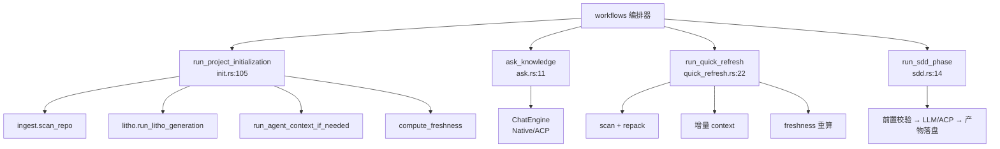

# workflows（业务流程编排）领域

**模块路径**：`crates/terrain-agent/src/workflows/`
**生成日期**：2026-09-15

---

## 这个模块在做什么

workflows 模块是知识工厂的"生产计划科"——它把 core 的各个车间按"扫描→文档→上下文→保鲜"的固定顺序串成端到端任务，并负责任务级错误处理、进度上报与结果组装。如果把 Terrain 比作一条汽车生产线，workflows 就是那个决定"这批零件先去焊接车间、再去喷漆车间、最后质检出厂"的调度员：它不亲自干活，但知道每一步该找谁、顺序是什么、失败了怎么办。

这个模块的核心价值在于"编排"——它把分散的 core/agent 能力按业务逻辑串联起来，让 CLI 和 Tauri 只需调用一个函数就能完成端到端任务。每个工作流都共享同一个 `Runtime`（paths + model_config + agent_executor），确保两种形态行为一致。

---

## 核心功能点

1. **Init 编排**：scan → （可选）ACP Litho `human/` → agent context → freshness 基线 → 汇总 `ProjectInitResult`（含 human_doc_count + notes）。核心实现在 `crates/terrain-agent/src/workflows/init.rs:105`。

2. **Ask 编排**：构造 ChatEngine → 按可用性选路径 → 流式把 `AskStreamEvent` 回吐；LLM 缺失 → `fallback_search_reply`。核心实现在 `crates/terrain-agent/src/workflows/ask.rs:11`。

3. **QuickRefresh 编排**：repack 是否 in-sync → 增量/全量 context → 可选增量 human → freshness 重算 → `QuickRefreshResult`。核心实现在 `crates/terrain-agent/src/workflows/quick_refresh.rs:22`。

4. **SDD 编排**：进程级 guard → 是否 `CodeGen`/`execution_pure_acp` 决定走 ACP 还是 Native LLM → 写入 `sdd/sessions/{id}/outputs/{N}.md` → 校验非空。核心实现在 `crates/terrain-agent/src/workflows/sdd.rs:14`。

5. **Litho 编排**：计划 → 研究任务广播执行 → 顺序 composition（最多重试 3 次）→ 产物稳定检测 → 墙钟超时兜底（45min）。核心实现在 `crates/terrain-agent/src/litho.rs:388`。

---

## 关键组件

| 组件/类型 | 文件路径 | 核心职责 |
|---------|---------|---------|
| `run_project_initialization` | `crates/terrain-agent/src/workflows/init.rs:105` | 项目初始化入口 |
| `ask_knowledge` | `crates/terrain-agent/src/workflows/ask.rs:11` | Ask 问答入口 |
| `fallback_search_reply` | `crates/terrain-agent/src/workflows/ask.rs:79` | LLM 不可用时的纯检索降级 |
| `run_quick_refresh` | `crates/terrain-agent/src/workflows/quick_refresh.rs:22` | 快速刷新入口 |
| `run_sdd_phase` | `crates/terrain-agent/src/workflows/sdd.rs:14` | SDD 阶段执行入口 |
| `run_litho_generation` | `crates/terrain-agent/src/litho.rs:388` | Litho 四阶段驱动 |
| `ProjectInitResult` | `crates/terrain-agent/src/workflows/mod.rs` | 初始化结果（含 human_doc_count + notes） |
| `QuickRefreshResult` | `crates/terrain-agent/src/workflows/mod.rs` | 快速刷新结果 |

---

## 内部数据流

**关键步骤说明**：
1. **Init 编排**（`run_project_initialization`）：由 `init.rs:105` 处理，按顺序串联 scan → litho → context → freshness
2. **Ask 编排**（`ask_knowledge`）：由 `ask.rs:11` 处理，构造 ChatEngine 并路由
3. **QuickRefresh 编排**（`run_quick_refresh`）：由 `quick_refresh.rs:22` 处理，增量优先策略

---

## 关键数据流与状态

| 流程 | 输入 | 输出 | 失败兜底 |
|------|------|------|---------|
| Init | 仓库路径（--slug） | `ProjectInitResult` | notes 收集故障；无 LLM 时跳过文档生成 |
| Ask | 问题 + project slug | `ChatReply`（流式事件） | `fallback_search_reply`（搜索引用） |
| QuickRefresh | path/slug | `QuickRefreshResult` | 增量不可信 → 全量重做 |
| SDD phase | phase + input | 阶段产物文件 | 前序未完成直接报错；产物空报错 |
| Litho | research 计划 | `human/` 文档集 | 缺文档重试≤3 次；端到端墙钟超时 |

---

## 关键接口与扩展点

**新流程接入**：加一个 `workflows/<name>.rs` 模块 + 在 CLI/Tauri 注册即可，全链路共享 Runtime。

**与 chat/llm 的松耦合**：workflows 不直接碰 LLM 实现细节，仅通过 `ChatEngine` 与 `*IfNeeded` 判定暴露最小表面。

---

## 与其他模块的交互

| 交互模块 | 方向 | 接口/协议 | 说明 |
|---------|------|---------|------|
| cli | 被依赖 | `terrain init/ask/refresh/sdd` | CLI 子命令直接调用 workflow |
| tauri | 被依赖 | Tauri invoke 命令 | 桌面端通过 IPC 调用 workflow |
| ingest | 依赖 | `scan_repo` | workflows 调用 ingest 的扫描功能 |
| assets | 依赖 | `plan_litho_generation` / `run_agent_context_generation` | workflows 调用 assets 的生成功能 |
| chat | 依赖 | `ChatEngine` | workflows 通过 ChatEngine 执行 Ask/SDD |
| freshness | 依赖 | `compute_freshness` | workflows 在末尾调用保鲜 |

---

## 跨模块协作场景

> 本模块在核心业务流程中的角色

**在项目初始化中**：workflows 是总调度。具体参与：
- `run_project_initialization` 按顺序调用 ingest → litho → context → freshness
- 任何单步失败不会导致全局中断，notes 收集故障信息

**在 DeepWiki Ask 中**：workflows 是路由器。具体参与：
- `ask_knowledge` 构造 ChatEngine，按配置路由到 Native 或 ACP
- 流式事件通过 Tauri Channel 或 NDJSON stdout 推送

**在快速刷新中**：workflows 是增量策略执行者。具体参与：
- `run_quick_refresh` 先检查 in-sync，再决定增量/全量
- Litho 只在 `incremental_human_docs` 开启时更新

---

## 性能考量

- **顺序固定**：scan → docs → context → freshness，避免并发竞争
- **增量优先**：QuickRefresh 默认增量，Litho 默认跳过
- **墙钟超时**：Litho 45min、Ask 1200s，确保不会无限等待
- **最多重试 3 次**：Litho 编排阶段最多重试 3 次（`MAX_COMPOSITION_ATTEMPTS=3`）

---

## 实现亮点

- **"局部失败不全局中断"**：每个工作流都设计了降级路径和 notes 收集，确保部分失败不影响整体
- **共享 Runtime**：所有工作流共享同一个 Runtime（paths + model_config + agent_executor），确保 CLI 和 Tauri 行为一致
- **Litho 产物稳定检测**：通过"稳定样本计数"启发式判断文档集是否完整，避免无谓等待
