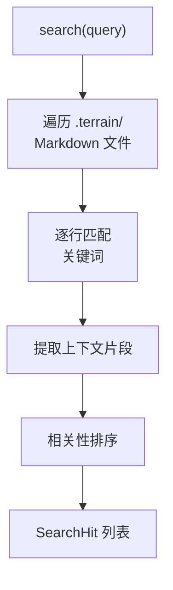

# 全文搜索

**模块路径**：`crates/terrain-core/src/search.rs`  
**生成日期**：2026-07-22

---

## 这个模块在做什么

全文搜索是 Terrain 知识检索的"搜索引擎"——它在 `.terrain/` 目录下的所有 Markdown 文档（human/、knowledge/、agent/）中进行关键词匹配，返回带相关性排序的搜索结果。在三层检索模型中，搜索属于 Meso 层：比 Macro 预载更精确，比 Micro grep 包更面向文档语义。

## 核心功能点

1. **知识库搜索**——`KnowledgeSearch::search` 遍历 `.terrain/` 下的 Markdown 文件进行全文匹配。
2. **搜索选项**——`SearchOptions` 支持项目过滤、结果数限制、路径前缀过滤。
3. **搜索结果**——`SearchHit` 包含文件路径、匹配行、上下文片段和相关性分数。
4. **CLI 入口**——`terrain search <query>` 命令行搜索。
5. **Ask 工具集成**——ChatEngine 将 search 作为工具调用选项，ACP 模式通过 `terrain tools search` 暴露。

## 关键组件

| 组件/类型 | 文件路径 | 核心职责 |
|---------|---------|---------|
| `KnowledgeSearch` | `search.rs` | 搜索引擎主结构 |
| `SearchOptions` | `search.rs` | 搜索参数 |
| `SearchHit` | `search.rs` | 单条搜索结果 |
| `search_knowledge` | Tauri/CLI 命令 | 搜索入口 |

## 内部数据流

## 与其他模块的交互

| 交互模块 | 方向 | 接口/协议 | 说明 |
|---------|------|---------|------|
| chat/mod.rs | 被调用 | search 工具 | Ask Meso 层 |
| workflows/ask | 依赖 | `fallback_search_reply` | LLM 不可用降级 |
| terrain-cli | 被调用 | `terrain search` | CLI 入口 |

## 跨模块协作场景

**在 DeepWiki 问答中**：ChatEngine 在推理过程中调用 search 工具检索 human/knowledge 文档，结果作为上下文注入 LLM prompt。

**降级搜索**：`fallback_search_reply` 在 LLM 不可用时直接返回搜索结果作为回答。

## 性能考量

- 文件系统遍历，大型 `.terrain/` 目录可能较慢
- 无索引结构，每次搜索全量扫描
- 结果数默认限制 20 条

## 实现亮点

作为 Meso 层检索手段，搜索在"文档语义"和"源码细节"之间架起桥梁——比 Macro 更精确，比 Micro grep 更面向架构文档。
