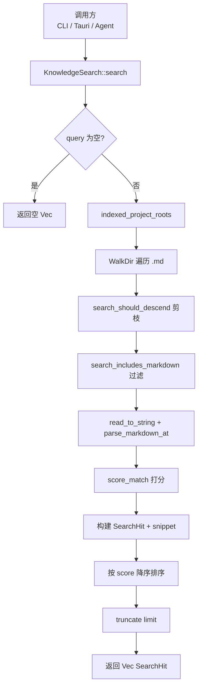

# 全文搜索领域

**模块路径**：`crates/terrain-core/src/search.rs`  
**生成日期**：2026-07-15

---

## 这个模块在做什么

全文搜索模块是 Terrain 知识库的「站内检索引擎」。它不依赖 Elasticsearch 或 SQLite FTS，而是在已注册项目的 `.terrain/` 目录树中，用 `walkdir` 遍历 Markdown 文件，对正文与 frontmatter 做 ASCII 不区分大小写的子串匹配，并按启发式权重打分排序。

搜索结果服务于三条消费路径：桌面 UI 的文档浏览与 Ask 辅助检索、CLI 的 `terrain search`、以及 ACP Agent 通过 `terrain tools search` 拉取 JSON 命中列表。

---

## 核心功能点

1. **项目范围遍历** — 通过 `KnowledgePaths::indexed_project_roots()` 获取所有已注册且存在 `index.md` 的项目根，支持按 `project` slug 过滤。

2. **智能目录剪枝** — `search_should_descend` 跳过 `agent`、`.litho-agent`、`.sdd-agent`、`.meta`、`env` 等目录；agent 目录下仅保留 `context.md`。

3. **启发式打分** — `score_match` 对 project 名、全文、正文分别加权，并对 query 分词追加 token 级加分。

4. **命中摘要** — `snippet` 在正文中定位首个 query token，截取前后约 40/80 字符。

5. **多根路径解析** — `read_doc_at_in_project` 依次尝试绝对路径、指定 slug 根、workspace 根、全部 indexed 根。

---

## 关键组件

| 组件/类型 | 文件路径 | 核心职责 |
|---------|---------|---------|
| `SearchHit` | `crates/terrain-core/src/search.rs:14-21` | 单条命中：path、project、doc_type、title、snippet、score |
| `SearchOptions` | `crates/terrain-core/src/search.rs:24-28` | 可选 project/doc_type 过滤与 limit |
| `KnowledgeSearch` | `crates/terrain-core/src/search.rs:30-137` | 搜索与 list_projects 入口 |
| `score_match` | `crates/terrain-core/src/search.rs:174-200` | 启发式相关性打分 |
| `search_should_descend` | `crates/terrain-core/src/search.rs:150-159` | WalkDir 剪枝规则 |
| `read_doc_at_in_project` | `crates/terrain-core/src/search.rs:291-345` | 多候选路径文档读取 |
| CLI 封装 | `crates/terrain-cli/src/commands/knowledge.rs:28-44` | `terrain search` → JSON 输出 |

---

## 内部数据流

---

## 关键接口与扩展点

- **打分策略** — 修改 `score_match` 可引入 BM25 或标题加权；当前实现刻意保持简单、无索引依赖。
- **doc_type 过滤** — `SearchOptions::doc_type` 已在核心层实现，CLI/Tauri 可按需加 `--doc-type` 参数。
- **排除规则** — `search_should_descend` / `search_includes_markdown` 是扩展新目录类型的单一入口。

---

## 与其他模块的交互

| 交互模块 | 方向 | 接口/协议 | 说明 |
|---------|------|---------|------|
| 路径布局 | 依赖 | `indexed_project_roots` | 多项目遍历范围 |
| 文档引擎 | 依赖 | `parse_markdown_at` | frontmatter 解析与标题提取 |
| CLI接口 | 被依赖 | `terrain search` | 命令行搜索入口 |
| 桌面UI | 被依赖 | `search_knowledge` IPC | UI 搜索面板 |
| Chat引擎 | 被依赖 | `terrain tools search` | Agent 辅助检索 |

---

## 跨模块协作场景

**在 DeepWiki 辅助检索中**：Agent 可通过 `terrain tools search` 在知识库中定位相关文档，再按需 `read-doc` 读取全文，作为 Macro/Meso 层的补充。

**在文档浏览中**：`read_doc_at_in_project` 的多候选路径解析是 UI 文档面板和源码引用模块的基础。

---

## 性能考量

- **全量扫描** — 每次搜索对所有 indexed 项目的 `.md` 做 WalkDir + `read_to_string`，与文档总量线性相关。
- **剪枝收益** — 跳过 `repomix.md` 与 agent 子树（除 context.md）显著降低 token 密集文件的重复读取。
- **默认 limit** — `options.limit == 0` 时默认 20，避免返回过大 JSON payload。

---

## 实现亮点

搜索模块刻意选择「无索引全量扫描」而非引入 Elasticsearch——对于 Terrain 的使用场景（每个 Agent 通常只关注当前仓库、文档量在数百篇级别），简单实现足够快且零运维，目录剪枝策略有效控制了扫描范围。
