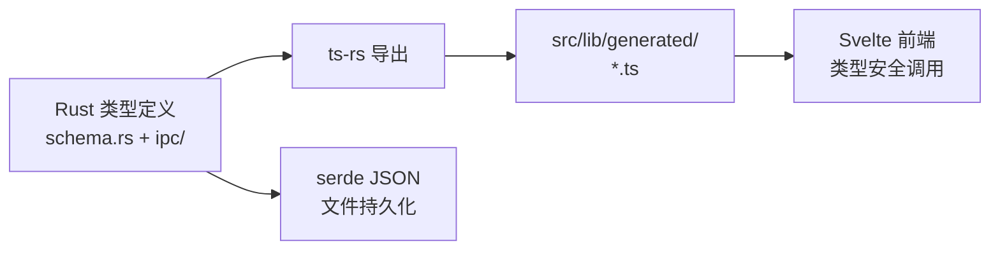

# 数据模型

**模块路径**：`crates/terrain-core/src/schema.rs` + `crates/terrain-core/src/ipc/`  
**生成日期**：2026-07-22

---

## 这个模块在做什么

数据模型模块定义了 Terrain 系统中所有跨边界共享的数据结构——从项目概览、新鲜度账本到 Litho 生成任务、Ask 流式事件。这些类型通过 ts-rs 自动导出到 TypeScript（`src/lib/generated/`），确保 Rust 后端与 Svelte 前端之间的类型安全契约。

Terrain 没有传统数据库，这些"数据模型"实际上是序列化到 JSON/Markdown 文件的结构定义。

## 核心功能点

1. **IPC 共享类型**——`crates/terrain-core/src/ipc/` 定义桌面与 CLI 共用的请求/响应类型。
2. **Schema 定义**——`schema.rs` 包含 FreshnessLedger、ProjectOverview、DocCounts 等核心结构。
3. **TypeScript 导出**——`#[cfg_attr(feature = "ts-export", derive(ts_rs::TS))]` 自动导出到 `src/lib/generated/`。
4. **序列化支持**——所有类型实现 `serde::Serialize/Deserialize`，支持 JSON 持久化。
5. **导出工具**——`terrain-ts-export` 二进制批量导出所有标记类型。

## 关键组件

| 组件/类型 | 文件路径 | 核心职责 |
|---------|---------|---------|
| `FreshnessLedger` | `schema.rs` | 新鲜度账本 |
| `ProjectOverview` | `schema.rs` | 项目概览 |
| `LithoGenerationJob` | `ipc/workflows.rs` | Litho 任务 |
| `AskStreamEvent` | `ipc/chat.rs` | Ask 流式事件 |
| `SddPhaseResult` | `ipc/workflows.rs` | SDD 阶段结果 |
| `ModelSettings` | `terrain-agent/settings.rs` | 模型配置 |
| `KnowledgePaths` | `paths.rs` | 路径布局根类型 |

## 内部数据流

## 与其他模块的交互

| 交互模块 | 方向 | 接口/协议 | 说明 |
|---------|------|---------|------|
| src-tauri | 消费 | IPC 类型 | Tauri 命令参数/返回值 |
| terrain-cli | 消费 | IPC 类型 | CLI 输出 JSON |
| Svelte 前端 | 消费 | generated/*.ts | invoke() 类型安全 |
| terrain-ts-export | 被调用 | 批量导出 | 类型同步 |

## 跨模块协作场景

**类型同步流程**：Rust 开发者修改 IPC 类型 → 运行 `terrain-ts-export` → 前端 `generated/` 自动更新 → TypeScript 编译检查类型一致性。

## 性能考量

- ts-rs 编译时导出，无运行时开销
- JSON 序列化用于文件持久化，非高频操作

## 实现亮点

单一数据源（Rust 类型定义）驱动前后端类型契约，避免手动维护 TypeScript 接口的漂移问题。
