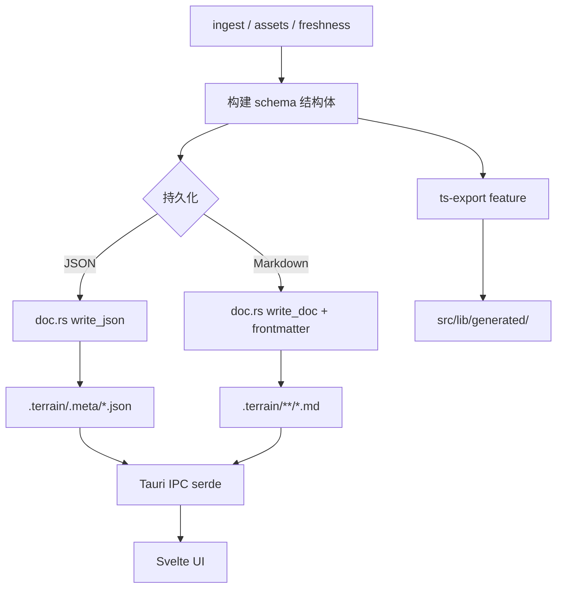

# 数据模型领域

**模块路径**：`crates/terrain-core/src/schema.rs`  
**生成日期**：2026-07-15

---

## 这个模块在做什么

`schema.rs` 是 Terrain 跨 crate、跨 IPC 边界的**类型契约层**。它用 `serde` 定义知识文档 frontmatter、项目元数据、Agent 资产 meta、新鲜度账本、SDD 会话、DeepWiki 引用等结构体，并在启用 `ts-export` feature 时通过 `ts_rs` 自动生成 TypeScript 类型到 `src/lib/generated/`。

该模块不包含业务逻辑，但决定了 `.terrain/` 目录下 JSON/Markdown 的字段命名、枚举序列化格式（如 `DocType` 小写、`AssetGenerator` kebab-case），以及 UI/CLI/Agent 之间的数据互操作性。

---

## 核心功能点

1. **文档类型枚举** — `DocType` 区分 project/module/interface/route/event/human/agent_context，并提供 `subdir()` 映射到目录（`schema.rs:12-48`）。

2. **通用 frontmatter** — `DocFrontmatter` 含 type、project、title、source、refs、deps 及 `extra` 扁平扩展字段（`schema.rs:52-69`）。

3. **采集元数据** — `ProjectMeta`、`InterfaceMeta`、`RouteMeta`、`EventMeta`、`SyncMeta` 支撑 ingest 写入（`schema.rs:71-112`）。

4. **资产轨道** — `AssetTrack`、`AssetGenerator`、`AgentPackMeta`、`AgentContextMeta` 描述 repomix 与 context 产出（`schema.rs:114-282`）。

5. **引用与切片** — `CitationKind`、`SourceCitation`、`SourceSlice` 服务 DeepWiki 回答与源码面板（`schema.rs:187-243`）。

6. **新鲜度全家桶** — `FreshnessSummary`、`FreshnessLedger`、`FreshnessDriftFactor` 等（`schema.rs:332-432`）。

7. **SDD 工作流** — `SddPhase`、`SddPlan`、`SddStatus`、`SddSessionInfo` 四阶段标准化开发（`schema.rs:466-579`）。

8. **项目概览 DTO** — `ProjectOverview` 聚合 doc_counts、litho、agent_context、asset_health、freshness（`schema.rs:438-464`）。

---

## 关键组件

| 组件/类型 | 文件路径 | 核心职责 |
|---------|---------|---------|
| `DocType` | `crates/terrain-core/src/schema.rs:12-48` | 知识文档种类与目录映射 |
| `DocFrontmatter` | `crates/terrain-core/src/schema.rs:52-69` | YAML frontmatter 结构 |
| `AgentPackMeta` | `crates/terrain-core/src/schema.rs:154-171` | repomix 打包元数据 |
| `FreshnessSummary` | `crates/terrain-core/src/schema.rs:346-370` | 新鲜度 API 响应 |
| `FreshnessLedger` | `crates/terrain-core/src/schema.rs:423-432` | 持久化账本 |
| `ProjectOverview` | `crates/terrain-core/src/schema.rs:438-464` | 桌面项目卡片数据 |
| `SddPhase` | `crates/terrain-core/src/schema.rs:471-514` | SDD 阶段枚举与文件名 |
| `SourceCitation` | `crates/terrain-core/src/schema.rs:202-214` | 回答中的引用条目 |
| TS 导出 | `src/lib/generated/*.ts` | 前端类型镜像 |

---

## 内部数据流

---

## 关键接口与扩展点

- **DocType 新种类** — 增加枚举变体、更新 `subdir()`、ingest 写入路径与搜索过滤；TS 导出需重新 `cargo test` 或 build script 刷新。
- **frontmatter.extra** — 结构化字段可暂存于 `extra` Map，稳定后再提升为一等字段，保持向后兼容。
- **FreshnessLedger version** — `LEDGER_VERSION` 在 `freshness.rs:27`；schema 变更时递增并在读取侧做迁移。
- **IPC 重命名** — `SourceSlice` 导出为 `IpcSourceSlice`（`schema.rs:235`）避免与前端本地类型冲突，新类型可沿用 `#[ts(export, rename = "...")]` 模式。

---

## 与其他模块的交互

| 交互模块 | 方向 | 接口/协议 | 说明 |
|---------|------|---------|------|
| 文档引擎 | 被依赖 | `DocFrontmatter`、`KnowledgeDoc` | Markdown 读写类型 |
| 新鲜度追踪 | 被依赖 | `FreshnessSummary`、`FreshnessLedger` | 评分与账本 |
| SDD工作流 | 被依赖 | `SddPhase`、`SddPlan` | 四阶段状态机 |
| 桌面UI | 被依赖 | `ProjectOverview` 等 IPC DTO | 前端类型安全 |
| 源码引用 | 被依赖 | `SourceCitation`、`SourceSlice` | 引用与切片 |

---

## 跨模块协作场景

**在项目概览面板中**：`ProjectOverview` 聚合 doc_counts、litho 状态、agent_context 就绪度与 freshness 分数，一次 IPC 调用驱动桌面项目卡片全部信息。

**在新鲜度计算中**：`compute_freshness` 构建 `FreshnessLedger` 并序列化到 `.meta/freshness.json`，`FreshnessSummary` 作为 API 响应返回 UI 与 CLI。

**在 SDD 工作流中**：`SddPhase` 枚举定义四阶段文件名与顺序，`SddSessionInfo` 跟踪会话进度供 UI 展示。

---

## 性能考量

- **序列化体积** — `ProjectOverview` 嵌套多层 Option 与 Vec，单次 IPC 可能达数十 KB；UI 应分接口加载（overview vs freshness vs docs）。
- **clone 成本** — 多数 API 返回 owned struct；大字段如 `structure_preview` 使用 `skip_serializing_if` 减少 JSON 体积。
- **枚举 Copy** — `DocType`、`SddPhase` 等为 `Copy`，热路径无堆分配。
- **无 schema 校验运行时** — 依赖 serde 反序列化失败即错误；恶意 JSON 可能导致反序列化开销，但仅本地信任文件。

---

## 实现亮点

`ts_rs` 自动导出使 Rust 与 Svelte 前端共享同一套类型定义——`ProjectOverview`、`FreshnessSummary` 等 IPC payload 在编译期保证字段一致，消除了手写 TypeScript 接口的漂移风险。
