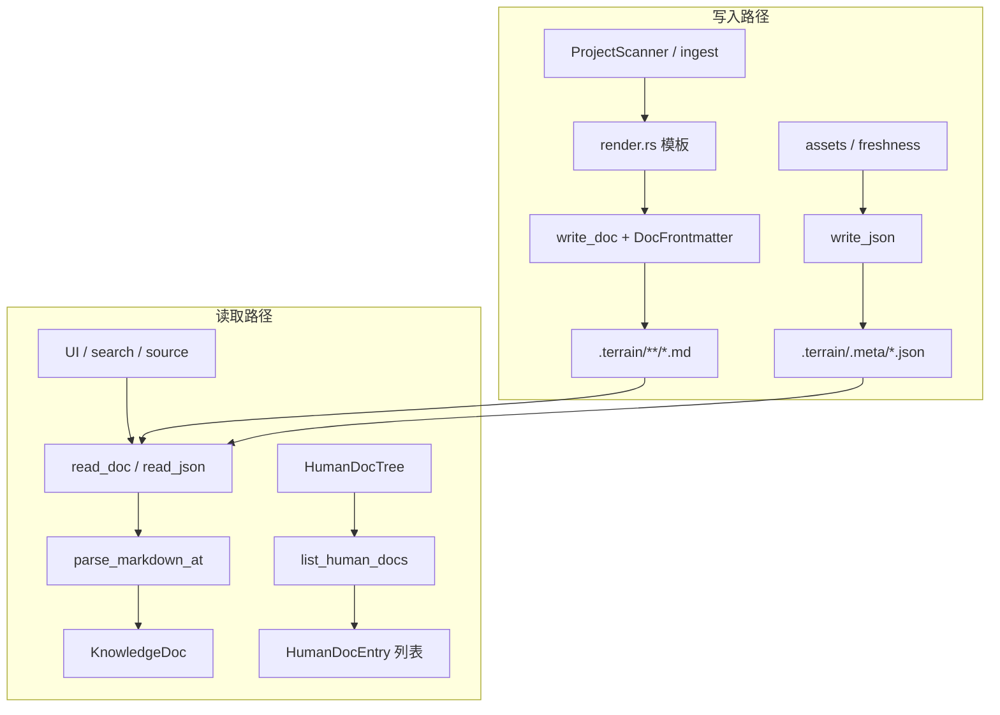

# 文档引擎领域

**模块路径**：`crates/terrain-core/src/doc.rs` + `human.rs` + `render.rs`  
**生成日期**：2026-07-15

---

## 这个模块在做什么

文档引擎由 `doc.rs`、`human.rs`、`render.rs` 三个文件组成，是 Terrain **Markdown/JSON 知识文件的读写与生成中枢**。`doc.rs` 负责 YAML frontmatter 解析、无 frontmatter 的 Litho `human/` 文档推断、以及 `read_doc`/`write_doc`/`read_json`/`write_json` 原语；`human.rs` 构建 UI 文档树（human/agent/structured 三区）并安全读取相对路径；`render.rs` 为 ingest 扫描器生成各类知识文档的 frontmatter 与正文模板。

三者配合实现「扫描器写 stub → Litho/Agent 覆写 → UI/搜索/引用读回」的闭环。

---

## 核心功能点

1. **frontmatter 解析** — `parse_markdown_at` 处理 `---` 分隔 YAML；无 frontmatter 时从路径推断 `DocType::Human`。

2. **项目 slug 推断** — `infer_project_slug` 沿 `.terrain` 祖先找仓库，再查 registry。

3. **文档 CRUD** — `read_doc`、`write_doc`、`render_markdown`。

4. **JSON 元数据** — `read_json`/`write_json` 服务 `.meta/*.json`、agent meta。

5. **文档树列举** — `list_human_docs` 合并 human、agent、structured 三区并排序。

6. **路径沙箱** — `sanitize_relative` + canonicalize 防止目录穿越。

7. **扫描模板** — `project_frontmatter`、`module_body`、`interface_frontmatter` 等。

---

## 关键组件

| 组件/类型 | 文件路径 | 核心职责 |
|---------|---------|---------|
| `KnowledgeDoc` | `crates/terrain-core/src/doc.rs:9-14` | path + frontmatter + body |
| `parse_markdown_at` | `crates/terrain-core/src/doc.rs:17-36` | Markdown 解析入口 |
| `infer_frontmatter` | `crates/terrain-core/src/doc.rs:42-59` | 无 YAML 时推断 |
| `read_doc` / `write_doc` | `crates/terrain-core/src/doc.rs:103-121` | 文件级读写 |
| `list_human_docs` | `crates/terrain-core/src/human.rs:15-25` | UI 文档树数据源 |
| `read_human_doc` | `crates/terrain-core/src/human.rs:143-156` | 安全读取 human/agent |
| `project_index_body` | `crates/terrain-core/src/render.rs:3-23` | 项目 index 正文模板 |
| `module_frontmatter` | `crates/terrain-core/src/render.rs:40-55` | 模块文档 frontmatter |

---

## 内部数据流

---

## 关键接口与扩展点

- **新 DocType 模板** — 在 `render.rs` 增加 `*_frontmatter` + `*_body`，并在 ingest 调用。
- **frontmatter 校验** — 可在 `parse_markdown_at` 后增加必填字段检查。
- **文档树分区** — `HumanDocEntry.section` 已支持 `human`/`agent`/`structured`，可增新区块。

---

## 与其他模块的交互

| 交互模块 | 方向 | 接口/协议 | 说明 |
|---------|------|---------|------|
| 源码扫描 | 被依赖 | `render.rs` 模板 | ingest 写 stub 文档 |
| 全文搜索 | 被依赖 | `parse_markdown_at` | 搜索命中解析 |
| 源码引用 | 被依赖 | `read_human_doc` | 知识 Markdown 捷径 |
| 数据模型 | 依赖 | `DocFrontmatter`、`DocType` | 类型契约 |
| 桌面UI | 被依赖 | `list_human_docs` | 文档树导航 |

---

## 跨模块协作场景

**在 ingest 扫描中**：`GitScanner` 和 `OpenApiImporter` 通过 `render.rs` 模板生成带 frontmatter 的 stub 文档，Litho 后续覆写 `human/` 目录下的 C4 文档。

**在 UI 文档树中**：`list_human_docs` 合并三区文档，`HumanDocTree` 不展示 `repomix.md`（`human.rs:138`），避免用户误打开数十万 token 的源码包。

---

## 性能考量

- **全文件读入** — `read_doc` 一次性 `read_to_string`；`list_human_docs` 对目录 WalkDir 仅收集元数据不读正文。
- **serde_yaml** — frontmatter 解析在热路径（搜索每次命中都 parse）；无 AST 缓存。
- **write 原子性** — `write_doc` 直接覆盖写，无临时文件+rename；崩溃可能留下半写文件，依赖 Git 恢复。

---

## 实现亮点

`infer_frontmatter` 对无 YAML 的 Litho `human/` 文档自动推断 `DocType::Human`，让 Litho 产出的人类文档无需 frontmatter 即可被搜索和引用模块正确识别——降低了 Litho Agent 的输出格式要求。
