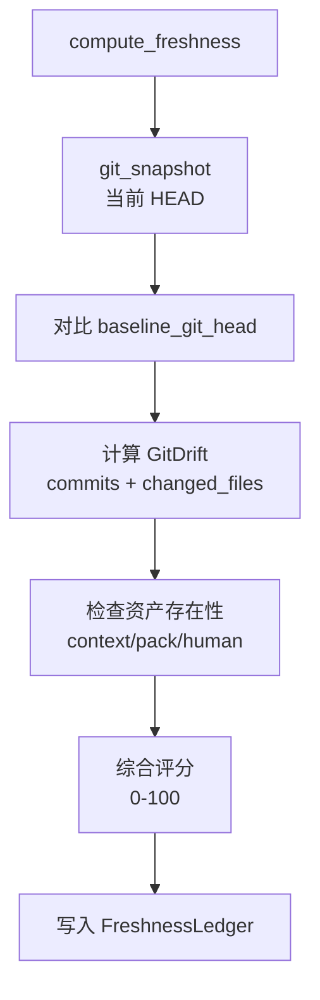

# 新鲜度追踪

**模块路径**：`crates/terrain-core/src/freshness.rs`  
**生成日期**：2026-07-22

---

## 这个模块在做什么

新鲜度追踪是 Terrain 的"质检部门"——它持续监控 Git 仓库与 `.terrain/` 知识资产之间的漂移程度，给每份资产打一个 0-100 的新鲜度评分。就像食品上的保质期标签，新鲜度评分告诉开发者和 Agent"这份架构文档还可靠吗？还是应该重新生成？"

当代码库经历了大量提交而知识资产未更新时，新鲜度评分下降，Ask 引擎会自动降低对 Macro 层（context.md）的信任权重，引导 Agent 更多依赖 repomix 源码包这一"权威快照"。

## 核心功能点

1. **新鲜度计算**——`compute_freshness` 综合 Git 漂移、资产存在性、生成时间等因素计算评分。
2. **Git 快照**——`git_snapshot`（`freshness.rs:70`）捕获当前 HEAD、dirty 状态。
3. **漂移检测**——`GitDrift` 计算 baseline 以来的提交数和变更文件列表。
4. **阈值控制**——`MACRO_PRELOAD_THRESHOLD=50`（预载门槛）、`FRESH_THRESHOLD=80`（绿色状态）、`VERIFY_THRESHOLD=70`（警告带）。
5. **账本持久化**——`FreshnessLedger` 写入 `.terrain/.meta/freshness.json`。

## 关键组件

| 组件/类型 | 文件路径 | 核心职责 |
|---------|---------|---------|
| `compute_freshness` | `freshness.rs` | 新鲜度计算主函数 |
| `git_snapshot` | `freshness.rs:70` | Git 状态快照 |
| `FreshnessLedger` | `schema.rs` | 账本数据结构 |
| `FreshnessSummary` | `schema.rs` | UI 展示摘要 |
| `FreshnessDriftFactor` | `schema.rs` | 漂移因子 |
| `read_freshness_ledger` | `freshness.rs:49` | 读取缓存账本 |

## 内部数据流

## 与其他模块的交互

| 交互模块 | 方向 | 接口/协议 | 说明 |
|---------|------|---------|------|
| chat/mod.rs | 消费 | `MACRO_PRELOAD_THRESHOLD` | Ask 预载决策 |
| ProjectOverviewPanel | 消费 | `FreshnessSummary` | UI 展示 |
| workflows/init | 触发 | 初始化后重算 | 更新基线 |

## 跨模块协作场景

**在 DeepWiki 问答中**：新鲜度 < 50 时 ChatEngine 跳过 context.md Macro 预载，避免基于过时架构信息回答。

**在桌面 UI 中**：`ProjectOverviewPanel.svelte` 展示新鲜度评分和漂移因子，`FreshnessHelpPanel.svelte` 解释评分含义。

## 性能考量

- 账本缓存避免每次 Ask 都重算 Git 漂移
- `read_freshness_ledger` 提供快速读取缓存路径
- Git 操作 best-effort，非 Git 仓库返回空快照

## 实现亮点

三级阈值设计（50/70/80）将"能不能用"、"要不要验证"、"是否新鲜"三个决策点解耦，比单一布尔值更实用。
