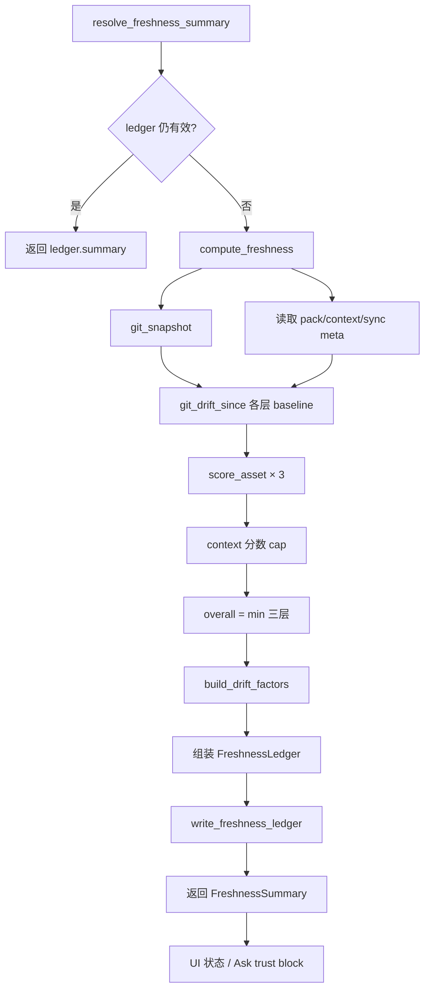

# 新鲜度追踪领域

**模块路径**：`crates/terrain-core/src/freshness.rs`  
**生成日期**：2026-07-15

---

## 这个模块在做什么

新鲜度追踪模块回答一个核心问题：**当前 `.terrain/` 里的知识资产，与 Git 仓库 HEAD 相比有多「旧」？** 它把知识分成三层资产——源码索引（`agent/repomix.md`）、Agent 架构上下文（`agent/context.md`）、人类文档（`human/`）——分别计算 0–100 分，再取最低值作为综合分。

分数驱动 UI 绿/黄/红状态、Ask 模式是否预加载宏观架构（`MACRO_PRELOAD_THRESHOLD = 50`），以及注入 LLM prompt 的强制信任规则块。

---

## 核心功能点

1. **三层资产评分** — `compute_freshness` 分别计算 pack、context、human 分数；context 受 pack 牵连（×0.9 且不超过 pack 分）。

2. **启发式扣分** — `score_asset` 按提交数、变更文件占比、同步天数、工作区脏递减。

3. **阈值常量** — `FRESH_THRESHOLD = 80`（UI 绿色）、`VERIFY_THRESHOLD = 70`（需 repomix 验证）、`MACRO_PRELOAD_THRESHOLD = 50`（Ask 预加载门槛）。

4. **漂移解释** — `build_drift_factors` 生成人类可读的 `FreshnessDriftFactor` 列表，说明扣分原因。

5. **账本缓存** — `resolve_freshness_summary` 在 HEAD/dirty 与 meta 时间戳未变时直接返回缓存。

6. **知识产出排除** — `.terrain/` 变更不计入脏工作区，避免知识资产更新自身触发扣分。

---

## 关键组件

| 组件/类型 | 文件路径 | 核心职责 |
|---------|---------|---------|
| `GitSnapshot` / `GitDrift` | `crates/terrain-core/src/freshness.rs:30-43` | Git HEAD 与 baseline 漂移快照 |
| `score_asset` | `crates/terrain-core/src/freshness.rs:132-152` | 单资产 0–100 评分公式 |
| `compute_freshness` | `crates/terrain-core/src/freshness.rs:398-590` | 主计算 + 写 ledger |
| `resolve_freshness_summary` | `crates/terrain-core/src/freshness.rs:593-608` | 缓存优先解析 |
| `format_freshness_trust_block` | `crates/terrain-core/src/freshness.rs:649-688` | LLM prompt 信任块 |
| `FreshnessSummary` | `crates/terrain-core/src/schema.rs:346-370` | 序列化类型定义 |
| CLI tools | `crates/terrain-cli/src/commands/tools.rs` | `terrain tools freshness` |

---

## 内部数据流

---

## 关键接口与扩展点

- **评分权重** — `score_asset` 中各扣分项系数可配置化。
- **第四层资产** — 若引入 CodeGraph 结构化文档层，可在 `FreshnessAssets` 扩展字段。
- **非 Git 仓库** — 当前非 Git 时主要靠同步天数评分，可接入文件 mtime 哈希作为伪 baseline。

---

## 与其他模块的交互

| 交互模块 | 方向 | 接口/协议 | 说明 |
|---------|------|---------|------|
| Chat引擎 | 被依赖 | `format_freshness_trust_block` | Ask prompt 信任规则注入 |
| Agent上下文 | 被依赖 | `agent_context_fresh` | context 层新鲜度判定 |
| 知识资产管理 | 被依赖 | `agent_pack_fresh` | pack 层新鲜度判定 |
| 路径布局 | 依赖 | `is_knowledge_output_path` | 脏工作区排除规则 |
| CLI接口 | 被依赖 | `terrain tools freshness` | Agent 新鲜度查询 |

---

## 跨模块协作场景

**在 DeepWiki 问答中**：`macro_preload` 由 `resolve_freshness_summary` 决定，低分时 withheld 宏观概览，引导 Agent 走 grep 验证路径；`format_freshness_trust_block` 注入 MANDATORY 信任说明。

**在外部 Agent 集成中**：Agent 应先调用 `terrain tools freshness`，`score < 50` 时降权信任并主动告知用户知识可能过期。

---

## 性能考量

- **账本缓存** — `resolve_freshness_summary` 的缓存路径将常见 UI 轮询成本降至接近零。
- **变更文件列表** — `sample_changed_files` 仅保留前 12 条用于 UI 展示。
- **同步计算** — 新鲜度计算在 IPC 线程同步执行，大仓库可能短暂卡顿。

---

## 实现亮点

「新鲜度降权而非阻断」的设计哲学——`score < 50` 时 Agent 降权信任而非拒绝服务，在可用性与准确性之间取得平衡。同时 `.terrain/` 变更不计入脏工作区，避免「更新知识资产反而降低分数」的悖论。
