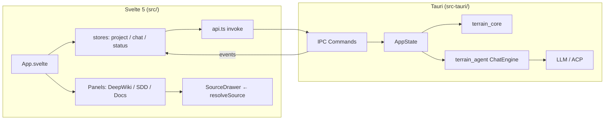

# 桌面UI领域

**模块路径**：`src/` + `src-tauri/`  
**生成日期**：2026-07-15

---

## 这个模块在做什么

桌面 UI 由 **Tauri v2 壳**（`src-tauri/`）与 **Svelte 5 前端**（`src/`）组成，是 Terrain 的主要交互界面。Rust 侧持有 `AppState`（`KnowledgePaths`、可热更新的 `ModelConfig`、懒加载的 `ChatEngine`），通过 `invoke_handler` 暴露 40+ IPC 命令；前端通过 `src/lib/api.ts` 调用这些命令，用 Runes 响应式 store 驱动项目选择、文档树、DeepWiki 问答、SDD 工作流、设置与用量监控。

应用启动时初始化系统托盘、bundled tools 与 preset skills，与 CLI 共享同一套 `terrain-core` / `terrain-agent` 能力，但增加了进度事件与剪贴板/对话框等原生能力。

---

## 核心功能点

1. **应用壳与状态** — `AppState` 管理 paths、model_config、ChatEngine 单例复用（`lib.rs:11-58`）。

2. **IPC 命令面** — `lib.rs:81-125` 注册 list/scan/search/ask/litho/sdd/freshness/env/usage 等命令。

3. **主界面编排** — `App.svelte` 集成项目选择器、导航 Tab、文档树、AskBar、DeepWiki、SDD、设置、SourceDrawer。

4. **类型安全桥接** — `ts-rs` 从 Rust schema 导出至 `src/lib/generated/`，`api.ts` 封装 `invoke`。

5. **源码面板** — `SourceDrawer` + `resolveSource` 将 `SourceCitation` 转为 `SourceSlice` 展示高亮代码。

6. **新鲜度 UX** — `mergeFreshness` 将 `FreshnessSummary` 合并进 `ProjectOverview`，配合 `FreshnessHelpPanel` 解释扣分因子。

---

## 关键组件

| 组件/类型 | 文件路径 | 核心职责 |
|---------|---------|---------|
| `AppState` | `src-tauri/src/lib.rs:11-58` | 全局状态与 ChatEngine 池 |
| `run` / invoke 注册 | `src-tauri/src/lib.rs:60-130` | Tauri 构建与命令表 |
| `commands/knowledge.rs` | `src-tauri/src/commands/knowledge.rs:11-70` | search/read/source IPC |
| `commands/project.rs` | `src-tauri/src/commands/project.rs:23+` | 项目初始化/概览/刷新 |
| `commands/settings.rs` | `src-tauri/src/commands/settings.rs` | 模型设置读写 |
| `App.svelte` | `src/App.svelte:1-120` | 主布局与 refresh 编排 |
| `api.ts` | `src/lib/api.ts:33+` | 前端 IPC 封装 |
| `DeepWikiPanel.svelte` | `src/lib/components/DeepWikiPanel.svelte` | Ask 问答 UI |
| `HumanDocTree.svelte` | `src/lib/components/HumanDocTree.svelte` | 文档树导航 |
| `SettingsPanel.svelte` | `src/lib/components/SettingsPanel.svelte` | LLM/ACP 配置 |

---

## 内部数据流

---

## 关键接口与扩展点

- **新面板** — 在 `MainNavTabs` 注册 Tab，添加 Svelte 组件 + Tauri command + `api.ts` 方法 + `ts-rs` 类型。
- **插件化 IPC** — 新命令集中在 `commands/mod.rs` 导出并在 `lib.rs` 注册。
- **主题与 i18n** — `app.css` / `terminology.ts` 是文案与术语中心。

---

## 与其他模块的交互

| 交互模块 | 方向 | 接口/协议 | 说明 |
|---------|------|---------|------|
| Chat引擎 | 依赖 | `ChatEngine::ask` | DeepWiki 问答 |
| 项目初始化 | 依赖 | `run_project_initialization` | 一键 onboarding |
| Litho文档生成 | 依赖 | litho IPC + progress events | 文档生成与进度 |
| SDD工作流 | 依赖 | sdd IPC 命令 | 四阶段 UI |
| 数据模型 | 依赖 | `ts-rs` 导出 | 类型安全桥接 |
| 源码引用 | 依赖 | `resolve_source_citation_cmd` | 源码面板 |

---

## 跨模块协作场景

**在 DeepWiki 问答中**：用户通过 `DeepWikiPanel` 提问，`AppState` 复用 `ChatEngine` 实例，`ChatPhase` 事件驱动 UI 进度指示（Thinking → Tools → Generating → Streaming）。

**在项目初始化中**：`litho-progress` 与 `project-init-progress` 事件让 UI 分阶段展示扫描/Litho/上下文进度，长时任务通过 `spawn` + event 推送避免 UI 假死。

---

## 性能考量

- **ChatEngine 复用** — `chat_engine()` 在 model_config 与 acp_settings 不变时复用实例。
- **大文档渲染** — `MarkdownViewer` / `SourceCodeViewer` 对 repomix 级大文件需懒加载。
- **前端轮询** — `readProjectFreshnessCached` 减轻重复 IPC 计算。
- **单线程 IPC** — 长时 Litho/SDD 通过 event 推送进度，避免 UI 假死。

---

## 实现亮点

`ts-rs` 单向类型导出消除了 Rust 与 TypeScript 之间的手写类型同步——`schema.rs` 中定义一次，`src/lib/generated/` 自动生成镜像，IPC payload 类型错误在编译期即可发现。
