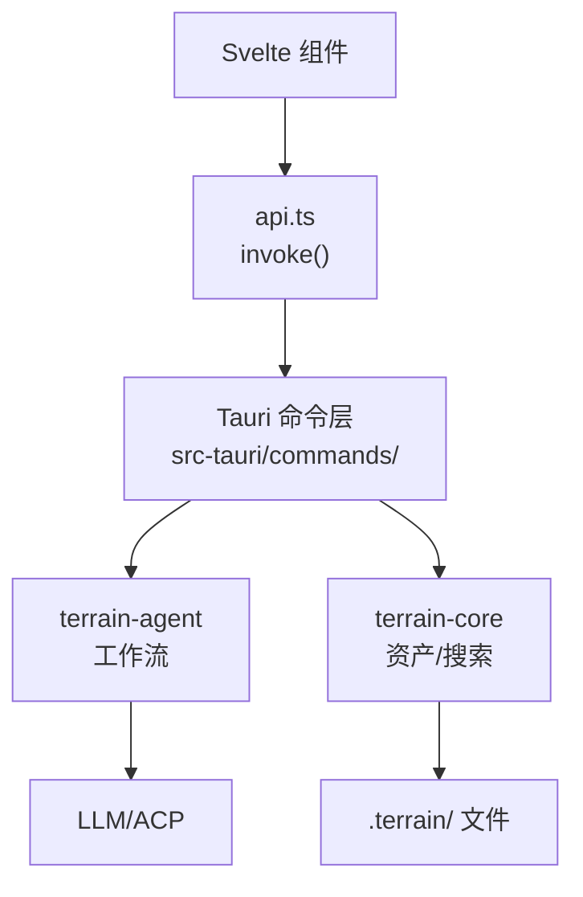

# 桌面 UI

**模块路径**：`src/lib/` + `src-tauri/`  
**生成日期**：2026-07-22

---

## 这个模块在做什么

桌面 UI 是 Terrain 的人类交互界面——基于 Svelte 5 + Tauri 2 构建的跨平台桌面应用。它把 Terrain 的所有能力（DeepWiki 问答、Litho 文档浏览、SDD 工作流、环境集成、项目概览）组织为面板化的标签页界面，通过 `invoke()` 调用 Rust 后端。

## 核心功能点

1. **面板化导航**——`MainNavTabs.svelte` 组织 Overview、DeepWiki、SDD、Env、Settings 等面板。
2. **DeepWiki 面板**——`DeepWikiPanel.svelte` + `stores/chat.svelte.ts` 实现流式问答和工具调用追踪。
3. **Litho 面板**——`ProjectOverviewPanel.svelte` + `HumanDocTree.svelte` 展示文档生成进度和 C4 文档树。
4. **SDD 面板**——`SddWorkflowPanel.svelte` 四阶段工作流 UI 和会话管理。
5. **环境集成面板**——`EnvIntegratePanel.svelte` 检测和安装 Skills/Tools/AGENTS.md。
6. **API 封装**——`api.ts` 封装所有 Tauri `invoke()` 调用。

## 关键组件

| 组件/类型 | 文件路径 | 核心职责 |
|---------|---------|---------|
| `App.svelte` | `src/App.svelte` | 应用根组件 |
| `api.ts` | `src/lib/api.ts` | Tauri invoke 封装 |
| `DeepWikiPanel.svelte` | `src/lib/components/` | 问答面板 |
| `ProjectOverviewPanel.svelte` | `src/lib/components/` | 项目概览 |
| `SddWorkflowPanel.svelte` | `src/lib/components/` | SDD 工作流 |
| `SettingsPanel.svelte` | `src/lib/components/` | 模型/ACP 设置 |
| `stores/chat.svelte.ts` | `src/lib/stores/` | Ask 会话状态 |
| `stores/project.svelte.ts` | `src/lib/stores/` | 项目选择状态 |
| Tauri 命令 | `src-tauri/src/lib.rs:54-107` | 40+ invoke 处理器 |

## 内部数据流

## 与其他模块的交互

| 交互模块 | 方向 | 接口/协议 | 说明 |
|---------|------|---------|------|
| terrain-agent | 依赖 | Tauri commands | 工作流执行 |
| terrain-core | 依赖 | Tauri commands | 资产/搜索 |
| generated/*.ts | 依赖 | IPC 类型 | 类型安全 |

## 跨模块协作场景

**Ask 流式问答**：`DeepWikiPanel` → `ask_knowledge_cmd` → ChatEngine → `AskStreamEvent` 流式更新 UI。

**Litho 生成**：`ProjectOverviewPanel` → `run_litho_generation_cmd` → Litho 进度事件 → `TaskProgressBar` 更新。

## 性能考量

- Svelte 5 runes 响应式模型，细粒度更新
- 流式 Ask 通过 NDJSON 事件逐步渲染
- Mermaid 图表懒加载避免首屏阻塞

## 实现亮点

`ToolCallTrace.svelte` 可视化 Agent 工具调用过程，让开发者理解 AI 如何检索知识——这是 DeepWiki 透明性的关键 UI 组件。
