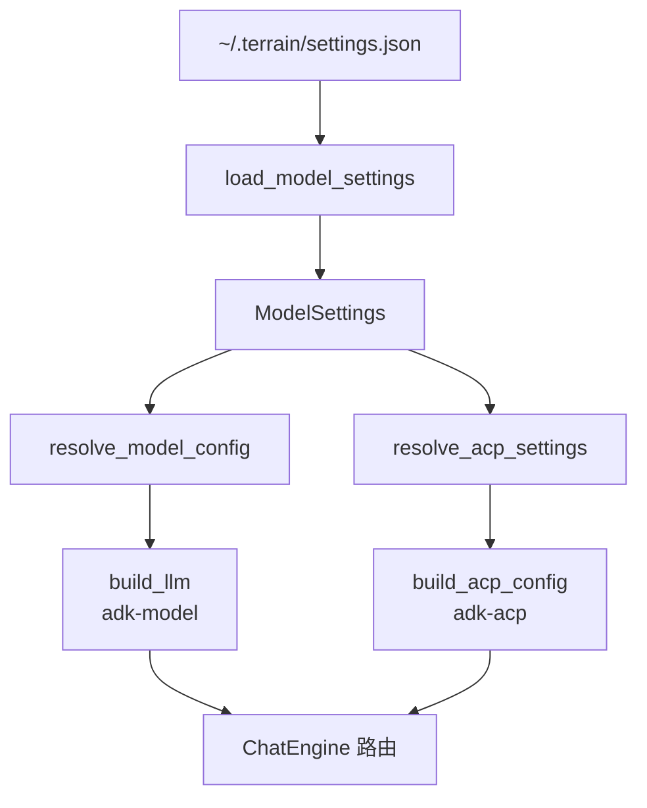

# 模型配置

**模块路径**：`crates/terrain-agent/src/model.rs` + `crates/terrain-agent/src/settings.rs`  
**生成日期**：2026-07-22

---

## 这个模块在做什么

模型配置模块管理 Terrain 的 LLM Provider 和 ACP Agent 设置——包括 API 端点、模型名称、API Key 以及执行模式（Native/ACP/混合）。这些配置决定了 ChatEngine 如何路由推理请求：哪些任务走直连 LLM，哪些委托给 ACP 子进程。

## 核心功能点

1. **Provider 解析**——`parse_provider` / `resolve_model_config`（`model.rs`）解析 OpenAI/Ollama/LM Studio 配置。
2. **LLM 构建**——`build_llm` 基于 `ModelConfig` 创建 adk-model LLM 实例。
3. **连通性检测**——`llm_status` 检测 LLM Provider 是否可用。
4. **设置持久化**——`load_model_settings` / `save_model_settings`（`settings.rs`）读写 `~/.terrain/settings.json`。
5. **执行模式**——`AgentExecution`（AcpNative/AcpOnly/NativeOnly）和 `AskExecution` 控制路由策略。
6. **环境变量加载**——`load_dotenv` 加载 `.env` 中的 API Key。

## 关键组件

| 组件/类型 | 文件路径 | 核心职责 |
|---------|---------|---------|
| `ModelConfig` | `model.rs` | LLM 配置结构 |
| `LlmProvider` | `model.rs` | Provider 枚举 |
| `ModelSettings` | `settings.rs` | 完整设置结构 |
| `AcpSettings` | `settings.rs` | ACP 配置 |
| `ProviderProfile` | `settings.rs` | 模型 Profile（efficient/powerful） |
| `AgentExecution` | `settings.rs` | 执行模式枚举 |
| `SettingsPanel.svelte` | `src/lib/components/` | 设置 UI |

## 内部数据流

## 与其他模块的交互

| 交互模块 | 方向 | 接口/协议 | 说明 |
|---------|------|---------|------|
| chat/mod.rs | 消费 | `ModelConfig` | 推理配置 |
| acp.rs | 消费 | `AcpSettings` | ACP 配置 |
| Runtime | 管理 | `set_model_config` | 运行时配置更新 |

## 实现亮点

efficient/powerful 双 Profile 设计让日常推理和复杂推理使用不同模型，平衡成本与质量。
