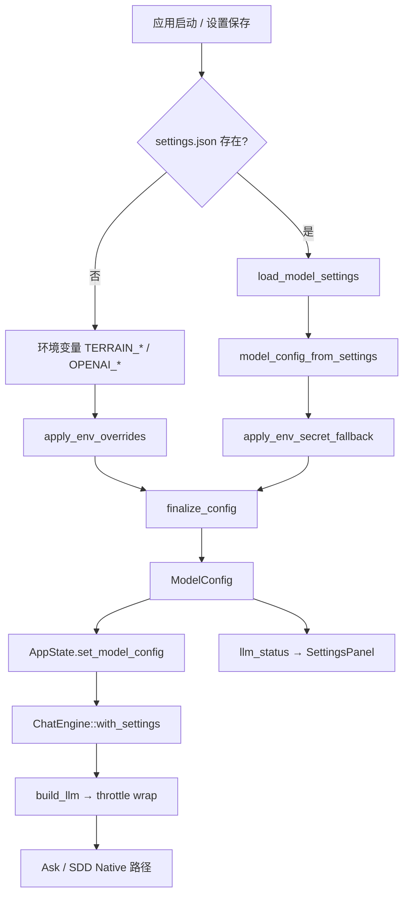

# 模型配置领域

**模块路径**：`crates/terrain-agent/src/model.rs` + `crates/terrain-agent/src/settings.rs`  
**生成日期**：2026-07-15

---

## 这个模块在做什么

模型配置模块统一管理 Terrain 所有 LLM 调用的**提供商、模型名、API 密钥与端点**。配置来源有优先级：`~/.terrain/settings.json`（桌面 UI 保存）高于环境变量；环境变量仅在无 settings 文件时作为完整 fallback，或在 OpenAI 提供商缺少 key 时补充密钥。

模块还定义 **Agent 执行模式**（`AgentExecution::Acp` vs `AcpNative`），决定 Ask/SDD 文档阶段走 Native LLM 还是纯 ACP，与 `AcpSettings` 一并序列化在 settings 文件中。

---

## 核心功能点

1. **三提供商** — `LlmProvider`: Ollama、OpenAI 兼容（含 NVIDIA 默认端点）、LM Studio。

2. **配置解析** — `resolve_model_config`：settings 优先 → env override → `finalize_config` 补默认 URL/key。

3. **LLM 构建** — `build_llm` 实例化 `OllamaModel` 或 `OpenAIClient`，并套 `throttle::wrap_llm` 冷却。

4. **就绪检查** — `llm_status` / `ensure_llm` 供 UI 设置页与 Ask 前校验。

5. **持久化 settings** — `load_model_settings` / `save_model_settings` 读写 `~/.terrain/settings.json`。

6. **多 Profile** — `ModelSettings.profiles` 按 provider 保存独立 model/key/url/ollama_host。

7. **ACP 设置** — `AcpSettings` 含 binary、args、command、`agent_execution`。

---

## 关键组件

| 组件/类型 | 文件路径 | 核心职责 |
|---------|---------|---------|
| `LlmProvider` | `crates/terrain-agent/src/model.rs:16-21` | 提供商枚举 |
| `ModelConfig` | `crates/terrain-agent/src/model.rs:24-30` | 运行时 LLM 配置 |
| `resolve_model_config` | `crates/terrain-agent/src/model.rs:67-83` | 配置解析主入口 |
| `build_llm` | `crates/terrain-agent/src/model.rs:133-146` | 构造 `Arc<dyn Llm>` |
| `LlmStatus` | `crates/terrain-agent/src/model.rs:35-41` | UI 状态 DTO |
| `ModelSettings` | `crates/terrain-agent/src/settings.rs:79-90` | 持久化 JSON 结构 |
| `AgentExecution` | `crates/terrain-agent/src/settings.rs:18-27` | Acp / AcpNative 模式 |
| `settings_path` | `crates/terrain-agent/src/settings.rs:92-94` | `~/.terrain/settings.json` |

---

## 内部数据流

---

## 关键接口与扩展点

- **新提供商** — 扩展 `LlmProvider`、`default_profile_for`、`build_llm` 分支。
- **密钥安全** — 当前 API key 明文存 settings.json；可接入系统 keychain。
- **按任务路由** — 可为 Litho/Ask/SDD 配置不同 model profile。
- **ACP 命令模板** — `AcpSettings.command` 允许自定义 spawn 行。

---

## 与其他模块的交互

| 交互模块 | 方向 | 接口/协议 | 说明 |
|---------|------|---------|------|
| Chat引擎 | 被依赖 | `resolve_model_config`、`build_llm` | LLM 客户端构建 |
| ACP协议 | 被依赖 | `AcpSettings`、`AgentExecution` | 执行模式与 ACP 配置 |
| SDD工作流 | 被依赖 | `execution_uses_native_llm` | 文档阶段路由 |
| 桌面UI | 被依赖 | settings IPC | 设置面板读写 |
| 项目初始化 | 被依赖 | `agent_execution_ready` | 初始化前配置检查 |

---

## 跨模块协作场景

**在 Hybrid 执行模式中**：`AgentExecution::AcpNative` 让 SDD 文档阶段与 Agent 上下文走 Native LLM，CodeGen 等仍走 ACP——仅改 settings 中的 `agent_execution` 即可切换，无需改业务代码。

**在 ChatEngine 复用中**：`AppState::chat_engine` 在 `model_config` 或 `acp_settings` 变化时丢弃旧引擎并重建，确保设置变更立即生效。

---

## 性能考量

- **ChatEngine 重建** — 频繁改设置会触发 LLM 客户端重建。
- **throttle 冷却** — `wrap_llm` 按环境限制调用频率，防止 UI 连点 Ask 打爆 API。
- **Ollama num_ctx** — `TERRAIN_OLLAMA_CTX` 可选覆盖上下文窗口，影响 Ollama 端内存与延迟。

---

## 实现亮点

settings 优先、环境变量 fallback 的双层配置解析（`resolve_model_config`）让桌面 UI 配置与环境变量部署场景无缝共存——开发者在 UI 中保存设置，CI/脚本通过环境变量覆盖，互不冲突。
