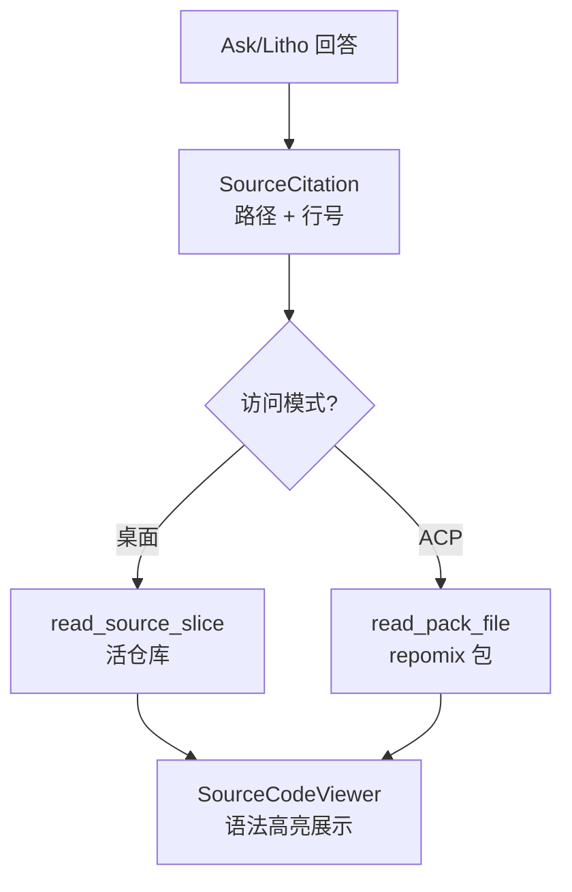

# 源码引用

**模块路径**：`crates/terrain-core/src/source.rs` + `crates/terrain-core/src/citations.rs`  
**生成日期**：2026-07-22

---

## 这个模块在做什么

源码引用模块管理 Terrain 回答中的来源引用（SourceCitation）——当 DeepWiki 回答或 Litho 文档引用代码时，需要提供可点击的文件路径和行号，让读者能追溯到具体源码位置。Terrain 维护两条源码访问路径：活仓库直接读取（桌面模式）和 repomix 包内检索（ACP 模式）。

## 核心功能点

1. **活仓库切片**——`read_source_slice`（`source.rs`）从 Git 仓库读取指定行范围的源码。
2. **引用解析**——`resolve_source_citation` 将引用路径解析为可读的源码切片。
3. **Citation 结构**——`SourceCitation`（`citations.rs`）包含文件路径、行号、引用类型（CitationKind）。
4. **Repomix 包检索**——`grep_pack` / `read_pack_file`（`assets/pack_read.rs`）在 ACP 模式下替代活仓库访问。
5. **前端展示**——`SourcePanel.svelte` / `SourceCodeViewer.svelte` 展示引用源码，支持语法高亮。

## 关键组件

| 组件/类型 | 文件路径 | 核心职责 |
|---------|---------|---------|
| `SourceCitation` | `citations.rs` | 引用数据结构 |
| `CitationKind` | `citations.rs` | 引用类型枚举 |
| `read_source_slice` | `source.rs` | 活仓库切片读取 |
| `resolve_source_citation` | `source.rs` | 引用解析 |
| `grep_pack` | `assets/pack_read.rs` | 包内 grep |
| `read_pack_file` | `assets/pack_read.rs` | 包内文件读取 |
| `SourceCodeViewer.svelte` | `src/lib/components/` | 源码查看器 |

## 内部数据流

## 与其他模块的交互

| 交互模块 | 方向 | 接口/协议 | 说明 |
|---------|------|---------|------|
| chat | 产出 | `SourceCitation` | Ask 回答引用 |
| terrain-cli/tools | 被调用 | grep/read-pack-file | ACP 工具 |
| Tauri | 被调用 | `read_source_slice_cmd` | 桌面源码查看 |

## 实现亮点

双路径设计（活仓库 vs repomix 包）是 Terrain 信任模型的核心体现——ACP 模式禁止读活仓库，强制通过 repomix 权威快照检索。
