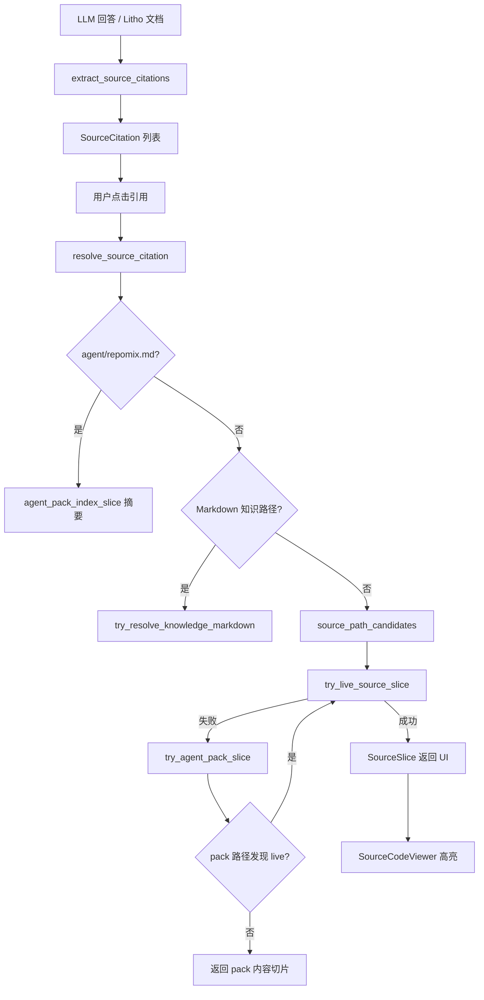

# 源码引用领域

**模块路径**：`crates/terrain-core/src/citations.rs` + `crates/terrain-core/src/source.rs`  
**生成日期**：2026-07-15

---

## 这个模块在做什么

源码引用模块负责 DeepWiki 回答与 Litho 文档中的**可点击代码引用**全链路：从 LLM 输出文本中 regex 提取 `path:line` 模式，到 UI 点击后解析为可展示的 `SourceSlice`。解析策略明确分层：**优先读 live Git 工作区文件**，其次用 repomix pack 做路径别名发现，最后才回退 pack 内嵌内容。

这使 Agent 可以引用 `src/lib.rs:42` 这类惯用写法，而用户能在桌面端看到真实源码高亮，而非过期的 pack 快照。

---

## 核心功能点

1. **引用提取** — `extract_source_citations` 用 `SOURCE_REF` 正则匹配多种扩展名与可选行号范围（`citations.rs:6-58`）。

2. **去重与过滤** — 跳过 `agent/repomix.md` 索引路径，按 path+line 去重。

3. **引用合并** — `merge_citations` 将工具调用产生的引用与文本提取结果合并。

4. **行号切片** — `read_source_slice` 从仓库文件读取指定行范围，支持 `0` 表示全文。

5. **路径候选** — `source_path_candidates` 处理 project 前缀、文件名缩写、扩展名变体。

6. **统一入口** — `resolve_source_citation` 编排 live → pack 别名 → pack 内容三级回退。

---

## 关键组件

| 组件/类型 | 文件路径 | 核心职责 |
|---------|---------|---------|
| `SOURCE_REF` 正则 | `crates/terrain-core/src/citations.rs:6-11` | path:line 模式 |
| `extract_source_citations` | `crates/terrain-core/src/citations.rs:14-58` | 从文本提取引用 |
| `merge_citations` | `crates/terrain-core/src/citations.rs:61-68` | 引用列表合并 |
| `read_source_slice` | `crates/terrain-core/src/source.rs:68-113` | 仓库文件行范围读取 |
| `resolve_source_citation` | `crates/terrain-core/src/source.rs:369-429` | UI 主解析入口 |
| `SourceCitation` / `SourceSlice` | `crates/terrain-core/src/schema.rs:202-243` | 引用与切片 DTO |
| Tauri IPC | `src-tauri/src/commands/knowledge.rs:52-69` | `resolve_source_citation_cmd` |

---

## 内部数据流

---

## 关键接口与扩展点

- **正则语言覆盖** — `SOURCE_REF` 扩展名列表可增补 Vue、Scala 等。
- **LSP 定义跳转** — 当前仅静态路径+行号；可接入 CodeGraph 符号解析。
- **引用样式** — `CitationKind` 已区分 HumanDoc/StructuredDoc/SourceCode，UI 可按 kind 渲染不同图标。

---

## 与其他模块的交互

| 交互模块 | 方向 | 接口/协议 | 说明 |
|---------|------|---------|------|
| Chat引擎 | 被依赖 | `extract_source_citations`、`merge_citations` | 回答引用提取 |
| 知识资产管理 | 依赖 | `read_agent_pack_file` | pack 回退读取 |
| 全文搜索 | 依赖 | `read_doc_at_in_project` | 知识 Markdown 捷径 |
| 桌面UI | 被依赖 | `resolve_source_citation_cmd` | SourceDrawer 展示 |
| 数据模型 | 依赖 | `SourceCitation`、`SourceSlice` | 引用 DTO |

---

## 跨模块协作场景

**在 DeepWiki 问答中**：`run_turn_native` 在答案生成后调用 `extract_source_citations` 与 `merge_citations`，将文本中的 `path:line` 模式与工具调用产生的引用合并，返回给前端的 `ChatReply.citations`。

**在用户点击引用时**：`resolve_source_citation` 优先读 live 仓库文件（测试 `prefers_live_repo_over_agent_pack` 保证），仅在 live miss 时才回退 pack，确保用户看到的是最新代码。

---

## 性能考量

- **live 优先** — 避免读数百 KB pack；pack 解析仅在 live miss 时触发。
- **正则单次扫描** — `extract_source_citations` 对整段回答 O(n)。
- **全文读取** — `start_line/end_line == 0` 时读整个文件，大文件引用应提示行范围。

---

## 实现亮点

三级回退解析策略（live → pack 别名 → pack 内容）在「引用准确性」与「离线可用性」之间取得平衡——有 live 仓库时始终展示最新代码，无 live 时仍能从 pack 快照中获取内容。
