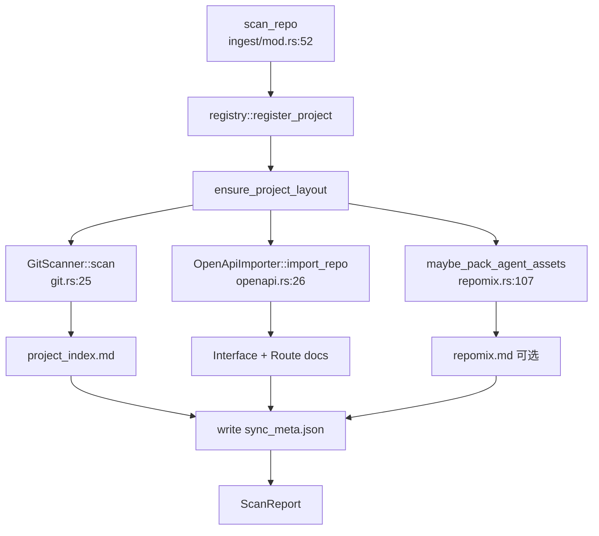

# 源码扫描领域

**模块路径**：`crates/terrain-core/src/ingest/`  
**生成日期**：2026-07-15

---

## 这个模块在做什么

源码扫描模块是 Terrain 知识库的**第一道数据采集流水线**。当用户指向一个 Git 仓库时，它不负责深度 AI 分析，而是快速、确定性地产出三类结构化索引：项目概览文档（技术栈 + 目录树）、OpenAPI 接口/路由文档、以及可选的 Repomix Agent Pack。

`ProjectScanner` 是整个 ingest 层的编排者——它注册项目 slug、确保 `.terrain` 目录布局、依次调用各采集器，最后写入 `sync_meta.json` 记录本次同步的 collector 列表与时间戳。

---

## 核心功能点

1. **统一扫描入口**——`ProjectScanner::scan_repo`（`ingest/mod.rs:52-111`）协调全部采集器，返回 `ScanReport`。

2. **Git 项目索引**——`GitScanner::scan`（`git.rs:25-46`）检测技术栈标记推断栈，用 `WalkDir` 生成最多 80 行的浅层目录树。

3. **OpenAPI 导入**——`OpenApiImporter::import_repo`（`openapi.rs:26-38`）递归查找 `openapi.yaml/json`，为每个 path×method 生成 Interface 与 Route 两份文档。

4. **Repomix 打包（可选特性）**——`#[cfg(feature = "repomix")]` 分支调用 `maybe_pack_agent_assets`，仅在需要时真正打包。

5. **同步元数据**——`SyncMeta` 写入 `sync_meta_path`，记录 `collectors` 数组供 UI 展示。

---

## 关键组件

| 组件/类型 | 文件路径 | 核心职责 |
|---------|---------|---------|
| `ProjectScanner` | `crates/terrain-core/src/ingest/mod.rs:39-111` | 扫描编排与 `ScanReport` 产出 |
| `ScanReport` | `crates/terrain-core/src/ingest/mod.rs:20-26` | 扫描结果 DTO |
| `GitScanner` | `crates/terrain-core/src/ingest/git.rs:12-46` | 技术栈检测 + 目录树 + 项目索引 |
| `detect_tech_stack` | `crates/terrain-core/src/ingest/git.rs:49-66` | 根据根目录标记文件推断栈 |
| `OpenApiImporter` | `crates/terrain-core/src/ingest/openapi.rs:13-122` | OpenAPI 规范解析与文档落盘 |
| `find_openapi_specs` | `crates/terrain-core/src/ingest/openapi.rs:124-145` | 仓库内 OpenAPI 文件发现 |
| `maybe_pack_agent_assets` | `crates/terrain-core/src/assets/repomix.rs:107-117` | 扫描期条件触发 repomix |

---

## 内部数据流

---

## 关键接口与扩展点

- **新增采集器**：在 `scan_repo` 中追加 collector 调用并 push 到 `collectors` 向量。
- **技术栈标记**：扩展 `detect_tech_stack` 的 `markers` 数组支持更多生态。
- **Repomix 特性门控**：无 `repomix` feature 时 `agent_pack` 为 `None`，轻量构建可剥离打包依赖。

---

## 与其他模块的交互

| 交互模块 | 方向 | 接口/协议 | 说明 |
|---------|------|---------|------|
| 路径布局 | 依赖 | `register_project`、`ensure_project_layout` | 注册 slug 与创建目录 |
| 知识资产管理 | 被依赖 | `maybe_pack_agent_assets` | 扫描期触发 repomix |
| 文档引擎 | 被依赖 | `render.rs` 模板 | 生成 frontmatter 与正文 |
| 项目初始化 | 被依赖 | `ProjectScanner::scan_repo` | 初始化第一步 |
| 新鲜度追踪 | 被依赖 | sync_meta 时间戳 | 新鲜度计算的同步基准 |

---

## 跨模块协作场景

**在项目初始化中**：`scan_repo` 是整条 onboarding 流水线的第一步，确保 `ensure_project_layout` 并注册 slug，为后续 Litho 与上下文生成奠基。

**在 CLI `terrain scan` 中**：独立触发扫描，不依赖 Litho 或 Agent 上下文，适合 CI 流水线在 merge 后刷新知识索引。

---

## 性能考量

- **浅层目录树**：`max_depth=2` 且最多 80 行，避免巨型 monorepo 扫描卡顿。
- **条件 OpenAPI**：无 spec 文件时 `import_repo` 返回 `None`，不做无效解析。
- **增量 Repomix**：扫描调用 `maybe_pack_agent_assets` 而非无条件 `pack`，Git 未变则跳过。

---

## 实现亮点

OpenAPI 双文档策略（每个 HTTP 操作同时写 Interface 与 Route）服务不同检索场景——Interface 含 summary 适合语义搜索，Route 含 operationId 适合按 handler 名定位。
