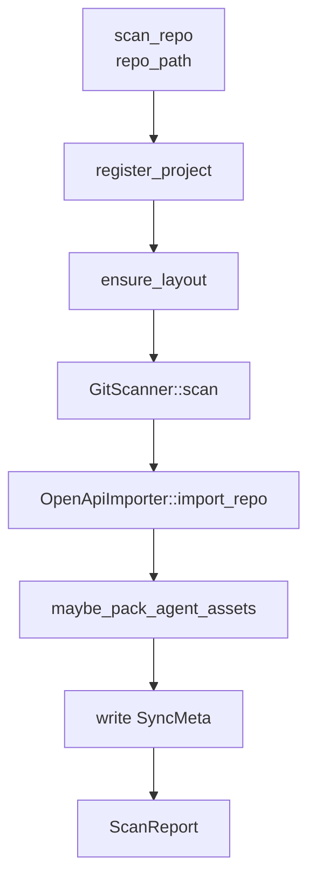

# 源码扫描

**模块路径**：`crates/terrain-core/src/ingest/`  
**生成日期**：2026-07-22

---

## 这个模块在做什么

源码扫描是 Terrain 知识工厂的"原材料入库"环节——它把一个 Git 仓库的元数据和结构信息采集为结构化的 Markdown 和 JSON 文件，为后续所有知识资产生成提供基础数据。扫描不是简单的文件列表，而是有针对性的采集：Git 提交历史、OpenAPI 规范、以及通过 repomix-core 打包的源码索引。

## 核心功能点

1. **项目扫描编排**——`ProjectScanner::scan_repo`（`ingest/mod.rs:52`）注册项目、确保目录布局、依次调用各采集器。
2. **Git 元数据采集**——`GitScanner`（`ingest/git.rs`）采集分支、提交历史、贡献者等 Git 元数据。
3. **OpenAPI 导入**——`OpenApiImporter`（`ingest/openapi.rs`）自动发现并导入仓库中的 OpenAPI 规范。
4. **Repomix 打包**——`maybe_pack_agent_assets`（`assets/repomix.rs`）调用 repomix-core 生成 `agent/repomix.md`。
5. **同步元数据**——写入 `SyncMeta` 到 `.terrain/.meta/sync.json` 记录扫描状态。

## 关键组件

| 组件/类型 | 文件路径 | 核心职责 |
|---------|---------|---------|
| `ProjectScanner` | `ingest/mod.rs:39` | 扫描编排器 |
| `ScanReport` | `ingest/mod.rs:20` | 扫描结果摘要 |
| `GitScanner` | `ingest/git.rs` | Git 元数据采集 |
| `OpenApiImporter` | `ingest/openapi.rs` | OpenAPI 规范导入 |
| `AgentPackSummary` | `ingest/mod.rs:31` | repomix 包摘要 |
| `registry::register_project` | `registry.rs` | 项目注册 |

## 内部数据流

## 与其他模块的交互

| 交互模块 | 方向 | 接口/协议 | 说明 |
|---------|------|---------|------|
| workflows/init | 被调用 | `ProjectScanner::scan_repo` | 初始化第一步 |
| workflows/quick_refresh | 被调用 | 扫描 + repack | 快速刷新 |
| assets/repomix | 依赖 | `maybe_pack_agent_assets` | 源码打包 |
| registry | 依赖 | `register_project` | 项目注册 |

## 跨模块协作场景

**在项目初始化中**：作为 `run_project_initialization` 的第一步执行，产出 `ScanReport` 供后续 Litho 和 context 生成使用。

**在快速刷新中**：`run_quick_refresh` 重新执行扫描和 repomix 打包，跳过 Litho。

## 性能考量

- repomix 打包是扫描中最耗时的步骤（取决于仓库大小）
- `maybe_pack_agent_assets` 有跳过逻辑（`agent_pack_ready` 检测）
- Git 和 OpenAPI 采集为同步操作，通常很快

## 实现亮点

采集器插件化设计——`collectors` 数组记录本次扫描使用了哪些采集器（git/openapi/repomix），便于追踪和调试。
