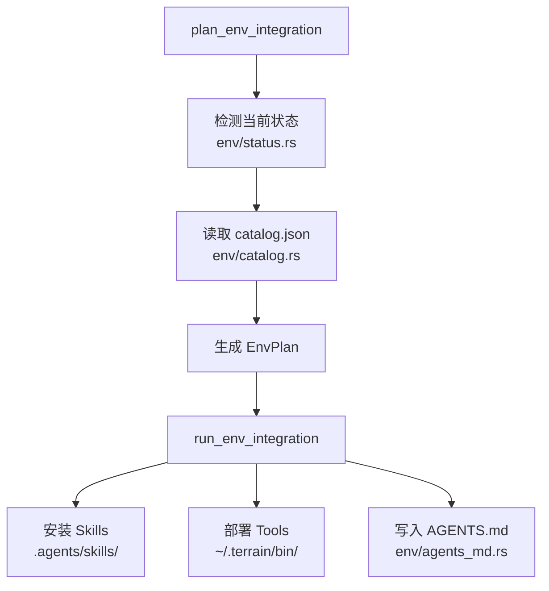

# 环境集成

**模块路径**：`crates/terrain-core/src/assets/env/`  
**生成日期**：2026-07-22

---

## 这个模块在做什么

环境集成模块是 Terrain 的"修路队"——它为外部 Coding Agent 安装和配置所需的 Skills、CLI 工具链和 `AGENTS.md` 引导片段，让 Agent 知道如何正确使用 Terrain 的知识层。没有环境集成，Agent 就像没有地图的旅行者；有了它，Agent 有了标准化的"导航路线"。

## 核心功能点

1. **集成计划**——`plan_env_integration`（`env/mod.rs`）检测当前环境状态，生成安装计划。
2. **集成执行**——`run_env_integration`（`env/apply.rs`）按依赖顺序安装 Skills 和工具。
3. **状态检测**——`get_env_status`（`env/status.rs`）检测 Skills/CodeGraph/RTK 安装状态。
4. **目录管理**——`env/catalog.rs` 读取 `env-catalog/catalog.json` 集成目录。
5. **AGENTS.md 写入**——`env/agents_md.rs` 向项目根目录写入管理的 AGENTS.md 片段。

## 关键组件

| 组件/类型 | 文件路径 | 核心职责 |
|---------|---------|---------|
| `plan_env_integration` | `assets/env/mod.rs` | 生成集成计划 |
| `run_env_integration` | `assets/env/apply.rs` | 执行安装 |
| `get_env_status` | `assets/env/status.rs` | 状态检测 |
| `EnvPlan` / `EnvPlanStep` | `schema.rs` | 计划数据结构 |
| `EnvIntegratePanel.svelte` | `src/lib/components/` | 集成 UI |
| `env-catalog/` | 项目根目录 | 集成目录定义 |

## 依赖安装顺序

```
terrain-knowledge → repomix-context → codegraph → rtk
```

## 内部数据流



## 与其他模块的交互

| 交互模块 | 方向 | 接口/协议 | 说明 |
|---------|------|---------|------|
| preset_skills | 依赖 | skill 目录 | Skills 来源 |
| bundled_tools | 依赖 | 工具部署 | CodeGraph/RTK |
| Tauri | 被调用 | `plan/run_env_integration_cmd` | 桌面触发 |
| terrain-cli | 被调用 | `terrain env plan/apply` | CLI 触发 |

## 跨模块协作场景

**在桌面 UI 中**：`EnvIntegratePanel.svelte` 展示各组件安装状态，`EnvPlanPanel.svelte` 预览变更后执行 apply。

## 实现亮点

依赖顺序强制执行（knowledge → repomix → codegraph → rtk）确保 Agent 按正确层级使用知识——先读 context，再 grep 包，最后用 CodeGraph 分析。
