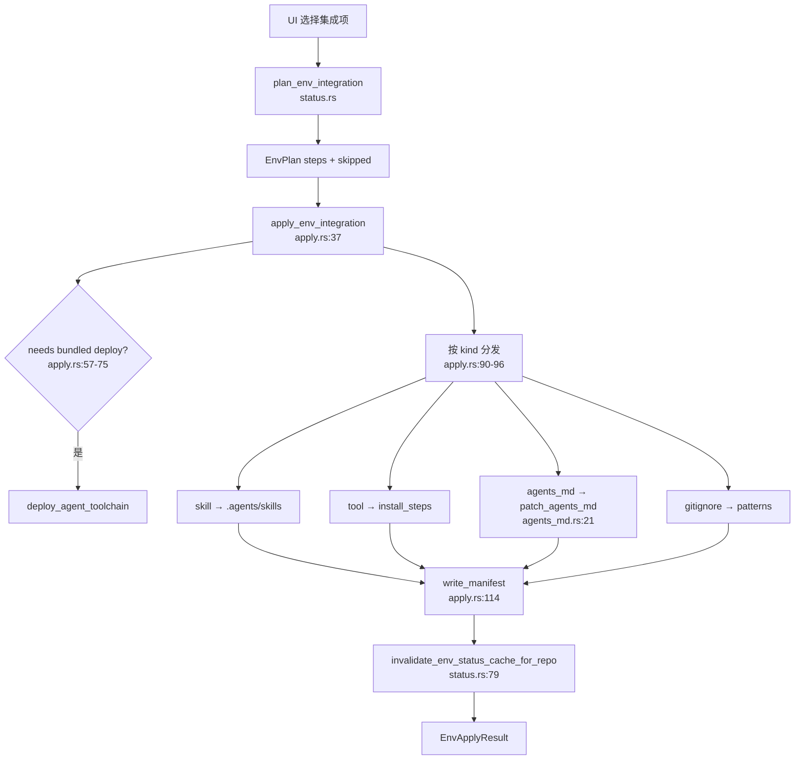

# 环境集成领域

**模块路径**：`crates/terrain-core/src/assets/env/`  
**生成日期**：2026-07-15

---

## 这个模块在做什么

环境集成模块解决的是另一个维度的问题：Terrain 不仅要在自己的知识库里理解项目，还要帮开发者在**目标仓库里**搭好 AI 工程环境——安装 preset skills、部署 bundled 工具链（RTK、CodeGraph）、修补 `AGENTS.md`、更新 `.gitignore`，并创建 `.terrain/knowledge/` 目录供团队沉淀文档。

它采用「声明式目录 + 命令式应用」模式：`env-catalog/catalog.json` 描述所有可集成项，`get_env_status` 检测当前仓库就绪度，`plan_env_integration` 生成执行计划，`apply_env_integration` 真正落盘。UI 上的「环境优化」向导背后就是这条链路。

---

## 核心功能点

1. **目录加载与缓存**——`load_catalog`（`catalog.rs:20-27`）从 `env_catalog_root()`（`83-88` 行，默认 `env-catalog/`）读取 `catalog.json`，`OnceLock` 全局缓存。

2. **集成状态检测**——`get_env_status`（`status.rs`）遍历 `IntegrationDef`，按 `kind`（skill/tool/agents_md/gitignore）执行不同就绪检查，结果带 `integrated`、`depends_on`、`bundled` 等字段；带 per-repo fingerprint 缓存（`18-23、72-88` 行）。

3. **执行计划**——`plan_env_integration`（`status.rs`）根据用户选中的 ID 与 `depends_on` 拓扑排序，产出 `EnvPlanStep` 列表与跳过原因。

4. **应用集成**——`apply_env_integration`（`apply.rs:37-120`）按 plan 逐步执行：skill 复制到 `.agents/skills` 与 `.claude/skills`（`SKILL_DEPLOY_DIRS`，`18` 行）、tool 安装、gitignore 补丁、`patch_agents_md`。

5. **AGENTS.md 块管理**——`patch_agents_md`（`agents_md.rs:21-55`）用 `<!-- terrain:begin {id} v{n} -->` 标记替换或追加片段，支持版本升级（`replace_or_append_block`，`57-86` 行）。

6. **轻量摘要**——`summarize_agent_env_light`（`status.rs:92+`）为项目概览提供快速 env 就绪摘要，复用与 `get_env_status` 相同的规则。

---

## 关键组件

env 子模块按 catalog、status、apply、agents_md 四层拆分。

| 组件/类型 | 文件路径 | 核心职责 |
|---------|---------|---------|
| `EnvCatalog` | `crates/terrain-core/src/assets/env/catalog.rs:29-35` | 集成清单与 AGENTS.md 块定义 |
| `load_catalog` | `crates/terrain-core/src/assets/env/catalog.rs:20-27` | 加载并缓存 catalog.json |
| `resolve_skill_source` | `crates/terrain-core/src/assets/env/catalog.rs:90-101` | 解析 skill 源目录（preset 或 catalog） |
| `get_env_status` | `crates/terrain-core/src/assets/env/status.rs` | 检测仓库各集成项就绪状态 |
| `plan_env_integration` | `crates/terrain-core/src/assets/env/status.rs` | 生成应用计划与依赖排序 |
| `apply_env_integration` | `crates/terrain-core/src/assets/env/apply.rs:37-120` | 执行集成并写 manifest |
| `patch_agents_md` | `crates/terrain-core/src/assets/env/agents_md.rs:21-55` | 幂等更新仓库 AGENTS.md |
| `agents_md_ready` | `crates/terrain-core/src/assets/env/agents_md.rs:10-19` | 检测 knowledge-guide 块是否存在 |
| `invalidate_env_status_cache_for_repo` | `crates/terrain-core/src/assets/env/status.rs:79-88` | apply 后失效状态缓存 |

---

## 内部数据流

用户在 UI 选择集成项后，系统先规划再逐项应用，最后写 manifest 并刷新缓存。

**关键步骤说明**：

1. **依赖满足**：`dependencies_satisfied` 确保例如 tool 在 skill 之后安装。
2. **Bundled 工具链**：选中 bundled 集成时可能触发 `deploy_agent_toolchain_with_options`（`apply.rs:67-74`），并写 `REPO_AGENT_TOOLS_MANIFEST`。
3. **可选项容错**：`optional` 集成失败进入 `skipped` 而非 `errors`（`apply.rs:103-107`）。
4. **knowledge 目录**：`ensure_knowledge_dir`（`apply.rs:112`）保证 `.terrain/knowledge/` 存在，与 `project_meta` 的 knowledge 采集对齐。

---

## 关键接口与扩展点

- **Catalog 扩展**：在 `catalog.json` 新增 `IntegrationDef` 即可添加 skill/tool，无需改 Rust（`catalog.rs:37-67` 字段已覆盖 install、check、patterns 等）。
- **自定义 Catalog 根**：`TERRAIN_ENV_CATALOG` 环境变量（`catalog.rs:84-86`）指向企业私有集成清单。
- **AGENTS.md 片段**：`agents_md_blocks` 数组（`catalog.rs:34、76-81`）声明 fragment 文件与版本号，升级时自动替换旧块。
- **Skill 部署目录**：`SKILL_DEPLOY_DIRS`（`apply.rs:18`）常量控制复制目标，可扩展 Cursor 等工具的 skills 路径。

---

## 与其他模块的交互

| 交互模块 | 方向 | 接口/协议 | 说明 |
|---------|------|---------|------|
| 知识资产管理 | 协作 | `assets/mod.rs` 导出 | env 是 assets 子模块 |
| CLI接口 | 被依赖 | `terrain env` 子命令 | status/plan/apply |
| 桌面UI | 被依赖 | env IPC 命令 | 环境优化向导 |
| 预设Skills | 依赖 | `resolve_skill_source` | skill 源目录解析 |

---

## 跨模块协作场景

**在环境集成流程中**：用户从项目概览进入环境向导，`get_env_status` 展示当前就绪度，`plan_env_integration` 生成可执行计划，`apply_env_integration` 落盘 skills 与 AGENTS.md。

**在项目初始化后**：团队可选择性应用 env 集成，让外部 Cursor/OpenCode Agent 通过 AGENTS.md 片段知道如何访问 `.terrain/` 知识层。

**在 ACP Agent 工作流中**：安装的 skills 与 `terrain tools` 指引使外部 Agent 能按标准协议检索知识，无需人工配置路径。

---

## 性能考量

- **状态缓存**：`ENV_STATUS_CACHE` 以 repo fingerprint 为键（`status.rs:18-23`），重复打开项目不反复跑 tool check。
- **Catalog 单次解析**：`OnceLock` 缓存（`catalog.rs:8-27`），多项目切换不重复读 JSON。
- **apply 后精准失效**：`invalidate_env_status_cache_for_repo` 只清当前仓库（`status.rs:79-88`），不影响其他已缓存项目。
- **轻量概览 API**：`summarize_agent_env_light` 供列表页使用，避免完整 `get_env_status` 的 tool 子进程检查开销。

---

## 实现亮点

`patch_agents_md` 的版本化块标记（`<!-- terrain:begin {id} v{n} -->`）使 AGENTS.md 集成可幂等升级——重复 apply 不会堆叠重复片段，而是替换同 ID 的旧版本，适合随 Terrain 版本演进更新指引内容。
