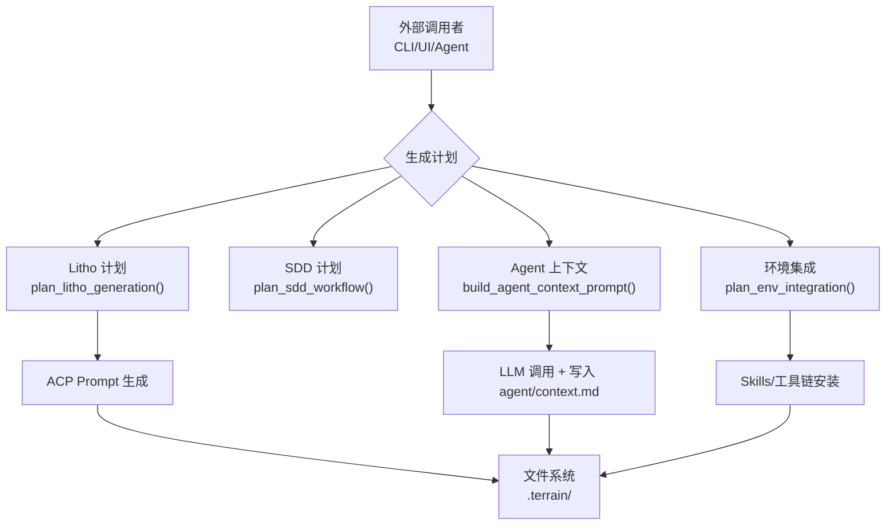

# 知识资产管理领域

**模块路径**：`crates/terrain-core/src/assets/`
**生成日期**：2026-06-14
**分析置信度**：8/10

---

## 这个模块在做什么

知识资产管理是 Terrain 的"数据中台"——它不直接存储数据，而是协调"什么资产该在什么时候生成、放在哪里"。具体来说，它管理四条资产生产线：（1）Agent 友好的架构上下文（`agent/context.md`），（2）AI 工程环境集成（Skills/工具链/AGENTS.md），（3）Litho 和 SDD 的工作计划和提示构建，（4）repomix 源码打包。

你可以把它想象成一个"工厂计划调度中心"——每个生产任务（生成计划）到达后，它决定需要哪些原材料（项目元数据、源码目录）、用什么工艺流程（Litho/SDD/Agent context）、把成品送到哪个仓库（`agent/` 或 `human/` 目录）。

---

## 核心功能点

1. **Agent 上下文管理**——`agent_context.rs` 中的 `build_agent_context_prompt()` 构建 LLM 提示，`write_agent_context()` 将 LLM 回复写入 `agent/context.md`。这是 AI 编码助手理解项目架构的主要入口。

2. **上下文分层**——`context_layers.rs` 实现了 macro/meso/micro 三层上下文管理，`build_context_overview()` 生成概览摘要，`split_context_sections()` 拆分章节，`extract_context_section()` 按章节名提取内容。

3. **Litho 计划构建**——`litho.rs` 中的 `plan_litho_generation()` 构建 `LithoPlan`（`crates/terrain-core/src/schema.rs:162`），包含技能路径、输出目录、工作区目录。`build_litho_generation_prompt()` 和 `build_litho_composition_prompt()` 分别生成全流水线和编排阶段的 ACP Agent 提示。

4. **SDD 计划构建**——`sdd.rs` 中的 `plan_sdd_workflow()` 构建 `SddPlan`，`build_sdd_phase_prompt()` 和 `build_sdd_llm_prompt()` 分别生成 ACP 模式和 Native 模式的阶段提示。

5. **Repomix 打包**——`repomix.rs` 中的 `pack_agent_assets()` 调用 repomix-core 将源码打包为 Agent 友好格式，包含文件列表、token 统计、目录结构。

6. **项目元数据采集**——`project_meta.rs` 中的 `collect_project_meta()` 从文件系统采集技术栈、目录结构等信息。`collect_knowledge_dir_inputs()` 收集已经存在的知识目录输入。

7. **grep 搜索**——`query.rs` 中的 `grep_file()` 和 `grep_text()` 在 Repomix pack 中执行 regex 搜索。

8. **环境集成**——`env/` 子模块的 `get_env_status()` 检查环境状态，`plan_env_integration()` 生成集成计划，`apply_env_integration()` 执行安装。

---

## 关键组件

| 组件/类型 | 文件路径 | 核心职责 |
|---------|---------|---------|
| `LithoPlan` | `crates/terrain-core/src/schema.rs:162` | Litho 生成计划（skill_dir, human_output_dir, litho_workspace_dir） |
| `ContextOverview` | `crates/terrain-core/src/assets/context_layers.rs` | 上下文概览摘要 |
| `AssetGenerationPlan` | `crates/terrain-core/src/assets/mod.rs:55` | 完整资产生成计划 |
| `EnvStatus` | `crates/terrain-core/src/assets/env/` | 环境集成状态 |

---

## 内部数据流

**关键步骤说明**：
1. 计划构建：根据路径和项目元数据构建执行计划
2. Prompt 生成：将计划转换为 ACP Agent 可执行的 LLM 提示
3. 执行：通过 ACP Agent（Litho/SDD）或 ChatEngine（Agent 上下文）执行
4. 写入：将输出写入 `.terrain/` 相应目录

---

## 关键接口与扩展点

- **扩展点**：Skill 目录是可配置的（通过 `TERRAIN_LITHO_SKILL` 环境变量），用户可以自定义 Litho 的文档生成逻辑
- **可插拔设计**：`resolve_litho_skill_dir()`（`crates/terrain-core/src/assets/litho.rs:17`）优先使用环境变量指定的 skill，其次使用默认内嵌 skill

---

## 与其他模块的交互

| 交互模块 | 方向 | 接口/协议 | 说明 |
|---------|------|---------|------|
| 数据模型（Schema） | 依赖 | `LithoPlan`, `SddPlan`, `AssetTrack` | 使用 schema 中定义的计划和资产结构 |
| 路径布局（Paths） | 依赖 | `KnowledgePaths` | 通过 paths 定位输出目录和工作区目录 |
| Litho 文档生成 | 被依赖 | `plan_litho_generation()` | Litho agent 模块使用本模块的计划功能 |
| Chat 引擎 | 被依赖 | `build_context_overview()` | Chat 引擎读取上下文概览作为预加载信息 |
| 项目初始化 | 被依赖 | `pack_agent_assets()` | 初始化流水线使用本模块的打包功能 |

---

## 跨模块协作场景

**在 Litho 文档生成流程中**：本模块提供 `plan_litho_generation()` 构建计划 → `build_litho_generation_prompt()` 构建 ACP Agent 提示 → `litho_research_ready()` 检测研究产物是否齐全 → `litho_human_complete_with_research()` 检测人类文档是否完整。Litho agent 模块通过这些接口实现了可恢复的流水线。

**在 DeepWiki 问答中**：本模块的 `build_context_overview()` 生成概览预加载到 LLM Prompt 中，`split_context_sections()` 和 `extract_context_section()` 支持按章节查询上下文。

---

## 性能考量

本模块全部是纯本地计算（无 IO 等待），性能瓶颈在依赖的 repomix-core 打包操作（涉及大量文件读取）。打包操作在首次准备 Agent 资产时执行一次，后续 Ask 模式仅在资产缺失时触发。

---

> **分析置信度说明**：8/10 — 基于完整阅读了 mod.rs、litho.rs、agent_context.rs、context_layers.rs 等核心文件，但 env/ 和 repomix.rs 的完整实现未逐行覆盖。
